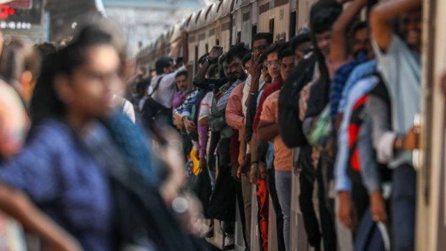
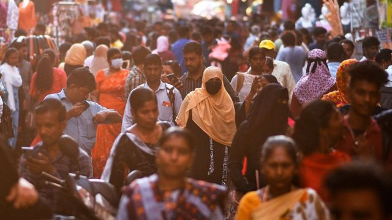
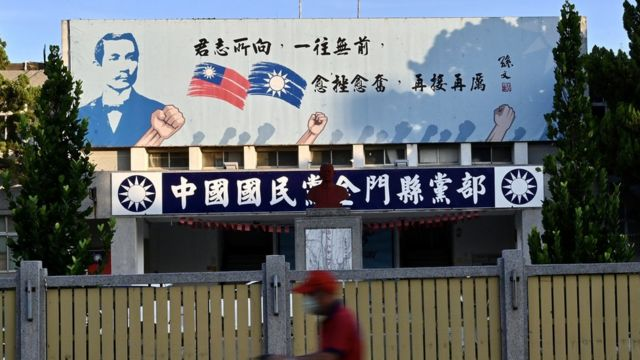
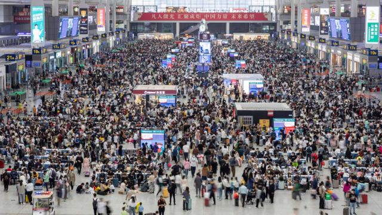
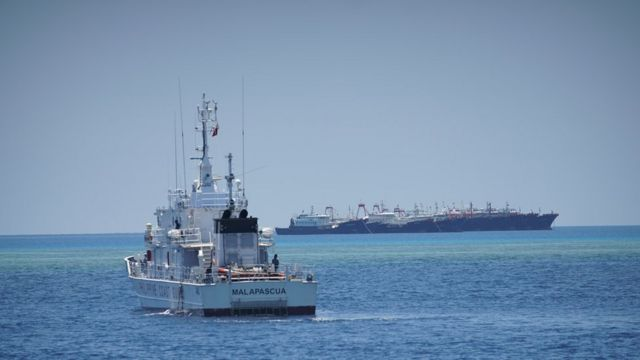

# [Press] 印度人口超中国、台湾选举、五一旅游季再现和本周更多重要故事

#  印度人口超中国、台湾选举、五一旅游季再现和本周更多重要故事

> 图像来源，  EPA
>
> 图像加注文字，按推算，印度人口仍会持续增长数十年。

**2023年5月开始，中港澳最关心的也许是疫情之后的首个五一长假，英国最关心的大概是新国王加冕大典——无论是支持还是反对君主制。**

但这一周还有其他新闻更为瞩目：印度人口在本周超越中国，成为世界第一；中国国民党仍未确定台湾总统参选人，令人不解；菲律宾总统访美之际，中国与菲律宾海巡人员再次在南中国海上对峙。

刚刚过去的一周，BBC中文以上新闻内容受到读者的关注。如果你错过了它们，我们带你一一回顾。

##  1\. 印度人口超越中国成世界第一，祸福难料

> 图像来源，  EPA
>
> 图像加注文字，印度要变成全世界人口最多的国家，但是没有人真正知道这个国家有多少人。

据联合国经济和社会事务部推算，印度人口在4月底达到1425775850人，从本周起，印度取代中国，成为世界人口第一大国。

印度十年一次的人口普查原定于2021年进行，但是已经延后，于是便没有了官方的人口数据。中国最近一次人口普查——中共建政以来的第七次——已于2020年进行。

为了估计和推算印度和中国的人口，联合国只能依靠从现有纪录、调查和行政数据等得来的生育、死亡和移民等数据的量级和趋势。

明确的是，印度和中国各自的人口均超过14亿，而超过70年来，两国占全球人口超过三分之一。

所以，印度取代中国成为世界第一人口大国，到底意味着什么？

##  2\. 台湾总统选举前哨战已开打，中国国民党却仍无人选

> 图像来源，  AFP
>
> 图像加注文字，中国国民党在来届大选要面对的，不只是现任执政民主进步党的挑战，还有像民众党等第三势力的崛起。

台湾总统大选将在2024年初投票，但前哨战目前已经开打，民进党和民众党都已确定了参选人。在野中国国民党党内被认为人气最旺的现任新北市长侯友宜，正在面对希望回到党内参选的台湾富豪郭台铭的挑战，但是侯友宜至今仍不愿松口，表态是否参选，加上国民党主席朱立伦也迟迟不底定党内初选规则，引发该党选举被指“拖泥带水”的批评。

台湾东海大学政治系教授张峻豪向BBC中文表示，他认为重点是国民党党主席朱立伦在去年选举大胜后，身为党主席也想要借着战果将自己送上总统大位，开始拖延侯友宜的提名。侯友宜又刚选上新北市长，因此不想像上届大选韩国瑜刚当选高雄市长后不久就宣布参选总统，引发选民激烈反弹，最后大败收场。

张峻豪教授认为，这两大因素叠加，导致国民党的选举提名拖宕，引发支持者忧心。

##  3\. 新冠疫情三年来首个五一长假，挤与涨再现中国旅游业

> 图像来源，  Xinhua
>
> 图像加注文字，中国放开疫情管控后的首个五一劳动节长假期，人多拥挤，价格飙升。

“今年五一太难了。”家住河南的武女士说起自己筹划全家“五一”假期旅行计划时谈论起了遇到的苦恼。

“疫情三年憋坏了，”武女士告诉BBC中文记者，家里的二女儿才四岁多，几乎没有出门旅行过，今年说什么也要出去。“大儿子说想去北京的环球影城，女儿想去上海的迪士尼，我一看票，说你们别争了，都去不成。”

对于武女士而言，今年“旅游热”比疫情前更甚，往年4月初开始订酒店机票都来得及，今年纷纷售罄，往年“五一”、“十一”也有涨价，今年则涨得接受不了。

中国文化和旅游部数据中心（中国旅游研究院）最初推算，今年“五一”假期，中国旅游出行预计达2.4亿人次，结果数据中心在5月4日公布，全国国内旅游出游合计2.74亿人次，按可比口径恢复至2019年同期的119.09%；实现国内旅游收入1480.56亿元人民币，基本恢复至2019年同期水平。

##  4\. 菲律宾总统小马科斯访美会晤拜登，BBC直击菲中海巡人员南海对峙

> 图像来源，  VIRMA SIMONETTE
>
> 图像加注文字，中菲爆海上冲突

菲律宾总统小马科斯（Ferdinand Marcos Jr .）本周在华盛顿与美国总统拜登（Joe Biden）会晤。拜登政府一名高级官员告诉路透社，拜登和小马科斯预计将在加强商业往来以及“军事强化”方面达成协议，双方都对中国感到担忧。

就在这场会面之前，BBC目睹了在南沙群岛仁爱礁（菲律宾称阿云津礁）附近发生的紧张冲突。马尼拉方面表示，这一举动完全是北京一手策划；中国外交部称，菲律宾海警船“未经中方允许，擅自闯入仁爱礁海域”，又称“菲方船只搭载记者冲闯仁爱礁海域，是一场有预谋的挑衅行为，蓄意找茬碰瓷，并借机炒作”。

中国声称拥有几乎整个南海的主权，包括南沙群岛，但菲律宾也声称拥有部分主权。马来西亚、越南、文莱和台湾也都声称对南海拥有主权。这让南海成为世界上最大的一个热点，尤其是在中美关系紧张加剧的情况下。

首先，中国对台湾的主张日益强烈，这些水域的通行对保卫台湾很重要。其次，这些水道每年还承载着价值5万亿美元的全球贸易，这引发了人们对北京日益增长的足迹可能会限制贸易的担忧。

##  5\. 英国国王查尔斯三世加冕大典在即，各方暖身迎接盛事

5月6日，新任英国国王查尔斯三世（King Charles III）与王后卡米拉（Camilla, the Queen Consort）将走进伦敦西敏寺（Westminster Abbey）接受加冕。

这是英国70年来再次举行君主加冕大典，预计将有数以百万计的民众观看。加冕礼进入倒计时，白金汉宫正如火如荼的准备，全世界的焦点也关注着这场极具意义的仪式。

有些人可能会对那些人群、那些派对、那些排场和那些仪式万分陶醉，但另一些人却是会想尽办法躲开这个场合。

