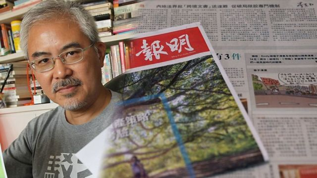
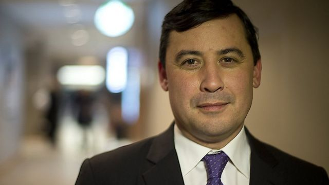
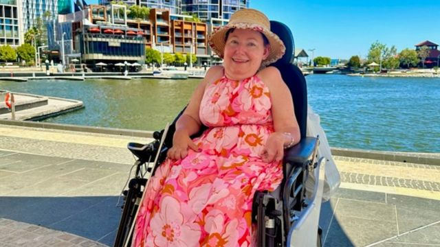

# [Press] 中加互逐外交官、外资中国境遇、香港尊子漫画停刊和本周更多重要故事

#  中加互逐外交官、外资中国境遇、香港尊子漫画停刊和本周更多重要故事

> 图像来源，  Getty Images

**本周，BBC中文报道涵盖中港台，以及政治、经济、军事、人口等领域。**

在香港，《明报》宣布结束政治漫画家尊子在该报已有40年历史的政治漫画专栏。该专栏过去半年多以来屡次被香港官员指责“抹黑政府”，停刊的决定再次引起业界担忧香港新闻自由状况。

台湾是中美关系的重要一环，本周我们关注拜登能否成功串连第一岛链，吓阻北京在台海发动战争。而对中国来说，解放军如何突破第一岛链的封锁，在区域间与美国抗衡是现在军事部署的重要核心。

此外，中国经济处于复苏的关键阶段，但外资在中国利润大降，外贸数据出现分化，这意味着什么？中加关系尚未开始修复，又进入新一轮对峙，甚至到了互相驱逐外交官的地步。

刚刚过去的一周，BBC中文以上新闻内容受到读者的关注。如果你错过了它们，我们带你一一回顾。

**1** **.** 从大众宝马到德勤贝恩 疫情后外资在中国面临的新困境 

> 图像来源，  Getty Images
>
> 图像加注文字，电动汽车成为中国经济增长的新亮点。4月中国汽车出口同比增长196%，其中新能源汽车占乘用车出口量的31%。

2023年的春天，中国对待外资的态度似乎表里不一。在官方层面，从博鳌论坛到全国“两会”，官方都不忘大力宣扬降低门槛，吸引外资。但实际上，德勤、美光、贝恩、明茨，以及日本的安斯泰来制药等知名外企今年以来密集受到中国政府打压，美国商会也报告称，在华美企日益担心地缘政治争端对在华业务的负面影响。

**2.** 庄文浩事件：加拿大与中国互相驱逐领事 

> 图像来源，  Toronto Star via Getty Images
>
> 图像加注文字，庄文浩目前是在野加拿大保守党的影子外相。

加拿大与中国就联邦议会众议员庄文浩（Michael Chong）在港家属怀疑被骚扰事件互相驱逐外交人员。

加拿大《环球邮报》（The Globe and Mail）上周援引加方情报文件称，中国外交人员在庄文浩发起有关新疆人权状况的议案后，遭中方针对，并搜集其在港家属情报，以便实施打击，阻吓其“反华立场”。

加拿大外长乔美兰（Mélanie Joly）星期一（5月8日）宣布，将被指与此事有关的中国驻加拿大多伦多总领事馆领事赵巍列为“不受欢迎人物”（persona non grata），并将其驱逐出境。

将加拿大驻上海总领馆领事甄逸慧（Jennifer Lynn Lalonde）同样列为“不受欢迎的人”，并限令她在5月13日前离境。

**3** **.** 第一岛链：拜登重新串连亚洲盟友与中国的突围 

美国总统拜登（Joe Biden）上台后持续美国在印太地区的军事部署，以“结盟”各国为其外交主战略。其中，在西太平洋的“第一岛链”与菲律宾，日本，韩国及台湾等盟友的军事合作，近日持续受到全球关注。

舆论关心的是，拜登能否成功串连第一岛链，吓阻北京在台海发动战争。而对中国来说，解放军如何突破第一岛链的封锁，在区域间与美国抗衡是现在军事部署的重要核心。专家向BBC表示，现在美军部署的的情况类似于冷战初期的态势。

**4.** 梅兰妮与柴斯：残疾女性与她雇佣的性工作者 

> 图像来源，  Melanie
>
> 图像加注文字，梅兰妮从三岁起就一直坐在轮椅上。

当梅兰妮（Melanie）因新冠病毒在澳大利亚的家中被隔离时，她对自己做出了承诺。一旦她被允许再次外出，她将雇佣一名性工作者，失去童贞，并停止她作为一个残疾人对爱情和亲密关系产生的焦虑。柴斯（Chayse）就是她预约的那个人。

在此之前，没有人以非医疗的方式触碰过梅兰妮，43岁的她意识到自己想要更多。

梅兰妮从三岁起就一直坐在轮椅上，因为她被诊断出患有脊髓炎症——一种被称为横贯性脊髓炎的疾病。这使得她的双腿瘫痪，手臂活动受限。作为一个成年人，她让护工来帮助完成日常需要。

**5.** 成蕾：澳洲华裔记者在中国被关押千日后仍未得到判决 

> 图像来源，  Nick Coyle
>
> 图像加注文字，柯伊尔希望，案件能够得到紧急处理。

成蕾原本供职于中国国营英文电视台中国环球电视网（CGTN），她在2020年8月13日忽然被中国国安人员带走，之后被指控“向境外非法提供国家机密”。

她被拘的前6个月是独立关押，被置于压力之下，在接受问讯时也未有获得律师协助。自此之后，她与其他囚犯共同关押。

她的审判却被一再延后。

和成蕾的其他亲友一样，她的男友柯伊尔说，对于成蕾到底做了什么，为什么要被这样对待，他仍一无所知。

**6** **.** 尊子漫画：《明报》停刊40年政治讽刺专栏 再引香港新闻自由争议 

香港《明报》宣布结束政治漫画家尊子在该报已有40年历史的政治漫画专栏。该专栏过去半年多以来屡次被香港官员指责“抹黑政府”，停刊的决定再次引起业界担忧香港新闻自由状况。

《明报》星期四（5月11日）出版的尊子漫画上部以“编按”形式公布该决定，称该专栏将于星期天（14日）起停刊。报社未给出原因，只称“《明报》多谢尊子40年来与我们一起见证时代的变迁”。

本名黄纪钧的尊子回覆BBC中文查询说：“我认为停刊的决定是协商下得出的。我觉得停刋的可能性常存在。漫画因应形势及读者对象调节是常有的，只要不损害或扭曲含意。”

