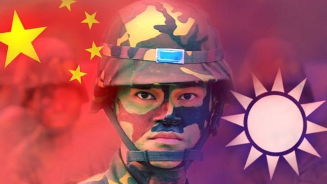
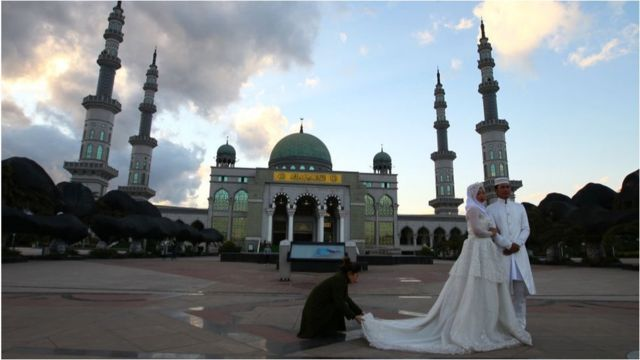
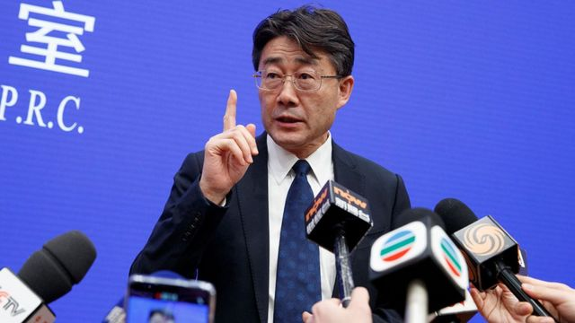
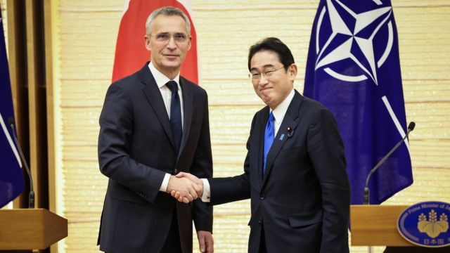

# [Press] “武统台湾”民调、清真寺遭强拆、北约“东进”和本周更多重要故事

#  “武统台湾”民调、清真寺遭强拆、北约“东进”和本周更多重要故事

> 图像来源，  Getty Images

**在五月下旬，一份有关近1800多位中国公民针对“武统”台湾的相关民调结果，在两岸局势紧张及美中关系不睦的当下，引发各方关注。**

另一方面，在过去的周末，互联网上传出消息，中国云南省一座清真寺的阿拉伯式外观遭当局强行拆除，施工期间有当地穆斯林居民到场试图阻止，与警察发生冲突，被指是在北京政府“宗教中国化”政策下的新一轮事件。

今年5月，日本官方证实北约将于7月在东京设立联络处，虽然同时澄清日本现在无意申请加入北约，但是北约在亚洲活动越趋高调，引发印太区域国家关注。

5月28日，中国第一架国产大飞机C919成功实现商业首航，由上海飞往北京。这家飞机由国资背景的中国商飞（COMAC）制造，从2007年立项到2023年商业首航，历时15年。

BBC中文梳理信息，采访专家，分析中国大飞机独特的优势和劣势，试图回答一个问题——中国产飞机能否复制高铁的成功？

新冠疫情紧急状态解除之后，一位前中国政府高级科学家接受BBC访问表示，不应排除新冠病毒从实验室泄露这一可能性。

越来越多的科技界领袖警告，人工智能（AI）可能导致人类灭绝，这种事情会如何发生？

刚刚过去的一周，BBC中文以下新闻内容受到读者的关注。如果你错过了，我们带你一一回顾。

**1.** 谁更支持“武统”台湾？一份针对中国大陆受访者的民调说了些什么？ 

今年五月，知名英文期刊《当代中国》（Journal of Contemporary China）发表了一份有关近1800多位中国公民针对“武统”台湾的相关民调结果。

研究调查显示，受访者中表示支持北京“武统”台湾者仅有55%，而且有33%的受访者不同意动用武力统一台湾，表态希望立即对台湾发动战争者则仅有1%，民调结果引发舆论讨论。

有关中国民众对于两岸议题的看法，因为议题敏感一直不多见。

作者之一的刘遥告诉BBC中文说，“最重要的发现是大陆民众对解决台湾问题的手段有比较大的包容性，并不是像预期的一样多数都倾向武统。换言之，研究结果显示，武统并没有在受访者间获得压倒性的支持。

在两岸局势紧张及美中关系不睦的当下，相关调研引发各方关注。两位作者在论文最后也提到研究结果或可让美国决策者认识到，对多数中国受访者来说，并没有一个立即出兵武统台湾的时钟正在倒数，美国无须施行强硬的对华政策。

**2.** 中国云南清真寺疑遭“强拆”，警民冲突引“宗教中国化”疑虑 

> 图像来源，  Getty Images
>
> 图像加注文字，云南省有众多清真寺（资料图片）

日前互联网上传出消息，中国云南省一座清真寺的阿拉伯式外观遭当局强行拆除，施工期间有当地穆斯林居民到场试图阻止，与警察发生冲突。

社交媒体上流传的显示，数十名民众在云南玉溪市通海县纳家营清真寺外与配有防暴装备、手持盾牌的警察发推撞，试图突破警方防线，期间有人向警察投掷物件。

中国官方消息似乎确认该事件发生于上周六（5月27日）。当地警方于5月28日，称“通海县纳古镇发生一起严重妨害社会管理秩序的案件”，呼吁涉案人员在6月6日前“投案自首”，以争取“宽大处理”。

冲突被指是与当局拆除清真寺的穹顶有关。当地法院曾于2020年作出一项判决，指清真寺部分改建属于违法，下令拆除。

通海县警方在周日的通报中称，事件造成了“恶劣的社会影响”，将严厉打击，并且“鼓励和保护”民众积极举报。

中国在近年加紧了对宗教团体及个人的政治管制，并将“深入推进我国宗教中国化”列为统战工作的明确要求。

法新社引述英国曼彻斯特大学回族问题专家大卫·史特鲁普（David Stroup）评论指，虽然这些做法对新疆以外的社群影响相当较小，但仍然有不少清真寺被“强制改建”，以符合官方的中国化定义。

**3.** 3 中国产大飞机C919：能否复制高铁的成功？ 

> 图像来源，  Getty Image
>
> 图像加注文字，中国的C919。

5月28日，中国第一架国产大飞机C919成功实现商业首航，由上海飞往北京。中国寄希望由这架飞机打破美国波音（Boeing）和欧洲空客（Airbus）的垄断，在万亿级的航空市场中分一杯羹。甚至复制中国高速铁路的成功——2004年高铁立项到2018年，14年间开通里程3.8万公里，占全球高铁里程的七成，并成为中国高端制造的"名片"，开始对外输出。

但大飞机与高铁不同的是，后者中国通过短短三四年的时间就通过技术转让、消化和升级，形成自有技术；而大飞机的发动机等关键部件，还在依赖欧美，有观点认为，在日益紧张的地缘政治格局下，随时面临技术"卡脖子"的危险。

那么，中国国产大飞机的未来在哪里？中国产大飞机能否复制高铁的成功？

**4** **.** 新冠病毒溯源：顶级中国科学家称不该排除实验室泄露 

> 图像来源，  Reuters
>
> 图像加注文字，高福

一位前中国政府高级科学家告诉BBC，不应排除新冠病毒从实验室泄露这一可能性。

曾作为中国疾病预防控制中心主任，高福教授在疫情应对和溯源工作中发挥了重要作用。

中国政府否认了这种疾病可能起源于武汉实验室的任何说法，但高教授没有直截了当 **。**

在接受BBC广播四频道播客《发热：寻找新冠病毒的起源》采访时，高教授说：“你总是可以怀疑任何事情。这是科学。不要排除任何可能性。”

高教授是世界级别的病毒学家和免疫学家，去年从中国疾病预防控制中心退休后，现任中国国家自然科学基金委员会副主任。

高教授还告诉BBC，中国政府对武汉病毒研究所进行了某种正式调查，这也许可以说明，中国政府对实验室泄密理论的重视程度比其官方声明所称的要高。

**5** **.** 人工智能三阶段：为何科学家联署限制可导致人类灭绝的AI技术 

> 图像来源，  Getty Images

包括OpenAI和谷歌Deepmind负责人在内的专家警告，人工智能可能导致人类灭绝，但是机器如何取代人类呢？

自2022年11月推出以来，ChatGPT——一款使用人工智能根据用户的需求回答问题或生成文本甚至代码的聊天机器人，已经成为历史上增长最快的互联网应用程序。

在仅两个月的时间里，它的活跃用户达到了1亿。据科技监测公司Sensor Town称，Instagram花了两年半的时间才达到这一里程碑。

数十名专家支持在人工智能安全中心（Center for AI Safety）网页上发表的一份声明，称：“减轻人工智能造成的灭绝风险，应该与流行病和核战争等其他社会规模的风险一起成为全球优先事项。”

但也有人表示，这种担忧被夸大了。

**6** **.** 北约“东进”设立东京联络处 乌克兰战争催生亚洲“小北约”？ 

> 图像来源，  Takashi Aoyama / Pool /Anadolu Agency via Getty
>
> 图像加注文字，岸田文雄之前一直被认为是日本自民党内坚定的温和派，但今年出台三份文件都显示，日本将突破诸多战后禁忌，包括进一步扩大武器对外出口等。

作为全球最大的跨国军事联盟，北约（NATO）自去年莫斯科入侵乌克兰后，在亚洲的活动越趋高调，引发印太区域国家关注。今年5月，日本官方证实北约将于7月在东京设立联络处，但同时澄清日本现在无意申请加入北约。

中国外交部立即抨击北约此举将破坏区域稳定。中国外交部发言人毛宁在新闻会上对此消息回应表示，“亚太不欢迎阵营对抗，不欢迎军事集团。”她强调，北约既然自称是区域性联盟，就不应当寻求地理突破。

但是，北约在印太设定第一个正式联络处，只有象征性意义还是具有实质战略功能？

