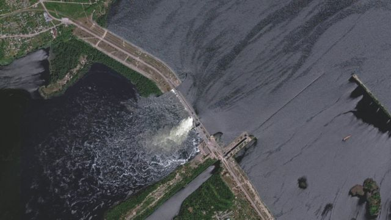
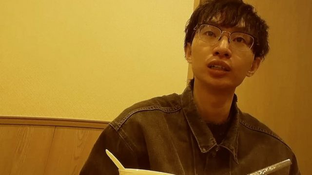
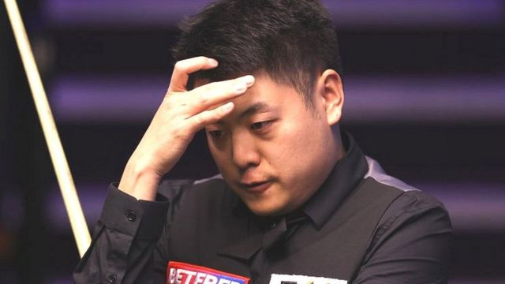

# [Press] 六四34周年、“反送中”四周年、乌克兰水坝被炸毁和本周更多重要故事

#  六四34周年、“反送中”四周年、乌克兰水坝被炸毁、台湾政坛性骚扰和本周更多重要故事

> 图像来源，  Reuters/Maxar Technologies
>
> 图像加注文字，卫星图像显示洪水涌过新卡霍夫卡水坝破口，几个城镇已经被淹。

**本周，2019年香港“反送中”运动四周年纪念，BBC中文将陆续推出一系列报道，回顾这次社会运动如何改变香港。值得注意的是，上周末是1989年“六四事件”34周年，往年在香港维园举办纪念活动，今年却了无声息，折射香港的改变。**

在俄乌战场，俄罗斯占领区的一座乌克兰重要水坝被炸毁后，数千民众从水坝下游疏散。俄乌相互指控对方是炸毁水坝的元凶。

BBC国际频道调查小组"BBC之眼"以卧底的方式，揭露通过性暴力牟利的幕后黑手。本周，台湾政坛上“性骚扰”指控的海啸来袭。相关实名指控先在民进党内部开始出现，之后有资深媒体人控诉国民党民代性骚扰等，性骚扰议题成为台湾总统大选开跑后不久的意外风暴。

此外，在斯诺克台球（snooker）界最大规模的一宗腐败案中，10名中国球员受到不同程度的处罚。

刚刚过去的一周，BBC中文以上新闻内容受到读者的关注。如果你错过了它们，我们带你一一回顾。

##  1\. 六四34周年：香港警方严防戒备 在铜锣湾带走数人

1989年"六四"事件34周年纪念日，香港维多利亚公园连续第四年没有举行烛光集会。从白天开始，铜锣湾一带已有大批警力驻守，反恐特勤队也出动巡逻。

##  2.香港“反送中”四周年

2019年香港“反送中”运动被官方定性为“颜色革命”，《国安法》标志着香港"二次回归"。BBC中文采访教育、传媒、公务员等多个界别的前线人员，他们都称感受到翻天覆地的变化，并指官方正从文化上改造香港。

此外，2019年香港的"反修例"运动开始后，大量年轻人因相关抗议被捕入狱。BBC中文採访了两位出狱的"反修例"运动示威者，以及帮助因社运案件入狱人士的支援网络。

##  3.乌克兰水坝遭炸毁

本周，俄罗斯占领区的一座乌克兰重要水坝被炸毁后，数千民众从水坝下游疏散。俄乌相互指控对方是炸毁水坝的元凶。

乌克兰总统泽连斯基表示，新卡霍夫卡（Nova Kakhovka）的水坝被毁后，可能有80个城镇和村庄会被淹没，他将此归咎于俄罗斯。滚滚河水正涌入德聂伯河，据说已经对赫尔松市构成了致命性的洪灾风险。

俄罗斯否认摧毁了这座由其控制的水坝，并指责是乌克兰炮击所致。

基辅和莫斯科就大坝决口相互指责，交战双方的说法尚未得到BBC的证实。

##  4.地铁性骚扰

> 图像加注文字，“猫咪”拥有三个“痴汉”网站提供性侵视频（图为BBC记者卧底拍摄的性侵视频网站主谋“猫咪”。）

在东亚各地的公共交通工具上遭遇性侵犯的女性，还面临着另一种风险：性侵者偷偷拍摄下猥亵过程，并把影片放在网上出售。经过超过一年的调查，BBC国际频道调查小组"BBC之眼"以卧底的方式，揭露通过性暴力牟利的幕后黑手。

##  5.斯诺克假球案

> 图像来源，  George Wood

在斯诺克台球（snooker）界最大规模的一宗腐败案中，中国球员梁文博、李行涉嫌参与假球，被世界职业台球与斯诺克协会（WPBSA）处以终身禁赛。

另外八名涉案的中国球员在相关调查中承认有不当行为，被处以20个月至5年不等的禁赛处罚。

涉案的10人中，世界排名最高的是第11位的前英国锦标赛冠军赵心童，他被处以1年零8个月禁赛，2021年大师赛冠军颜丙涛则被禁赛5年。

案件中的指控包括操纵比赛、打假球、唆使其他球员作弊以及赌球。

##  6.台湾政坛“性骚扰”指控

> 图像来源，  Getty Images
>
> 图像加注文字，台湾街头。

本周，台湾政坛上“性骚扰”指控的海啸来袭。

相关实名指控先在民进党内部开始出现，之后有资深媒体人控诉国民党民代性骚扰等，性骚扰议题成为台湾总统大选开跑后不久的意外风暴。

但争议也延烧到学术界及文艺界，这几天被指控者众，包括在台湾清华大学任客座助理教授的的中国“六四”民运人士王丹，曾在台湾访问的流亡作家贝岭。但两人都已否认相关指控。

其他案例尚有台湾中正大学副教授，台大医院教授，民众党主席柯文哲前文胆，国民党智库学者，纪录片导演及当地前报社高层等等，台湾的性骚扰议题继续延烧。

这些受指控者多数否认相关指控，并称愿意循司法途径釐清。BBC中文无法独立核实相关指控。

