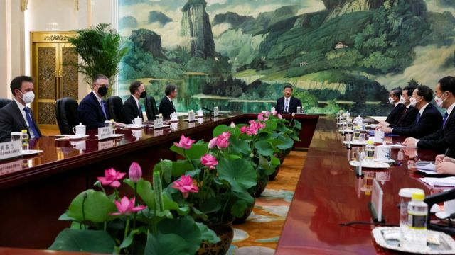
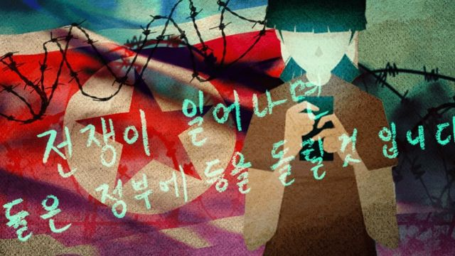
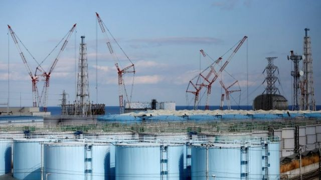

# [Press] 布林肯访华、“泰坦”潜水器海难、朝鲜疫情内幕和本周更多重要故事

#  布林肯访华、“泰坦”潜水器海难、朝鲜疫情内幕和本周更多重要故事

> 图像来源，  Reuters

**本周，布林肯（Antony Blinken）成为五年来首位访华的美国国务卿，他与中国国家主席、中共中央总书记习近平和两大外交负责人的会晤给观察人士留下许多讨论空间，但外界也许没有想到的，是美国总统拜登（Joe Biden）突然在一场没有安排媒体采访的竞选招待会上，批评习近平是“独裁者”。**

观乎布林肯访华情况，分析人士对中美关系能否真正恢复正常抱有怀疑，而拜登的“独裁者”论似乎为前路添加阴霾。

一艘前往参观“泰坦尼克”号（TMS Titanic，“铁达尼”号）沉船残骸的小型潜水器失踪，引发以美国和加拿大为主的多国大搜寻，震惊国际。事件最终以发现潜水器残骸，船主公司宣布公司负责人与另外四名乘客死亡的悲剧结束。然而，事故调查才刚刚开始。

2020年初新冠疫情爆发，朝鲜立即封锁全国边境，与世界隔绝。BBC记者秘密联系三位朝鲜居民，了解严密封锁下不为人知的苦难。有关报道在近日发表。

刚刚过去的一周，BBC中文以上新闻内容受到读者的关注。如果你错过了它们，我们带你一一回顾。

##  1\. 布林肯访华与拜登“独裁者”论 中美关系“唇枪舌战”下的一周

美国国务卿布林肯（Anthony Blinken）星期一（6月19日）在北京人民大会堂与中国国家主席习近平会面。他是美国总统拜登（Joe Biden）2021年就任后到访中国的最高阶美国官员。

在布林肯的两天访问行程里，中美双方均提出要稳定关系，但美方寻求重启军方沟通渠道一事未能如愿。中方则强调美方应为当前双边关系僵持而“反思”，而在中美关系的众多问题中，没有任何事情比台湾问题更为重要。

布林肯离开中国后，美国总统拜登（Joe Biden）先是形容美中关系已走在“正确轨道”上，然后在相隔一天后公开批评习近平是“独裁者”，再次引来北京的强烈批评。

一些媒体引述中国驻美国大使馆称，大使谢锋向白宫与美国国务院有关官员提出了“严正交涉和强烈抗议”。一份在星期四（22日）发表的声明称：“中方敦促美方立即采取切实行动，消除负面影响，恪守自己的承诺，否则一切后果将由美方承担。”

拜登则对记者回应称：“我不认为这会带来什么真实的后果。”

虽然普遍评论认为布林肯访华迈出了恢复双边关系健康发展的重要一步，但多位观察人士向BBC指出，能否真正恢复正常，仍待审慎观察。

##  2\. 观光潜水器前往参观“泰坦尼克”号沉船残骸途中“内爆”解体 五人殒命

观光潜水器“泰坦”号（Titan）6月18日在前往参观“泰坦尼克”号（TMS Titanic，“铁达尼”号）沉船残骸途中失踪，引发一场大规模多国联合搜救。然而，美国海岸警卫队与制造该潜水器的公司“海洋之门”（OceanGate）星期四（22日）表示，“泰坦”号在“泰坦尼克”号残骸附近内爆，所载的五人全部遇难。

美国海岸警卫队的梅杰少将（John Mauger）证实，在距离泰坦尼克号残骸船头约480米处发现了该潜水器的五个部件，以及一片“残骸区”，“这些残骸与压力舱发生毁灭性内爆的情况一致”。

五名乘客分别为“海洋之门”创始人兼首席执行官斯托克顿·拉什（Stockton Rush）、法国“泰坦尼克”号专家保罗—亨利·纳热奥莱（Paul-Henry Nargeolet）、巴基斯坦富豪沙赫扎达·达伍德（Shahzada Dawood）和他19岁的儿子苏尔曼（Suleman），以及英国商人和探险家哈米什·哈丁（Hamish Harding）。

1997年好莱坞电影《泰坦尼克号》导演，曾深潜“泰坦尼克”号残骸33次的詹姆斯·卡梅隆（James Cameron；詹姆斯·卡麦隆、占士·金马伦） 接受BBC采访时质疑  ，“海洋之门”在潜水器的安全措施上“图省事”，“海洋之门”创办人之一吉列尔莫·索恩莱因（Guillermo Söhnlein）反驳称，他们花了14年开发的潜水器“非常坚固”。

##  3\. 李强访德法：中国新总理的外交首秀

就在美国国务卿布林肯到北京会见中国最高领导人习近平的同时，中国国务院总理李强展开上任后的首度外访，先后抵达欧盟主要经济体德国和法国。

这是继去年底和今年初德法元首访华后，中方领导人受邀回访。此前，中共中央政治局委员、中央外事工作委员会办公室主任王毅和外长秦刚都曾出访欧洲。

“疫情后解除清零政策，北京就向欧洲示好。毕竟，欧洲离中国比较远，直接的利益冲突比较少。”新加坡国立大学政治学副教授、卡耐基中国项目研究员庄嘉颖对BBC中文说。

他认为，北京希望缓和中欧之间在俄乌战争后紧张的关系，而面对美国在科技和半导体等方面的限制，中国欲拉拢欧盟国家突破重围，同时试探是否可以让欧美的盟友关系有所动摇。

##  4\. BBC披露防疫封锁下的朝鲜

在2020年1月27日，朝鲜骤然关闭国门，以应对2019冠状病毒病（COVID-19）全球大流行疫情，不仅人员不能入境，连粮食和货物都被挡在门外。

在金正恩的极权统治下，朝鲜被禁止与外界接触。借助在该国境内有消息源网络的脱北者媒体《每日朝鲜》（Daily NK）帮助，BBC得以秘密地与朝鲜境内的三个人联络。他们迫切想向世界讲述封关给他们生活带来的灾难性影响。

##  5\. 鸿海集团董事长刘扬伟对话BBC 讨论台海局势与中美相争

随着美中两个超级大国关系降至冰点，总部设在台湾的富士康公司（Foxconn）正在面临抉择。这家电子制造巨头负责生产美国苹果公司60%的产品，包括iPhone手机。

在一次独家专访中，富士康的母公司鸿海科技集团董事长刘扬伟告诉BBC，希望台海战争不会发生，但自己也在为最坏的局面做准备。

##  6\. “全职儿女”在中国冒起的前因后果

> 图像来源，  Getty Images

在中国职场竞争激烈的环境下，许多年轻人回家做起了“全职儿女”，通过做家务或陪伴父母来获得认可。有人甚至与父母签订了一份劳务契约，列出付出与报酬。

“全职儿女”的背后是中国高企的失业率。中国官方最新数据显示，今年5月，16至24岁青年人的失业率升至20.8%，连续两个月创2018年有统计以来新高。

其中，大学毕业生的情况更糟糕，据中国国务院发展研究中心研究员卓贤估算，大学生失业率是青年整体失业率的1.4倍，是青年失业人口的主要群体。

新加坡国立大学李光耀公共政策学院助理教授陆曦告诉BBC中文：“全职儿女是社会失业大潮下出现的不可避免的现象，背后体现的是整个社会经济严重下滑、萎缩的现状。”

##  7\. 福岛核废水排海倒计时：盘点日本邻居们的怒哮

> 图像来源，  Reuters

经过多年国内外激辩，以及数任首相来来去去，日本政府计划在今夏将福岛第一核电站储存的超过130万吨核废水排入太平洋，引发全球关注及亚洲邻居紧张。

BBC中文整理了此次福岛核废水排放引发的各种议题及辩论，包括法律，生态方面的争议及日本的亚洲邻居们的激烈反应。

