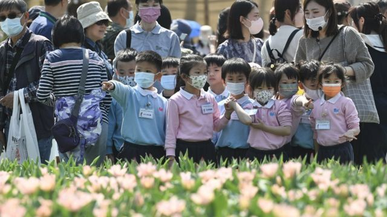
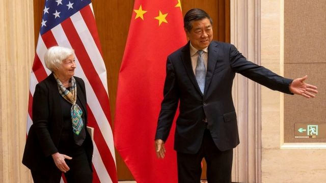
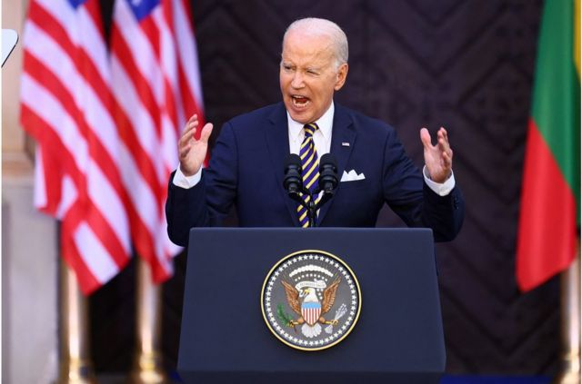
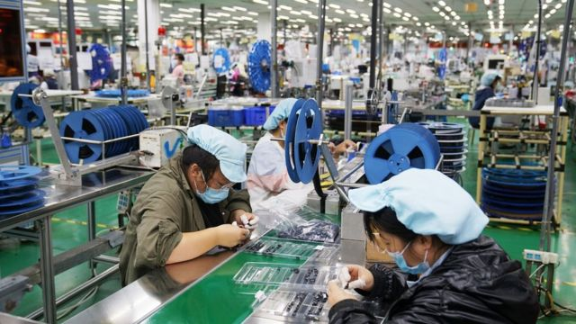
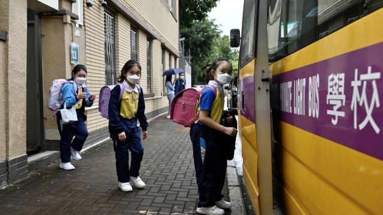

# [Press] 耶伦结束访华、北约峰会闭幕、富士康退出印度和本周更多重要故事

#  耶伦结束访华、北约峰会闭幕、富士康退出印度和本周更多重要故事

> 图像来源，  Getty Images

**七月第二周，美国财政部长耶伦结束访华，谈了从“脱钩”** **到** **镓锗管制、气候合作等问题，但悬而未决的关税问题并未出现在双方公开的议程中。**

在立陶宛首都维尔纽斯举行的北约峰会闭幕，31个成员国发表公报，对中国发出了迄今最为强烈的谴责。

在两岸三地，歌手李玟去世掀起有关“阳光忧郁症”的讨论。

科技领域，富士康宣布退出印度半导体晶片厂合资企业。一些分析师表示，这对印度的科技产业发展是一个挫折。

刚刚过去的一周，BBC中文有以下新闻内容受到读者的关注。如果你错过了它们，BBC中文带你一一回顾。

##  1\. 美国财政部长耶伦结束访华

> 图像来源，  Reuters
>
> 图像加注文字，耶伦（左）与中国新财金主管何立峰（右）的首次会晤在彬彬有礼的气氛中举行。

美国财政部长耶伦7月9日离开中国，结束她成为财长后的首次访华行程。

在四天的访问中，耶伦会见了中国总理李强等官员以及中国的女性经济学家等人，谈了从“脱钩”到镓锗管制、气候合作等问题，但悬而未决的关税问题并未出现在双方公开的议程中。

从整体舆论来看，虽然美国国务卿布林肯访华时和中国国家主席习近平会面，但耶伦访华时间更长、内容更加丰富，外界认为这可能与耶伦长期在美国政府内部扮演的反对“关税战”和“脱钩”的角色有关。

##  2\. 北约峰会闭幕，成员国强烈谴责中国

> 图像来源，  Reuters
>
> 图像加注文字，北约峰会结束后，美国总统拜登在立陶宛维尔纽斯大学发表关于北约的演讲。

在刚刚结束的北约峰会上，澳大利亚、日本、新西兰和韩国等四个国家（即“IP4”，印太地区四国）的领导人再次受邀出席，加强了与北约之间的合作关系。北约31个成员国发表公报，对中国发出了迄今最为强烈的谴责。

在立陶宛首都维尔纽斯举行的为期两天的峰会中，北约领导人发表了一份措辞强硬的声明，称中国以其“公开的野心和强制性政策”挑战了北约的利益、安全和价值观，并抨击中国与俄罗斯的伙伴关系。

有分析指出，北约有扩张到亚太地区的意图，并将进一步参与美国对中国的遏制，美中关系和中欧关系也将更加紧张。

##  3\. 歌手李玟骤逝与有关“阳光忧郁症”的讨论

> 图像来源，  Getty Images
>
> 图像加注文字，李玟的家人确认她这几年罹患了忧郁症，有定期就医接受治疗。

知名歌手李玟上周在香港过世，震撼华人娱乐圈。李玟以个性开朗外向，工作追求完美几乎“零负评”的形象走红乐团近30年，她在48岁的年龄骤逝，引发全球华人圈的广泛讨论及哀悼。

李玟的家人向港媒确认，李玟这几年罹患了忧郁症（抑郁症），有定期就医接受治疗。名人心理健康的问题，随着李玟的去世再次成为各大媒体上的热门话题，甚至开启有关于“阳光忧郁症”（smiling depression，也称“微笑忧郁症”）的讨论。

##  4\. 富士康宣布退出印度半导体晶片厂合资企业

> 图像来源，  Getty Images
>
> 图像加注文字，富士康在中国郑州的一家工厂。成本低廉是富士康参与国际产业链合作的主要优势。

苹果iPhone供应商，台商鸿海科技集团旗下的富士康（Foxconn）已退出与印度石油龙头威达塔（Vedanta）合作的一项195亿美元的投资项目，该项目原本计划在在印度建设一座晶片制造厂。不到一年前，这两家公司宣布计划在印度总理莫迪家乡古吉拉特邦（​​Gujarat）投资这座晶片厂。

一些分析师表示，这对印度的科技产业发展是一个挫折。

富士康本周二告诉BBC，撤资的决定是与威达塔“互相协议”下达成。鸿海退出后，威达塔已完全拥有该合资企业。此外，该公司还表示，仍将继续支持印度政府的“印度制造”（Made in India）雄心。总部位于新德里的威达塔则表示，他们已“与其他合作伙伴合作，建立印度首家（晶片）代工厂”。

##  5\. 香港移民潮叠加退学潮

> 图像来源，  Getty Images
>
> 图像加注文字，2019年“反送中”运动后香港持续出现退学潮

暑假来临，香港又进入移民旺季。

官方最新数字显示四年间香港流失近6.8万名中小学生，过去一年的流失率更创近年高峰。

退学潮是如港府所言“最坏情况已过”，抑或只是开始？

