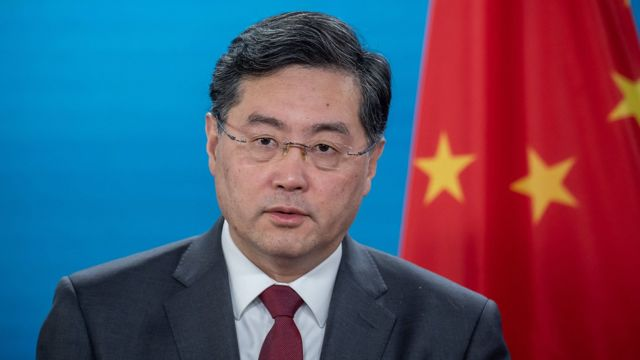
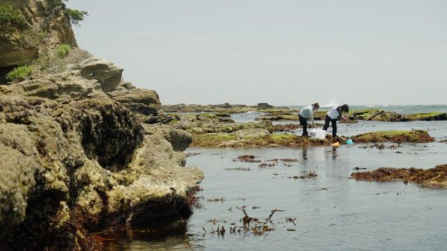
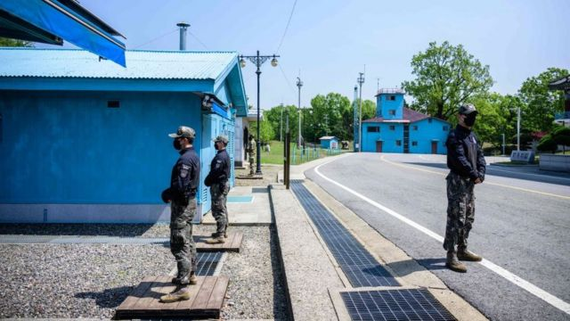

# [Press] 秦刚下落、中国最新GDP、福岛核废水排放和本周更多重要故事

#  秦刚下落、中国最新GDP、福岛核废水排放和本周更多重要故事

> 图像来源，  Reuters

**中国外交部长秦刚行踪成为本周最热门话题。在上周，北京方面曾称他因健康原因，未能如期出访。**

与此同时，中国公布最新经济运行数据：2023年第二季度国内生产总值（GDP）同比增加6.3%，青年就业前景备受关注。

再有一件热点事件同样跟中国关系密切，但并非发生在中国：联合国国际原子能机构（IAEA）对日本拟排放福岛和废水的审查报告争议未止，东京的政府内阁透露，北京方面的进口禁令似乎已经造成日本食品滞留中方海关。

刚刚过去的一周，BBC中文以上新闻内容受到读者的关注。如果你错过了它们，我们带你一一回顾。

##  1\. “秦刚在哪里”成热话

> 图像来源，  AFP

中国国务委员兼外交部长秦刚连续三周没有公开露面，缺席一系列外交活动。在中国不透明的政坛中，这一罕见情况引发外界关注，也激起了社交媒体上网民们对于他去向的猜测。

星期一（7月17日），中国国家主席习近平在北京会见了菲律宾前总统杜特尔特（Rodrigo Duterte）。官方中国中央电视台的画面显示，秦刚再次缺席了这一惯常由外长陪同的外事活动。

现年57岁的秦刚是一名职业外交官，他被视为是深得习近平信赖的官员，在去年12月被任命为外交部长，今年3月再被擢升兼任副总理级的国务委员。

中国外交部发言人曾在7月11日对记者说，秦刚因“健康原因”不能出席在印尼举行的东盟会议。中共党内职务比他级别更高的中共中央外事工作委员会办公室主任王毅代他出席了会议。

不过，发言人的这一表述并未被收录到中国外交部网站当日的记者会实录中。中国外交部通常在该实录中省略其认为敏感的内容。

##  2\. 中国二季度GDP增幅6.3%逊于市场预期

> 图像来源，  China News Service

中国星期一公布2023年上半年经济数据——二季度GDP增幅6.3%，快于一季度的4.5%；上半年增速为5.5%。官方设置的全年增长目标是5%左右。

单从数字上看，似乎中国在疫情后半年的复苏欣欣向荣。但研究指中国的疫后经济复苏实际上在放缓——2022年二季度因为上海等地封城造成GDP同比增速仅为0.4%，导致今年统计时的低基数效应。

从环比角度看，一季度环比增长为2.2%，二季度环比增长0.8%，体现出经济复苏放缓的趋势。

经济学上，经常把投资、消费和出口看作拉动经济增长的“三驾马车”。那么放缓背后，究竟是哪驾马车慢，哪驾马车快？

##  3\. “处理水”还是“核废水”？中日新争端在福岛核废水中“发酵”

> 图像来源，  Jiro Akiba/BBC

日本福岛第一核电站事故发生已有12年，日本政府与管有核电站的东京电力公司准备排放积存的核废水，引发中国官方与邻国民间团体的强烈抗议，一些太平洋岛国也表达忧虑。

国际原子能机构（IAEA）针对核废水处理方案发表的最新报告，以及该机构总干事拉斐尔·格罗西（Rafael Grossi）在同一时间访问韩国，开启了中日韩三国之间最新一轮争论。中国宣布禁止日本十都县食品进口，日本官房长官松野博一7月19日称，得悉有日本海产滞留在中国海关的情况，怀疑与此有关。

就在福岛第一核电站一个小时车程外，一个社区每日忙于检测渔获的核辐射水平。这是一个从未想过核电站事故有可能发生的社区，在遭受毁灭性打击之后的决定。如今，12年过去了，他们再次发现，自己很难相信日本政府，因为政府坚称把经过处理的放射性废水排入太平洋是安全的。

##  4\. 美军士兵游览板门店休战村期间翻越韩朝边界后下落不明

> 图像来源，  AFP

据报道，朝鲜扣押一名现役美军士兵，他在未经允许之下越过重兵守卫的朝韩边境。

该名男子当时正在联合国管理的板门店休战村分隔区，参加一个有组织的参观团。

此次危机发生在各方与朝鲜关系特别紧张的时刻，这是世界上最封闭的国家之一。美国告诫本国公民不要前往那里。

美国一名高级指挥官指，与该名士兵未曾联系。

##  5\. 极端高温继续煎熬世界多地

从中国到欧洲，再到北美，全球创纪录的高温报告7月此伏彼起。

严重的高温不仅造成人员中暑死亡的案例，还加剧了俄乌战争背景下原本就紧张的能源供给。

世界气象组织称，热带太平洋地区7年来首次形成厄尔尼诺条件，预计今后全球大部分地区气温将进一步升高，可能在5年内出现创纪录高温。

然而，厄尔尼诺出现后的第二年往往才是最明显之时，这意味着明年夏季可能也会异常炎热。

##  6\. 2023澳大利亚—新西兰女足世界杯揭幕

> 图像来源，  Getty Images

本周四（7月20日），全世界最顶尖的女子足球运动员就将云集澳大利亚和新西兰，展开第9届国际足联女足世界杯（FIFA Women's World Cup）赛事的角逐。

这将是历来最大规模的一届女足世界杯，我们来看看关于本届赛事赛场内外的一些有趣看点。

