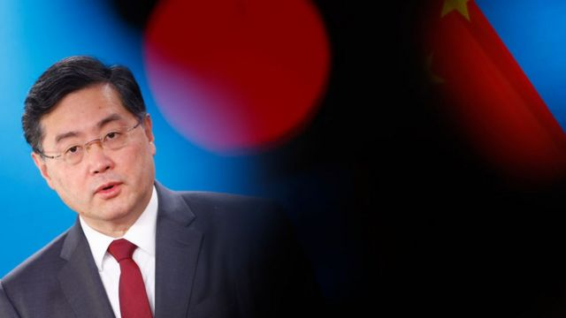
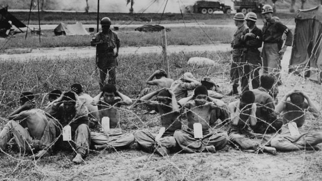

# [Press] 秦刚遭免职、福岛核废水争议、韩朝停战70周年和本周更多故事

#  秦刚遭免职、福岛核废水争议、韩朝停战70周年和本周更多重要故事

> 图像来源，  Getty Images

**2023年7月第4个星期，经历了混乱而戏剧化的等待，中国人大常委会在7月25日正式宣布秦刚被免去外长职务。秦刚突然消失在公众视野引发了全球关注。秦刚的外长生涯正式终结，但他的行踪仍是个谜。**

此外，日本福岛核废水排放，在联合国国际原子能机构（IAEA）及欧盟都正式表示安全性无虞后，仍持续引发日本邻国，特别是中国的强烈反弹。此外，70年前的7月27日，韩朝停战，当初被美韩联军俘虏的中国志愿军士兵，许多人前往了台湾，70年后，他们已经迈入90岁高龄，回顾当年的选择以及战争的残酷，带给我们什么反思？

在香港，一年一度的国际书展，笼罩在《港区国安法》的压力下，来逛书展的读者，心中有什么样的想法？

最后，中国东北部齐齐哈尔市一所中学的体育馆屋顶周日（7月23日）发生坍塌，目前已导致11人死亡。媒体报道称，遇难者均为该校女子排球队的学生，事发时该排球队正在体育馆内训练。

刚刚过去的一周，BBC中文以下新闻内容受到读者的关注。如果你错过了，我们带你一一回顾。

##  1\. 秦刚：中国外长仕途大起大落，背后有何政治意涵

> 图像来源，  Getty Images
>
> 图像加注文字，2022年5月，时任中国驻美大使秦刚在德克萨斯州。

中国前外长秦刚的仕途在短时间内大起大落，令人质疑中国高层到底发生了什么，又将如何影响中国未来的内政和外交。

中国全国人大常委会周二（7月25日）召开会议，宣布免去秦刚外交部长一职，重新任命王毅为外交部长。此时距离秦刚上任外长仅半年多，他被免职的原因没有说明。

有分析人士认为，秦刚事件凸显出中国政治的不透明，并且损害了中国的形象。

##  2\. 福岛核灾废水与核电厂废水哪个更可怕？

日本宣布最快将于今年8月开始排放福岛核电站事故后产生的“核废水”到大海。这一做法虽然得到国际原子能机构的认可，但在周边地区包括中国大陆、香港、台湾和韩国等地引来不少反对声音。

香港政府宣称，一旦日本排放福岛核废水，将禁止进口日本10个都县的水产，此举无疑将影响香港超过4000间的日本料理店。

##  3\. 韩朝停战70周年： 从“人民志愿军”到“反共义士”，在台中国战俘的故事

> 图像来源，  Getty Images
>
> 图像加注文字，1950年代的战争给朝鲜半岛留下巨大的惨痛和破坏

韩朝停火70周年前夕， 两位定居台北的前中国战俘接受了BBC中文的访问，讲述了当年的战俘生活， 如何沦落为国际战俘政治中的棋子，又是如何被塑造为当时国民党当局反共宣传“义士”，以及70年来人生足迹发生的种种改变。

##  4\. 观察：2023香港书展里的下架书、敏感书与新主流

> 图像加注文字，读者麦先生购入三本香港文化书籍，分别是《香港散步学》、《记住香港老美》和《香港巨大化动物vol.1》。

香港书展在7月25日落下帷幕，一年一度酷暑下的大型活动，让湾仔会展再度热闹起来。

今届是疫情通关后的首次，主办单位香港贸易发展局表示，一连七天展期有近百万人入场，其中一成是旅客。

但是，《港区国安法》实施三年以来，有读者认为香港书展越趋“和谐”。一名年年逛书展的50岁读者黄女士表示感受到明显变化，她说以前一进场就会看到政治讽刺漫画，如今不复存在。

##  5\. 中国齐齐哈尔一中学体育馆坍塌 11名死者包括女排队员

中国东北部齐齐哈尔市一座中学的体育馆屋顶周日（7月23日）发生坍塌，目前已导致11人死亡。据官方媒体报道，这座体育馆位于齐齐哈尔市第三十四中学内。

官方尚未公布死者的具体身份，但有媒体报道称，遇难者均为该校女子排球队的学生，事发时该排球队正在体育馆内训练。

广为流传的一段视频显示，有遇难者家长质疑，当局在事发后并未及时向家长告知孩子的情况，而是派出大量警察和官员到现场维稳。

