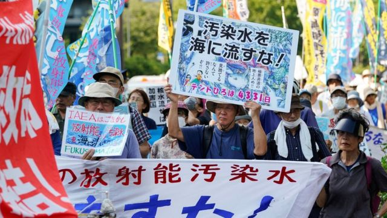
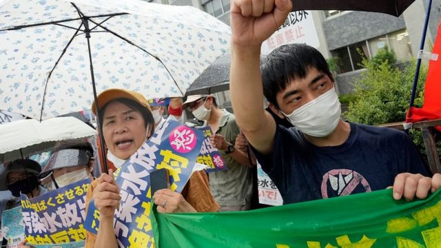
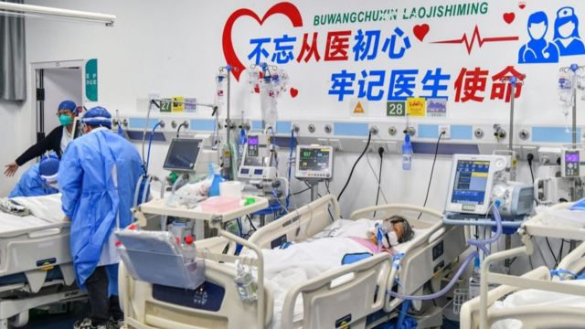
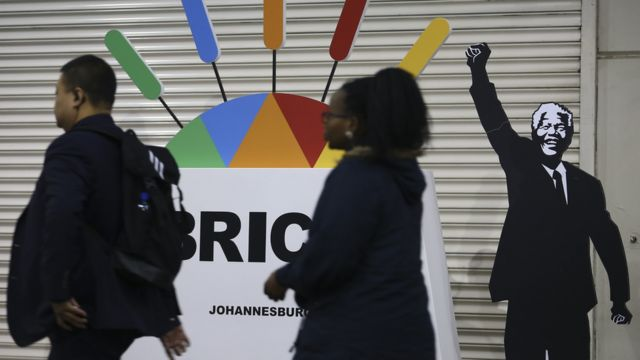
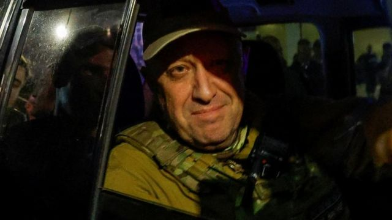
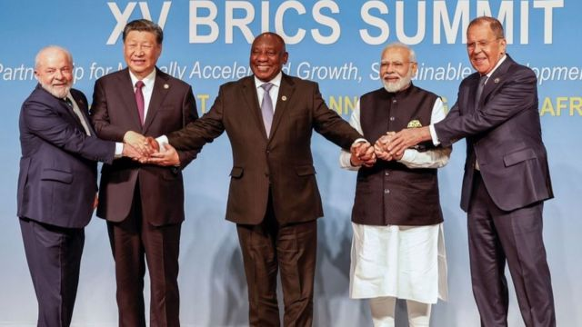

# [Press] 福岛核废水排放、金砖峰会、中国医疗反腐等本周更多重要故事

#  福岛核废水排放、金砖峰会、中国医疗反腐等本周更多重要故事

> 图像来源，  EPA
>
> 图像加注文字，福岛核废水排放问题牵扯着中日关系神经，在日本民间也引起莫大反弹。

**八月第四周，日本决定将处理后的福岛核电站放射性污水排入太平洋，掀起巨大争议。**

在中国，医疗领域刮起“反腐风暴”——7月底，中国卫健委联合公安部、审计署、药监局等10个部门，开展全国范围内医药行业腐败问题的全领域、全链条、全覆盖的集中整治，为期一年。

国际上，由巴西、俄罗斯、印度、中国和南非五国组成的金砖国家集团领导人在约翰内斯堡举行会议，会议的一个关键议题是——是否接纳新成员。

刚刚过去的一周，BBC中文有以下新闻内容受到读者的关注。如果你错过了，带你一一回顾。

##  1\. 日本福岛核电站开始排放核废水

> 图像来源，  EPA
>
> 图像加注文字，示威者周二在东京的日本首相府外抗议，要求政府放弃排放核废水。

在邻国的反对声中，日本仍决定从周四（8月24日）起将处理后的福岛核电站放射性污水排入太平洋，预计将在30年内持续排放。

自2011年海啸破坏福岛第一核电站以来，该地已经积累了134万吨废水，足以装满500座奥林匹克标准游泳池。

国际原子能机构（IAEA）今年7月对该排放计划开绿灯，指其符合国际安全标准。

日本首相岸田文雄在周二（22日）在内阁会议后表示，如果天气和海况适宜，当局将要求核电站运营商“迅速准备”在8月24日开始进行排水。

##  2\. 医疗腐败：中国医生和医药代表看反腐风暴 “不改不行”的医疗系统该怎么改

> 图像来源，  Getty Image
>
> 图像加注文字，研究显示，中国医疗腐败中，超过25.5%的腐败来自医疗器械领域，23%来自药品，耗材占6.2%，涉及两种以上的腐败则占35%。

中国医疗领域刮起“反腐风暴”——7月底，中国卫健委联合公安部、审计署、药监局等10个部门，开展全国范围内医药行业腐败问题的全领域、全链条、全覆盖的集中整治，为期一年。

进入8月，反腐力度不断加码。公开报道显示今年以来中国已经至少有174位医院院长、党委书记被查，已经超过去年两倍。

不仅在医院端，反腐也深入到医药企业，7月就有两位医药领域的上市公司董事长被立案调查，包括卫宁健康的董事长周炜和赛伦生物的董事长范志和。

中国医疗领域为何会形成大面积腐败？从业人士的现状如何？更重要的是，未来如何建立更清廉、高效的医疗体系？

##  3\. 金砖国家集团：这是什么组织，为何有40多个国家想加入？

> 图像来源，  Getty Images
>
> 图像加注文字，印有曼德拉头像的金砖峰会广告。

由巴西、俄罗斯、印度、中国和南非五国组成的金砖国家集团领导人8月22至24日在约翰内斯堡举行会议，会议的一个关键议题是——是否接纳新成员。

此次峰会的东道国南非表示，现在有40个或更多国家希望加入该集团。

##  4\. 瓦格纳首领普里戈津据报坠机死亡 有分析将矛头指向普京

> 图像来源，  Reuters
>
> 图像加注文字，瓦格纳集团（Wagner）首领普里戈津（Yevgeny Prigozhin）

一架据报载有瓦格纳集团（Wagner）首领普里戈津（Yevgeny Prigozhin）在内的私人飞机，8月23日傍晚在俄罗斯首都莫斯科以北的特维尔地区（Tver Region）坠毁，机上10人全部罹难。

克里姆林宫尚未证实普里戈津已死亡，但与瓦格纳有关的Telegram频道“灰色地带”（Grey Zone）已宣布普里戈津的死讯。

普里戈津曾是俄罗斯总统普京多年的亲信，其雇佣兵组织在2022年2月俄军全面入侵乌克兰后发挥关键作用。但普里戈津今年6月23日发动兵变进逼莫斯科，事败后与普京关系破裂。

##  5\. 金砖峰会：14年后再扩容 中国要打造自己的“G7”吗？

> 图像来源，  Getty Image
>
> 图像加注文字，金砖五国在经济、政治、战略利益上差异巨大。

全球各种国家间的俱乐部中，从七国集团（G7）、二十国集团（G20）到亚太经合组织（APEC），以及非盟、阿盟等，没有那个俱乐部的出勤率比得上金砖五国（BRICS）。过去14年的峰会中，没有哪个首脑缺席，即便疫情中也坚持视频连线。

而今年在南非举行的第十五次峰会（8月22日-24日）俄罗斯总统普京缺席了。

背后的原因不难理解，南非是《国际刑事法院罗马规约》的签署国，而该法庭发布对普京的逮捕令。如果他现身约翰内斯堡，南非就有义务逮捕他，然后送到海牙国际法庭接受审判。如果普京真去了，一向寻求不结盟的东道主南非会极其难受，甚至被这个问题逼得选边站队。

超高的出勤率，展示出成员国对于这个平台的重视；首次有人缺席，则折射出国际环境变迁中，金砖集团的面临的政治张力。在这种张力之下，本次会议有两点特殊之处：疫情后该组织第一次线下峰会；就金砖集团扩容达成共识。

