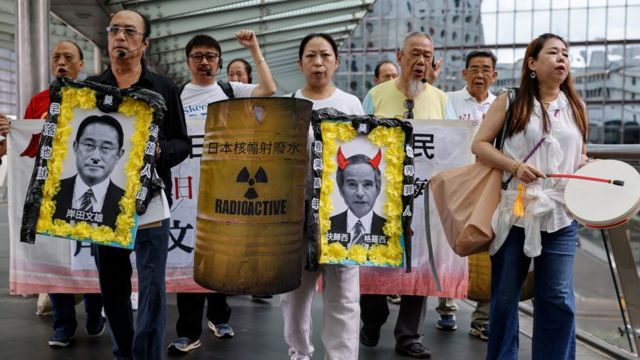
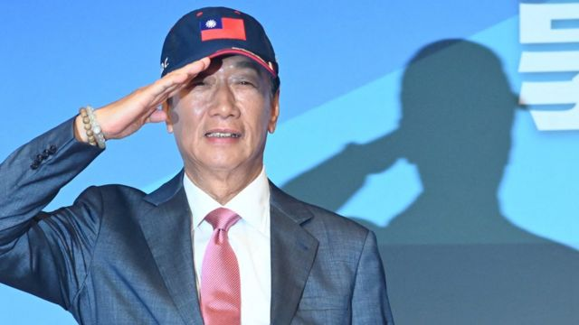
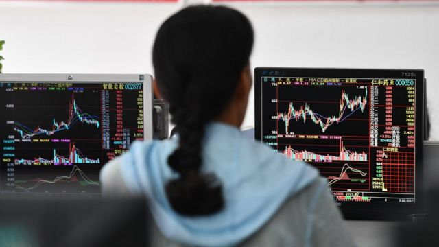
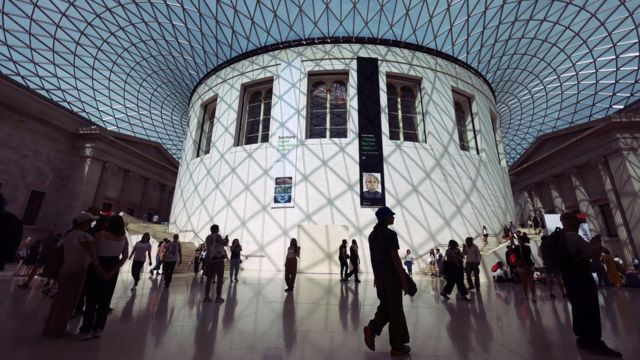
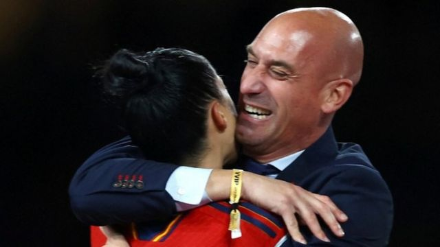

# [Press] 中国抗议福岛核处理水排放、郭台铭参选、中国救市和本周更多重要故事

#  中国抗议福岛核处理水排放、郭台铭参选、中国救市和本周更多重要故事

> 图像来源，  Reuters

**日本福岛第一核电站排放核处理水工作后的一周，日中两国因国民受滋扰互相指责对方。**

在相对平静的台湾，又一位备受关注的潜在参选人正式出征来届总统大选——电子业富商郭台铭加入选战，受关注。

中国股市低迷，政府部门相继开出猛药，也给房地产市场“进补”一下。

刚刚过去的一周，BBC中文以上新闻内容受到读者的关注。如果你错过了它们，我们带你一一回顾。

##  1\. 福岛核废水排放下中国民众暴怒与惊恐——北京“项庄舞剑”？

中日双方就福岛第一核电站经处理核废水排放问题互提外交抗议。日方同时表示，日本企业和机构接到大量关于福岛核电站排放核污染水的恶意来电，区码显示有关电话自中来国，其中福岛一家连锁餐厅接到超过1000个骚扰电话。

自排放开始以来，日本当局每天发放检测报告，称福岛第一核电站周边水域的核辐射量低于可检测水平。中国驻日大使吴江浩称，日方该先“正视现实，反躬自省，立即停止排海”，并称中国使馆受到了日方电话骚扰。

中国是日本海产品的主要买家。针对福岛核废水排放，北京宣布，出于对消费者健康的担忧，决定对日本海产品实施全面禁令。之后，东京呼吁北京取消这一“非基于科学的”举措。

“主要原因并不是安全问题，”国际贸易法专家高树超（Henry Gao）告诉BBC。“这主要是由于日本针对中国的举措。”他指出，近年来日本与美国和韩国的关系更加紧密。

##  2\. 鸿海富士康创始人郭台铭成台湾总统选举独立参选人

> 图像来源，  AFP
>
> 图像加注文字，郭台铭宣称总统人选“舍我其谁”。

距离台湾总统选举不到半年之际，72岁的知名电子产品代工商鸿海—富士康创办人郭台铭星期一（8月28日）在台北宣布以独立参选人身份加入宣战。

大选由此进入“四脚督”局面，即在野蓝白陣營的中国国民党参选人侯友宜、民众党参选人柯文哲、无党籍的郭台铭三人，挑战绿营的执政民进党参选人、现任副总统赖清德一人。

郭台铭称自己参选是为了扮演主导角色推动蓝白在野阵营整合，称“在野不整合，便宜賴清德”。但此举已造成泛蓝阵营进一步分裂，国民党批评郭台铭没有诚信，警告党内人士若替郭助选将有涉党纪会严肃处理。

多名政治学者向BBC中文分析，若郭台铭执意参选，只会让民进党参选人赖清德“躺赢”，对北京而言也並不乐见。

##  3\. 印花税减半、“认房不认贷”——中国政府下猛药提振股市、楼市

> 图像来源，  SOPA Images/LightRocket via Getty Images
>
> 图像加注文字，星期一中国股市早盘涨幅仅仅维持10分钟后开始回落。

上周末，中国政府接连发布多项刺激股市措施：证券交易印花税减半征收，收紧IPO（首次公开募股），限制实控股东减持，限制上市公司募资投向等。

此外，针对楼市，中国住建部通知称，允许“认房不认贷”，放松了限购政策。

这些措施都指向一个目的，给股市打“强心针”——今年上半年，中国在疫情防控放开后，股市一路走高，到5月初上探到3400多点，此后随着经济中出现的各种问题，信心下滑，股市也一路走低，8月21日下探到3074点，几乎与十年前持平。

##  4\. 《环球时报》要求大英博物馆退还文物“迎接”英国外相访华

> 图像来源，  EPA
>
> 图像加注文字，大英博物馆有不少文物与欧洲对外殖民扩张时期相关。

大英博物馆近日传出有2000件藏品遭职员监守自盗，博物馆馆长辞职下台之际，中共喉舌《人民日报》旗下小报《环球时报》发表社论公开要求英国返还博物馆的中国文物，并称引起网上广泛讨论。

《环时》形容大英博物馆为“全球最大的‘赃物接收者’”，并称声援全球其他国家提出同样声请。该报更进一步发表漫画，讥讽大英博物馆“贼喊捉贼”。有近270年历史的大英博物馆迄今并未回覆BBC的置评要求。

这起争议刚好发生在英国外交大臣詹姆斯·克莱弗利（James Cleverly；祁湛明）访华之际。星期三（8月30日）凌晨抵达北京的克莱弗利是五年来首位访问中国的英国外相。

目前中英关系因中资投资英国敏感行业受阻，围绕香港与新疆人权问题的争议，以及参与在北京眼中，以美国为首的“五眼联盟”等围堵中国行动，正陷于低谷。克莱弗利此行希望修补双边关系，而大英博物馆的中国文物似乎成为了新的烦恼。

##  5\. 女足世界杯2023：西班牙凯旋缘何变成#MeToo时刻？

> 图像来源，  Reuters
>
> 图像加注文字，鲁维亚莱斯在颁奖台上的举动成为争议风暴中心。

女足世界杯（FIFA Women's World Cup）冠军领奖台上一个似乎是强行发生的亲吻，和其后引发的广泛反响，在过去一周已经蔓延成为撼动西班牙体育界乃至全社会的事件——西班牙政府官员指，这应该成为这个国家的“MeToo”时刻。

8月20日，在西班牙夺得女足世界杯冠军并接受颁奖的光荣一刻，西班牙足协主席路易斯·鲁维亚莱斯（Luis Rubiales，卢比亚利斯）在颁奖台上疑似强行亲吻一名球员的嘴唇。

事件当事人、33岁的球员珍妮·埃尔莫索（Jenni Hermoso，艾莫素）在之后公开表示，那次亲吻并非她自愿。

此外，还有人批评鲁维亚莱斯在现场庆祝胜利时，站在西班牙王后的身旁抓摸自己的胯部。

