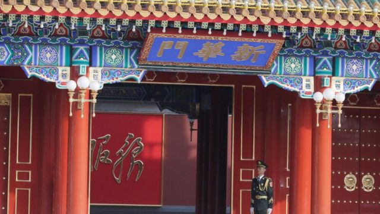
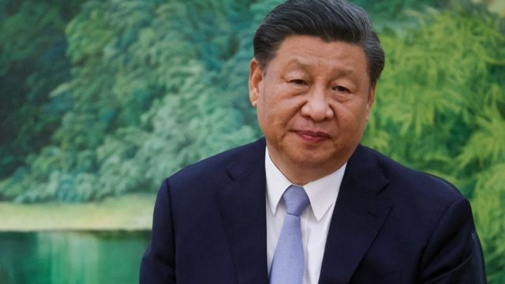
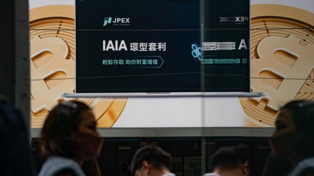
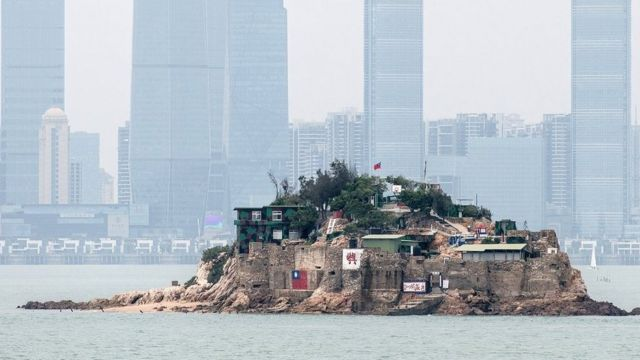

# [Press] 中国防长下落、网红李佳琦、港台加密币风波和本周更多重要故事

#  中国防长下落、网红李佳琦、港台加密币风波和本周更多重要故事

> 图像来源，  Reuters

**中国国防部长李尚福久未露面，在过去一周继续受到关注。这是否意味着中国领导人习近平遇到了管治困难？**

网红李佳琦质疑直播观众，因观众认为他推销的产品昂贵是因为工作不努力。李佳琦的质疑惹怒了万千网民。这场失言风波意外折射出当前中国经济面目，又是本周一大焦点。

同样跟网红有关系的还有香港虚拟货币交易平台JPEX诈骗疑云，报案受害人超过2000，涉案金额十多亿港元，被捕人士中至少包括三名网红。台湾也有人宣称为受害人，但损失总额仍待统计。

刚刚过去的一周，BBC中文以上新闻内容受到读者的关注。如果你错过了它们，我们带你一一回顾。

##  1\. 中国军方高层下落成疑 习近平大权在握还是出了状况？

> 图像来源，  Reuters
>
> 图像加注文字，手握中共兵权的习近平是否在整肃军队，受到外界关注。

他们曾受到习近平的信任和青睐。现在，他们似乎正在消失。

近几个月来，中国多位高级官员的“失踪”引发了外界的强烈猜测：领导人习近平是否正在展开一场大清洗，尤其是与军队有关的人士。

最近一名似乎“落马”的官员是国防部长李尚福，他已经有几周没有在公开场合露面了。

虽然他的缺席起初并未被视为不寻常的讯号，但当一位美国高级外交官指出这一点时，人们开始关注这一迹象。路透社随后报道称，曾负责监督中国人民解放军武器采购的李尚福正因装备采购问题接受调查。

现在又有新的传言称，解放军的领导机构——中央军委的一些干部也正在接受调查。

除了“健康原因”之外，官方几乎没有对这些免职做出任何解释。在信息真空状态下，各种猜测层出不穷。主要猜测是当局正在打击解放军中的腐败现象。

##  2\. 网红李佳琦一言得失中国网民如何折射出经济现实？

> 图像来源，  Getty Images
>
> 图像加注文字，李佳琦被称为“带货一哥”。

“有时候要找找自己的原因，这么多年工资涨没涨？有没有认真工作？”

上周末，被称为中国直播“带货一哥”的李佳琦说出这句话。他当时推销一款售价79元人民币的国产品牌花西子眉笔，有观众留言评论称该品牌越来越贵，李佳琦随即出言反驳。

他的言论登上微博热搜并惹怒网民，有人留言表示“你挣着普通人的钱，到头来嘲笑普通人贫穷”，“年轻人躺平摆烂不是因为不想努力不想挣钱，而是没有机会”，“什么都在涨，唯独工资三年不涨反而降，是怪我们没努力工作吗？”

一夜间，李佳琦掉粉百万。这场网络风波意外地折射了中国经济下行和青年失业的困境。

##  3\. 涉款十余亿港元 JPEX加密货币交易所诈骗疑云震撼港台

> 图像来源，  Getty Images
>
> 图像加注文字，JPEX在香港发动了铺天盖地的户外广告宣传攻势。

香港加密货币交易平台绿石交易所（JPEX）因有存户无法“出金”提取存款，引发证券监管部门与警察循“串谋诈骗”方向联合调查。

香港执法部门先后拘捕11名犯罪嫌疑人，当中至少三人为网络红人（KOL）。连日来报案人数持续增加。中国香港警察公布，截至星期五（9月22日）傍晚，共有2265人报案表示受害，涉及金额14亿港元（1.79亿美元；13.07亿元人民币；57.5亿元新台币）。一名替该交易所代言的台湾网红表示愿意配合调查。

证券监管部门公开表明JPEX并无准照，但JPEX反指香港特区政府有关部门“诽谤”，并宣称将“坚定不移地继续营运”。

数字经济评论人士对BBC中文指出，执法部门现有搜查手段恐难以阻止不法虚拟金融平台运作，既有法律法规也难以保障储户免受损失。

##  4\. 杭州亚运会——新冠疫情拖延一年后开幕在即

在因为新冠病毒病（COVID-19）全球大流行而延期一年后，杭州亚运会定于星期六（23日）开幕。

这是仅次于奥运会的世界第二大综合性运动会，1.25万名运动员参赛选手代表的45个国家和地区涵盖世界60%的人口，以及在种族和文化上极尽多元的社群。

除了全人类普及的游泳、田径、球类等等传统奥林匹克项目之外，具有亚洲文化色彩的武术、象棋、藤球、卡巴迪等则成为亚运会特有的竞技项目。

此外，电子竞技和霹雳舞还在本届亚运会上首次成为国际综合性运动会的奖牌项目。

##  5\. 选举临近台海两岸再度过招：经济示范区与国防报告书

> 图像来源，  Getty Images
>
> 图像加注文字，狮屿——台湾福建省金门县离岛。岛上插有中华民国国旗，对面高楼大厦是中国大陆福建省厦门市。

距离台湾选出下一届总统还有四个月，中共统战系统与台湾国防体系各有动作。

中国国务院颁布新的统战政策文件，宣布以福建作为“示范区”，强调以厦门及福州为基地，分别与台湾金门、马祖两岛接轨。中国国家发改委官员更称要“争取早日实现两岸民众坐着高铁轻松跨过台湾海峡的梦想”。

台湾国防部公布两年一度的《国防报告书》，有关中国大陆军力威胁台湾的讨论篇幅比2021年增加近两倍，并特别提及，中国解放军海军计划于2025年服役的第三艘航空母舰“福建舰”成为台海防务的聚焦点。

台湾智库“国防安全研究”钟志东博士向BBC中文分析称，此次北京颁布的方案该是呼应去年习近平颁布的《台湾问题与新时代中国统一事业》统战方针，以“地方包围中央”的战略施压民进党政府。

至于台湾《国防报告书》，钟志东称，2023年的报告首次强调“纵深防卫”，“即是将防卫空间从海防边境延伸到岛内领土，强调了‘全民国防’的重要性。”

