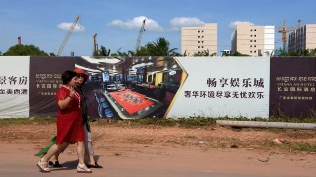
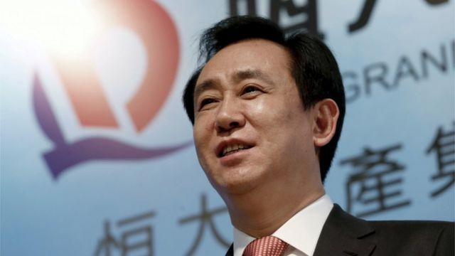
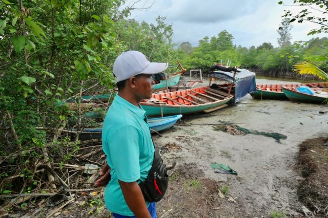
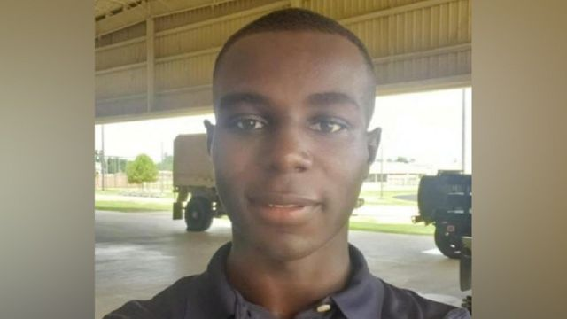
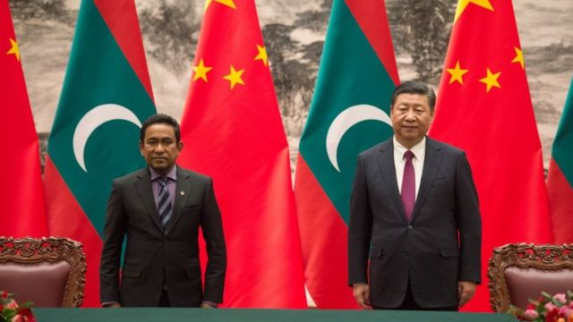
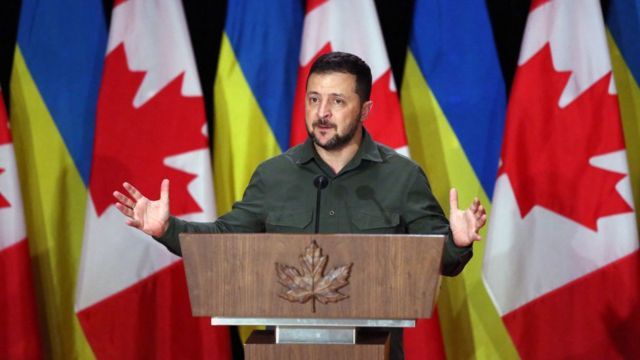

# [Press] 恒大许家印落马、非法入朝美军获释、马尔代夫大选的中国因素和本周更多重要故事

#  恒大许家印落马、非法入朝美军获释、马尔代夫大选的中国因素和本周更多重要故事

> 图像来源，  Getty Images

**9月最后一周，中国迎来中秋和国庆双节假期，但是对于房地产巨头企业恒大和其领头人许家印而言，却是可能迎来毁灭性的命运。**

许家印在一周内先是传出被监视居住，后又有正式宣告称，其因涉嫌犯罪被警方采取强制措施，意味着在试图“自救”两年后，恒大的超巨额债务以及由此牵涉的广泛问题，还是令许家印的“帝国”即将迎来悲剧性的终局。

另一方面，此前因非法闯入朝鲜境内而被扣押的美军二等兵特拉维斯·金在周三被平壤“驱逐”，回到美国。美方称这是两个多月“密集外交”的结果。

马尔代夫将迎来大选，但是这场选战背后，却是中国与印度的一次有关地区影响力的角力。

BBC曼谷分社还亲赴柬埔寨，了解当地企业在“一带一路”倡议下推行的项目，在中国经济出现危机之际将何去何从。

刚刚过去的一周，BBC中文以上新闻内容受到读者的关注。如果你错过了它们，我们带你一一回顾。

##  1\. 恒大“烂尾楼”何去何从？

延宕两年的恒大集团“爆雷”大戏，迎来高潮一幕——9月28日晚间，在香港上市的中国恒大集团发布公告称，公司董事局主席许家印因涉嫌违法犯罪，已被依法采取强制措施。与许家印一同被调查的还包括恒大的多名高管。

2020年中国逐步收紧对房地产行业的信贷政策，次年，高杠杆率运行的多家房企陷入资金链断裂的危机。而恒大的规模最大，负债2.43万亿，负债率为132.6%，已经资不抵债，陷入破产边缘的境地，并留下数百万的“烂尾楼”。

> 图像来源，  Reuters
>
> 图像加注文字，恒大总裁许家印2016年在香港参加年度财报发布会

##  2\. “一带一路”下的“中国租界”：柬埔寨七星海特区幕后的中国企业

> 图像来源，  BBC/Jonathan Head
>
> 图像加注文字，有12个村庄的居民因为七星海项目流离失所，包括索姆·缇的一家。

柬埔寨积极响应中国的“一带一路”倡议，该政策由中国国家主席习近平提出，旨在把中国建设和投资的基础设施扩展到世界各地。这当中很多是有效益的，也有很多投资显得投机、仓促和规划不当。

柬埔寨七星海特区是“一带一路”的重点项目之一，被一些人称为“中国式殖民地”，反映了洪森政权与中国政府及企业千丝万缕的利益交织。BBC记者深入当地，发现随着中国经济出现危机和资金链断裂，该项目已经近乎停滞，但对当地居民和环境的影响难以逆转。

##  3\. 美国就被扣押公民与朝鲜谈判，难度有多大？

> 图像来源，  Reuters

今年7月从韩国非法闯入朝鲜的美军二等兵特拉维斯·金（Travis King）于周三（9月27日）被平壤驱逐，现在由美国扣押。

这位23岁的侦察专员于7月非法越境，朝鲜官媒曾称，他逃离美国是因为受到“不人道对待”和种族歧视。

周三，朝鲜官方媒体称，依据该国法律对金进行驱逐出境，但未透露具体细节。

美国官员指，经过数月的“密集外交”后，金士兵已经回到美国人员手中，并与家人取得了联系，并在美国时间周三稍后抵达美国本土。

对于这场获释行动的细节和之后的影响，目前尚未清楚。BBC记者切尔西·拜利（Chelsea Bailey）对这场长达两个多月的谈判过程进行探讨解读。

##  4\. 马尔代夫大选为何成了中印角力的“战场”

> 图像来源，  Getty Images
>
> 图像加注文字，在前总统亚明（左）任内，马尔代夫与中国走得更近，并加入了习近平的“一带一路”倡议。

马尔代夫素以其原生态海滩、珊瑚礁和多样化的海洋生态著称，是你最不可能想象会展开地缘政治对抗的地方。

这个由大约1200个珊瑚岛和环礁组成的印度洋中心岛国，将于9月30日见证现任总统易卜拉欣·穆罕默德·萨利赫（Ibrahim Mohamed Solih）和反对派候选人穆罕默德·穆伊祖（Mohamed Muizzu）之间的决选。

但是，此次投票选的其实还有印度和中国。

这两个国家都试图加强自己在这个岛国当中的存在，这些岛屿地处战略位置，处在繁忙的东西方航运线上。

马尔代夫的两名总统候选人一直在上天下海地穿行在这些岛屿中间，争取选民的支持，而他们又各自代表背后两个不同的亚洲大国。

##  5\. 乌俄战争：盟友自顾不暇，乌克兰如何面对空前外交挑战

> 图像来源，  Getty Images
>
> 图像加注文字，而即将举行的波兰、斯洛伐克和美国等盟友的大选正在让情况变得更加混乱。一些候选人正在优先考虑国内问题，而忽略了对乌克兰的军事支持。

即将举行的波兰、美国等盟友的大选正在让情况变得更加混乱。一些人正在优先考虑国内问题，而忽略了对乌克兰的军事支持。

跟美国相比，加拿大的问题容易处理多了。加拿大总理贾斯汀·特鲁多已经承诺，“只要需要”就将继续支持乌克兰对抗俄罗斯的入侵，并在加国得到了跨党派的支持。

而美国能提供的援助更多，但政治情势却更复杂。泽连斯基总统刚从白宫收到新的一笔3.25亿美元军援，但这不是他一直期望的240亿美元的大款项。而且，这项军援提案在美国国会中因为预算分歧而陷入僵局。

