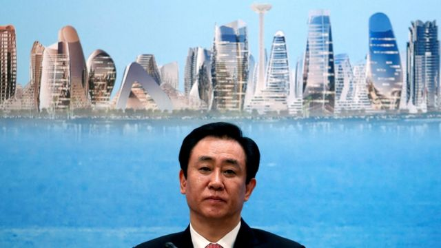
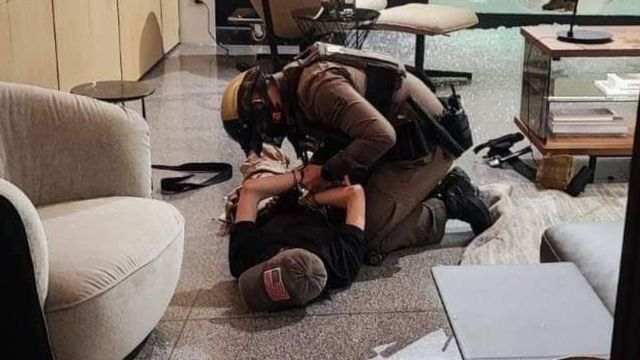
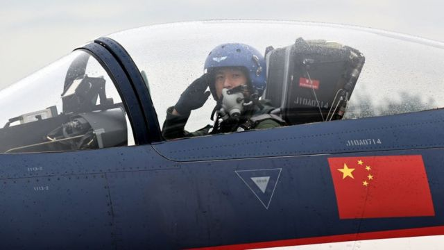
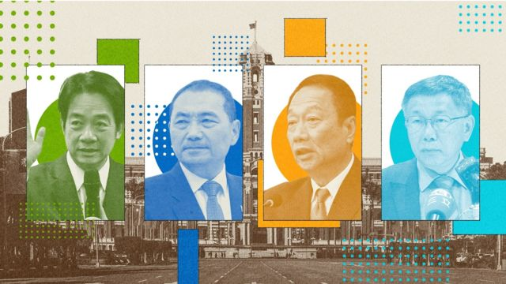
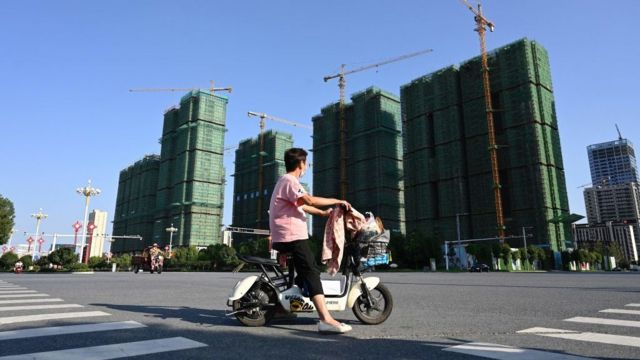
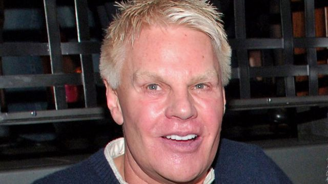

# [Press] 曼谷枪击案、台湾大选看点、恒大港交所復牌和本周更多重要故事

#  曼谷枪击案、台湾大选看点、恒大港交所復牌和本周更多重要故事

> 图像来源，  Reuters
>
> 图像加注文字，恒大总裁许家印2017年在香港出席年度财报发布会

**中国进入国庆“黄金周”假期的一星期，泰国曼谷枪击案有中国游客遇害成为本周最重大的新闻之一。當地旅游业者表示，在旅游旺季发生重大治安事件，恐直接冲击泰国旅游业复苏的节奏。**

假期内地股市停盘，但香港交易所在10月3日起已开始交易，中国恒大在港復牌，一度暴涨40%。BBC中文细看这类似暴跌之后的暴涨，对危机中的恒大是怎样的消息。

另一方面，欧洲联盟（EU）宣布正式开展对对中国进口纯电动汽车的反补贴调查，以决定是否开征反倾销关税。

今年9月中旬，103架中国解放军战机一天内飞越台海“海峡中线”，打破历史纪录。有分析指北京希望运用灰色地带战术，不发一枪而控制台湾。

台湾将于明年举行新一届大选，BBC中文带你一文看懂选举的重要资讯。

此外，BBC的调查团队还发现，美国时装品牌A&F前总裁（首席执行官）涉嫌利用组织缜密的网络招揽男子进行性爱活动。

刚刚过去的一周，BBC中文以上新闻内容受到读者的关注。如果你错过了它们，我们带你一一回顾。

##  1\. 曼谷枪击案：有中国游客伤亡，恐让旅游业“雪上加霜”

> 图像来源，  Thai police
>
> 图像加注文字，一名嫌犯被警方逮捕

周二（10月3日）在泰国曼谷市中心暹罗百丽宫（Siam Paragon）发生的枪击事件中，至截稿前已造成两人死亡，五人受伤，其中一名遇害者为中国公民。

事发地点是泰国首都最著名的购物中心之一，游客众多。

有旅游业者向BBC中文表示，在旅游旺季发生这起重大治安事件，恐直接冲击泰国旅游业复苏的节奏：“因为本来疫情结束之后，旅游业是跃跃欲试的……经历昨天的事件，我觉得会更雪上加霜”。

##  2\. 北京如何用“灰色地带”战术威胁台湾?

> 图像来源，  Getty Images

今年9月中旬，103架中国解放军战机一天内飞越台海“海峡中线”，打破历史纪录，其中有40架进入了台湾的“防空识别区”（ADIZ）。

这是中国战争游戏中的再次升级。北京一直主张拥有台湾主权，过去一年解放军的军事演习变得更具威胁性，反复演练海空包围台湾。

但北京的军事动作没有升级为入侵，而是停留在“灰色地带”（grey zone）。这个军事术语是指介于“战争与和平之间”的战术。

在美中关系不稳定的背景下，台湾成了东亚一个潜在的火药库，有分析指北京希望运用灰色地带战术，不发一枪而控制台湾。

##  3\. 台湾2024总统大选：一文看懂选举的重要资讯

台湾中央选举委员会在9月正式发布台湾第16任总统、副总统选举公告，新一届大选将于2024年1月13日投票。

委员会 预估此次大选合资格的投票人数高达1950万人。BBC中文整理了这次选举当中的候选人、投票形式和规则细节等重点资讯。

##  4\. 欧盟调查中国电动车补贴：你要知道的重点

> 图像来源，  NurPhoto via Getty Images
>
> 图像加注文字，分析人士认为中资欧洲汽车品牌也有可能被欧盟反补贴调查波及。

欧洲联盟（EU）宣布正式开展对对中国进口纯电动汽车的反补贴调查，以决定是否开征反倾销关税。

欧盟委员会主席冯德莱恩（Ursula von der Leyen）早于9月提出开启有关调查。欧盟认为中国廉价电动车“泛滥”欧洲市场，对欧洲电动车行业构成威胁。

中国商务部“强烈不满”欧盟委员会的决定，并称欧盟实行贸易保护主义，有关做法有违世界贸易组织（WTO）规则。

观察人士担忧，欧盟的行动有可能引发一场欧中贸易战；中国官方媒体警告，欧盟此举“损人不利己”。

##  5\. 恒大危机：恒大復牌一度暴涨40%，“回光返照”还是“利空出尽”

> 图像来源，  Getty Images

中国内地还在过国庆节假期，股市停盘，而港交所在10月3日起已开始交易。在10月2日晚，中国恒大、恒大物业在港交所公告，已向联交所申请由10月3日上午9时正起恢复买卖公司股份。

10月3日港股开盘后，中国恒大、恒大物业强势上扬，前者一度涨超40%，后者一度涨14%。随后，两股开始震荡下跌，收盘时中国恒大涨幅仍达到28%左右，恒大物业则收盘跌3%左右。

在股市中，类似暴跌之后的暴涨，一般被认为是市场预期“利空出尽”，即当前股价之低已经充分反映所有坏消息，甚至过度反应了坏消息，那么此时入市有机会上涨，并不代表公司层面有利好消息。

##  6\. A&F时装连锁前总裁涉嫌性剥削年轻男子，BBC调查曝光细节

> 图像来源，  Getty Images
>
> 图像加注文字，A&F前总裁麦克·杰佛瑞斯面临性剥削男性的指控。

**【警告：本报道内容有描述性行为情节】**

阿贝克隆比&费奇（Abercrombie & Fitch, A&F）前任总裁（CEO；首席执行官）及其英国籍伴侣面临剥削他人指控，他们涉嫌在世界各地招揽男子到他们主持的性爱活动上去。
 BBC一项调查  发现一个组织缜密的网络，利用中介人物色年轻男性到麦克·杰佛瑞斯（Mike Jeffries）与马修·史密斯（Matthew Smith）的活动上。

八名男子告诉BBC他们参加了这些活动，部分人声称遭到剥削或虐待。

##  本周其他新聞故事：

