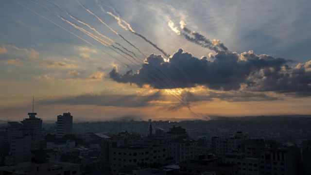
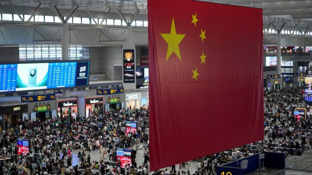
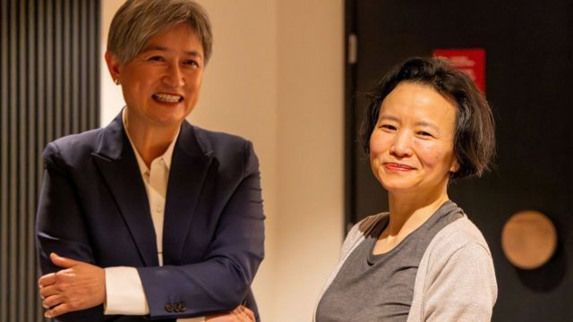
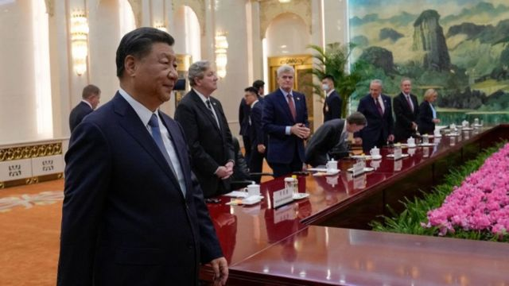

# [Press] 以巴冲突再起、中国经济、成蕾获释和本周更多重要故事

#  以巴冲突再起、中国经济、成蕾获释和本周更多重要故事

> 图像来源，  EPA
>
> 图像加注文字，哈马斯卡桑旅武装突袭以色列所造成的人命伤亡与破坏震惊国际社会。

**降落伞与火箭从天而降——就在一周前，以色列天空上的这片景象，拉开了巴勒斯坦哈马斯（Hamas）武装分支突袭以色列的序幕。**

袭击造成以色列严重人命伤亡，以色列军方发言人形容这是他们的“9·11事件”，宣布反击报复，空袭哈马斯控制的加沙地带（Gaza Strip）。

双方人命伤亡数以千计，持续多时的恩怨再写下血腥的一页。何时能看见尽头，无人知晓。

同样在这一周，被中国拘押三年多的澳大利亚华裔记者成蕾突然获释，返抵墨尔本一家团聚。中国政府首次证实起诉其间谍罪名，并以此判处有期徒刑，但案件以成蕾不提出上诉画上句号。

中国经济会否陷入“停滞的十年”？年轻人是为了避险而出走非洲吗？BBC中文本周有专题报道探讨此话题。

刚刚过去的一周，BBC中文以上新闻内容受到读者的关注。如果你错过了它们，我们带你一一回顾。

##  1\. 以巴冲突再起 哈马斯武装与以军陷入战争

巴勒斯坦哈马斯（Hamas）组织军事分支“卡桑旅”（Izz al-Din al-Qassam Brigades）10月7日清晨出动大批战斗人员潜入以色列南部地区发动突袭，并同时从加沙地带向以色列境内发射数千枚火箭弹，包括特拉维夫在内的多个城市都响起防空警报。

以色列南部超新星音乐节（Supernova）会场成为了主要攻击目标，大批青年男女被杀或被掳走。目前估计以色列各地合共至少150人被哈马斯战斗人员劫持。

以色列总理内塔尼亚胡（Benjamin Netanyahu）发布影片告诉国民“我们在战争中”，他称“敌人将付出前所未有的代价”。以军随即空袭加沙报复，国防部长加兰特（Yoav Gallant）星期一（9日）宣布“全面封锁”加沙地带，实行“不给电、不给吃、不给油”政策，供水也被中断。

以色列国防军发言人第纳尔少校（Maj Nir Dinar）称，哈马斯这次的协同袭击就像美国2001年发生的“9·11”袭击事件。另一位发言人康里克斯中校（Lt Col Jonathan Conricus）则加上二战美国遭遇的“珍珠港事件”来形容说：“这大概是‘9·11事件’跟‘珍珠港事件’合二为一。”

一周下来，以色列与加沙当局公布的死亡人数合共至少2800。

哈马斯武装为何能成功突袭以色列？此举有何用意？对世界有何影响？甚至说哈马斯到底为何存在？以色列与巴勒斯坦人为何敌对多时？这场爆发不到一周已经伤亡惨重的战争引发人们诸多疑问。

这场军事冲突的影响也波及中国，除了有中国公民伤亡外，以色列驻华使馆在社交媒体上表示有一位中以混血儿成为了哈马斯手上人质，引起了中国网络空间的密集讨论与质疑。

中国官方对待战争的立场也备受关注。北京连日强调“对冲突造成平民伤亡感到十分痛心，反对和谴责伤害平民的行为”；华盛顿政界高层不满中国并未谴责哈马斯杀害以色列平民百姓。

##  2\. 中国经济思考：会否陷入“十年停滞”？青年只能远走他乡？

> 图像来源，  Reuters
>
> 图像加注文字，疫情后中国经济会否重蹈日本泡沫经济爆破覆辙，令人忧虑。

中国会像日本一样经历经济长期停滞吗？2018年中美开打贸易战，这个问题第一次成为舆论热潮，因为日本是美国上一个贸易战对象，而后经历“失落的二十年”。

在中国经济不景气、青年失业率高企的情况下，职场竞争激烈，对于毕业于普通高校的年轻人来说更是如此。而随着中非经贸往来日益频繁，大批中资企业进驻非洲多国，越来越多大学毕业的年轻人把目光投向非洲，试图在那里找寻出路。

BBC中文本周备有专稿，分析中国经济与中国青年的前景。

##  3\. 中国释放“泄密”澳大利亚华裔记者成蕾

> 图像来源，  DFAT/AAP Images/Reuters
>
> 图像加注文字，澳大利亚外交部发放了外长黄英贤（左）在墨尔本机场迎接成蕾（右）的照片。

澳大利亚籍华裔记者成蕾被中国扣押超过三年后重获自由，星期三（11日）返抵墨尔本与家人团聚。总理阿尔巴尼斯（Anthony Albanese，又译艾巴尼斯）表示，48岁的成蕾“得到外长黄英贤（Penny Wong）在机场迎接”。

阿尔巴尼斯宣布成蕾归国的消息后，中国国家安全部发表声明，首次证实成蕾曾因“为境外非法提供国家秘密”罪被起诉，并被北京市第二中级法院判有期徒刑2年11个月，附加驱逐出境。

成蕾此前是官方英文中国环球电视网（CGTN）财经记者， 2020年8月13日被中国执法部门抓捕  ，其后在未被起诉下遭单独囚禁六个月。法院 曾于2022年3月闭门开庭  审理案件，但此后一直将其收押候判。

成蕾的处境一度成为处于低谷的中澳关系中其中一个主要僵持点。

##  4\. 蔡英文卸任台湾总统前最后一次发表“双十节”演说

台湾星期二（10日）举行“双十”国庆大会，即将于2024年5月卸任总统的蔡英文发表最后一次国庆演说。她说，和平是两岸唯一选项，愿以维持现状为核心，与北京当局发展和平共存之道。

国庆大会举行前夕，前总统马英九不满民进党政府将国庆大会英文名称写成“台湾国庆日”，不符国号中华民国，拒绝出席官方双十庆典，转而参加中国国民党另行举办的升旗活动。

中国国务院台湾事务办公室发言人陈斌华其后评论称，民进党“顽固遂行‘台独’分裂、‘倚外谋独’”，“把台湾带向兵凶战危的危险境地”，又称“赞赏马英九先生等岛内各界人士反对‘台独’的明确态度”。

##  5\. 习近平会晤美国参议院代表团释放了哪些信号？

> 图像来源，  Reuters
>
> 图像加注文字，习近平对舒默称，“修昔底德陷阱”并非必然。

10月9日，中国国家主席习近平在北京会见了美国国会参议院多数党领袖舒默（Chuck Schumer）率领的美国国会参议院两党代表团。

该代表团由六位参议员组成，民主党籍的参议员除舒默外，还有玛吉·哈桑（Maggie Hassan）和乔恩·奥索夫（Jon Ossoff），以及共和党籍的迈克·克拉波（Mike Crapo）、比尔·卡西迪（Bill Cassidy）和约翰·肯尼迪（John Kennedy）。

这是将近四年来，首次有来自美国国会的代表团访问中国。今年以来，美国国务卿布林肯（Antony Blinken）、财长耶伦（Janet Yellen），以及总统气候问题特使克里（John Kerry）、美国商务部长雷蒙多（Gina Raimondo）。

外界认为密集的来访是为下一次“习拜会”铺路。在上述代表团抵达中国当天，美国总统拜登表示，在11月于旧金山举行的亚太经济合作会议（APEC）期间他与习近平会面是“有可能的”，但尚未敲定。

##  本周其他重要故事：

