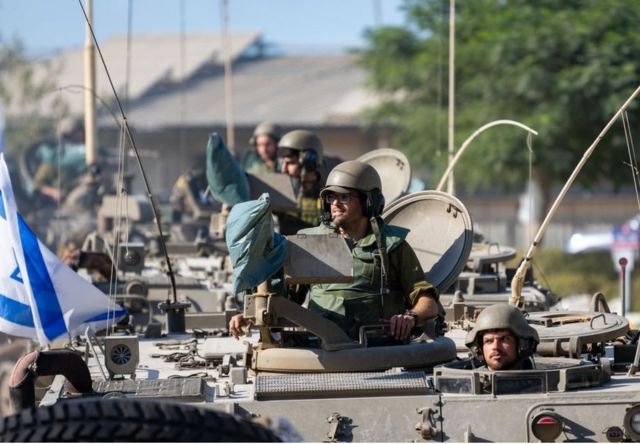
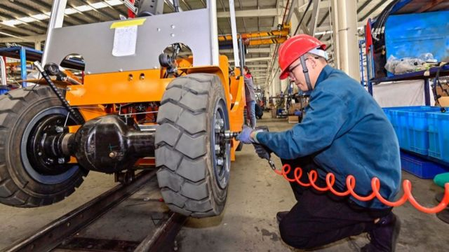
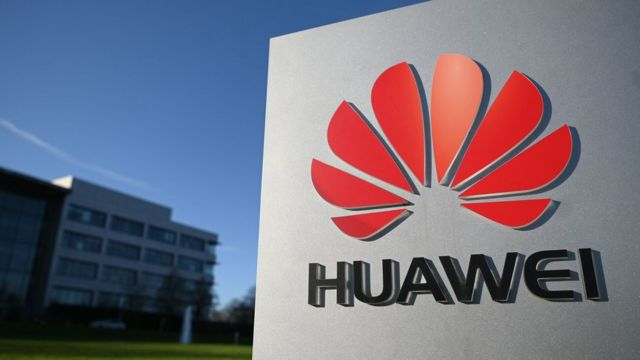
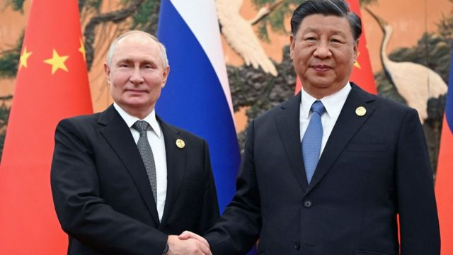
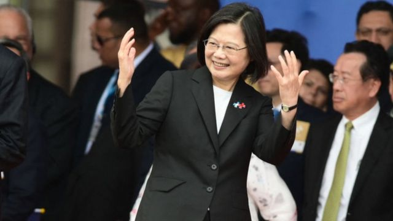

# [Press] 以巴冲突、“一带一路”论坛、台湾半导体前景和本周更多重要故事

#  以巴冲突、“一带一路”论坛、台湾半导体前景和本周更多重要故事

> 图像来源，  MOHAMMED SABER/EPA-EFE
>
> 图像加注文字，加沙的阿赫利医院（Al-Ahli Hospital）爆炸，导致数百平民丧生。

**过去的一周，越演越烈的以巴冲突持续占据全球新闻头条。**

加沙地带遭受连日轰炸，包括医院也受到袭击，大量平民伤亡。美国总统拜登在此危急情势下访问以色列，表态支持，中国则首度向以色列表示批评。同时，预告多时的以军地面进攻加沙一直未有实际发生，BBC分析了当中的缘由。

另一方面，中国在这一周召开第三届“一带一路”论坛，与会者包括俄罗斯总统普京和联合国秘书长古特雷斯等人。习近平与普京会晤，两人在俄乌战争和以巴冲突的背景下表达自己的立场。

同样在这一周，中国公布第三季度经济数据，这一季度GDP同比增长4.9%，超过市场预期。

美中半导体竞逐升温之际，未来台湾厂商合作的对象是美国还是中国，涉入的程度有多深，都要被高度检视，无法躲开区域政治。BBC中文对此有详细分析。

此外，BBC记者还对蔡英文即将卸任之际，“民主台湾”如何继续寻找盟友作了观察和分析。

刚刚过去的一周，BBC中文以上新闻内容受到读者的关注。如果你错过了它们，我们带你一一回顾。

##  1\. 以色列步伐突然放缓，攻入加沙前有何盘算

> 图像来源，  Getty Images
>
> 图像加注文字，数十万以色列国防军预备役人员已被征召，为地面攻入加沙做准备。

在哈马斯武装分子10月7日袭击以色列南部后，以色列连日来多次发出信号，称其集结的部队已做好攻入加沙的准备，以一劳永逸地消灭哈马斯。

以色列空军和海军一直猛攻加沙的每一处疑似哈马斯和巴勒斯坦伊斯兰圣战组织的藏身地点和武器库，在此过程中造成大量平民和少数哈马斯指挥官伤亡。

但是近两个星期以来，以军仍未如其预告的那样对加沙采取地面行动，这是为什么呢？BBC记者分析了这当中可能的几个因素。

此外，本周还有更多关于以巴冲突的报道：

##  2\. 中国前三季度经济超预期增长，但地产风险犹存

> 图像来源，  Getty Image
>
> 图像加注文字，专家预计中国今年完成全年经济增长目标问题不大。

10月18日上午，中国国家统计局公布了三季度GDP同比增长4.9%，超过市场预期。 有分析将其主要归功于服务业的快速复苏。

中国媒体财新此前进行的调查中，预测均值为4.5%；路透社的预测均值为4.4%。

二季度GDP增幅6.3%，三季度GDP增幅4.9%，看起来三季度增幅下降了，其实背后有基数效应的影响。中国国家统计局副局长盛来运称，四季度GDP只要同比增长4.4%以上，就可以实现全年GDP增长5%左右的目标。

##  3\. 晶片大战：台湾厂商助攻华为突破美国封锁？

> 图像来源，  AFP
>
> 图像加注文字，在美中晶片大战越演越烈的背景下，即便台厂未碰触到美国半导体禁令红线，但政治上的红线，就在脚边。

美中晶片大战越演越烈，台湾一向被视为“美国队”的重要成员，但本月初传出有台厂协助中国电子巨擘华为在广东深圳兴建晶片厂，消息在台湾政坛及科技界“卷起千堆雪”。

彭博社日前在调查报道中点名四家台湾厂商，质疑美国对中国半导体封锁的“破口”有可能就是台湾。四家厂商随即发声明称，业务未直接接触到半导体关键制程，一切合乎台湾法令。

此前，华为今年九月在美国重重围堵之下，无预警发售7奈米5G智慧型手机，引发白宫制裁中国高科技发展是否失灵之激辩。陷入尴尬的美国政府随后宣布，再次展开“地毯式搜查”华为在全球布局的产业链。

有分析认为，台湾厂商即便未违反美国半导体禁令，但在美中贸易大战的背景下，恐怕已经触及了美国敏感的神经。

##  4\. “一带一路”论坛：习近平会晤“老朋友”，普京称“共同威胁只会加强中俄关系”

> 图像来源，  AFP
>
> 图像加注文字，习近平感谢“老朋友”普京对“一带一路”倡议的支持。

星期三（10月18日），中国国家主席习近平与来华参加第三届“一带一路”国际合作高峰论坛的俄罗斯总统普京（Vladimir Putin）会晤，习近平称中国愿与俄国“维护国际公平正义”，普京称两国面对共同外部威胁，而这只会加强彼此关系。

这是普京下令军事入侵乌克兰，并被国际刑事法院 以战争罪罪嫌下达拘捕令  以来，首次访问中国。中国并非《国际刑事法院罗马规约》缔约国，该法院通缉令在中国无法执行。

两国元首在会晤前先后在“一带一路”论坛开幕式上发言，习近平不点名批评美国等西方国家称，中国“反对单边制裁，反对经济胁迫，也反对‘脱钩断链’”。普京称“一带一路”倡议与俄罗斯关于形成大欧亚空间的理念相契合，又邀请世界各国参与穿越北冰洋的北方海路开发。

据路透社报道，一些参与开幕式的西方国家代表在普京发言前离场，当中包括法国前总理拉法兰（Jean-Pierre Raffarin）。

出席此次高峰论坛的130多国代表主要来自非洲、南亚与拉丁美洲。

**更多关于“一带一路”倡议的最新报道：**

##  5\. 忧虑而孤独的台湾正在寻找新盟友

> 图像来源，  Getty Images
>
> 图像加注文字，台湾总统蔡英文将于明年下台，届时台湾将选出新领导人。

在今年台湾“双十”国庆庆祝活动中，“民主”一词出现的次数远超过以往任何一年。

“民主台湾”已经成为台湾的品牌——它向世界宣扬这个拥有2300万人口的自治岛屿为何重要，以及为何应该保护它免受中国吞并。然而，对于这个8000亿美元的晶片制造巨擘来说，与台湾有官方联系的外国朋友却寥寥无几。

台北曾与美国结成军事同盟，并在联合国安理会占有一席之地。它作为一个反共独裁政权，可以依靠从首尔到圣多明各、从比勒陀利亚到巴拿马城的志同道合的政权的支持。

现在，这些冷战时期的朋友几乎都不在了。台湾面临的威胁比以往任何时候都更加严峻，台北迫切需要新的盟友。

##  本周其他重要报道：

