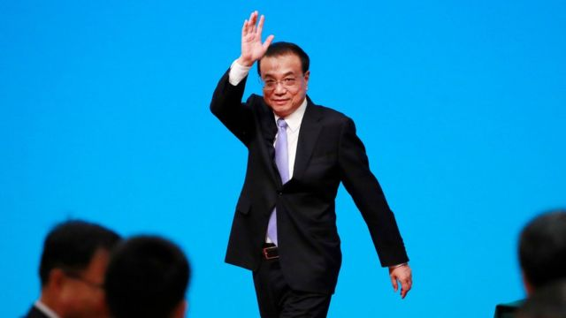
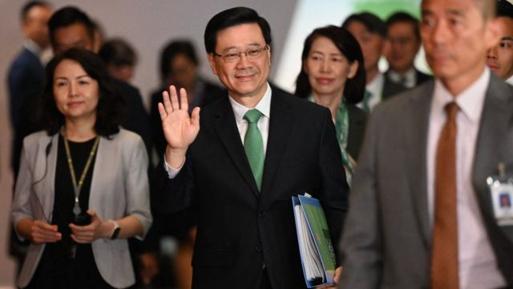
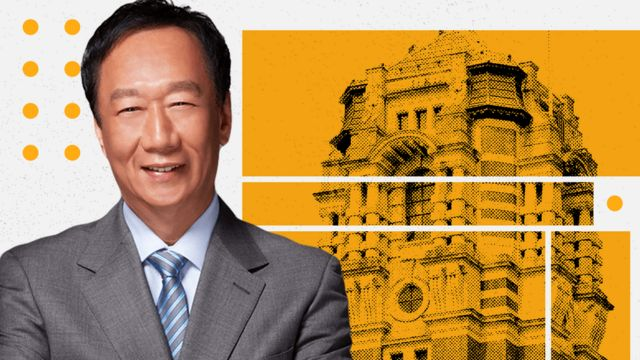

# [Press] 李克强逝世、香港施政报告、富士康遭税务调查和本周更多重要故事

#  李克强逝世、香港施政报告、富士康遭税务调查和本周更多重要故事

> 图像来源，  EPA
>
> 图像加注文字，李克强在卸任总理七个月后病逝。

**过去一周，中共高层的突发消息占据新闻头条。**

先是在公众视线中消失两个月的国防部长李尚福宣告被罢免，连同此前的外交部长秦刚，中国高层官员接连在毫无解释的疑云下遭免职。

在周五，中国官方媒体报道，前国务院总理李克强在上海休息期间因突发心脏病猝逝，终年68岁。

较早前，香港特首李家超发表任内第二份施政报告，将维护国安政策放在首位，确认将在2024年内完成备受争议的《基本法》第23条立法。

在南海，菲律宾与中国在争议岛礁对峙数十年，但近月事情有了变化。菲律宾记者数周来第二次，在第二汤马仕岛礁附近拍摄到两国船只近距离“相撞”的画面。

在台湾，以独立身份参选台湾总统的郭台铭所创办的鸿海富士康集团，在中国多地受到税务和土地使用调查，引发广泛关注。

刚刚过去的一周，BBC中文以上新闻内容受到读者的关注。如果你错过了它们，我们带你一一回顾。

##  1\. 中国前国务院总理李克强逝世，终年68岁

官方新华社与中国中央电视台报道，李克强星期四（10月26日）晚在上海突发心脏病，经全力抢救无效，于星期五（27日）北京时间00:10逝世，终年68岁。

李克强的逝世事出突然，引发各种揣测和解读。消息公布不到两小时，微博已开始过滤有关评论，目前搜索“李克强”只能看到官方媒体的报道。

李克强被视为作风务实的经济自由主义者，上任初期外界期待他改革中国经济结构。但随着习近平不断巩固权力，其总理生涯后期被边缘化，权力被架空，甚至有“最弱势总理”之称。

有学者表示，拥有经济学博士的李克强体现一种“专家治国”的理念，但是他推出的一些政策往往遇到阻力，可能显示他受到掣肘，而他的逝世或令中共党内温和改革派的声音被削弱。

##  2\. 李尚福与秦刚双双遭罢免，对习近平意味着什么？

> 图像来源，  Reuters
>
> 图像加注文字，秦刚（左）和李尚福（右）都是在今年3月中共两会上升任国务委员，跻身副国家级领导人，但上任半年多就被罢免。

消失于公众视线两个月后，中国国防部长李尚福在周二（10月24日）被正式宣告罢免。官方没有交代原因，或说明由谁接替。

这是继中国外交部长秦刚之后，又一名中国高层官员在毫无解释的疑云下遭免职。

如此频繁的高层变动，出现在习近平进入历史性第三任期的头一年里，引发外界对于其领导层的猜测和传言。

专家表示，二人被免职的原因没有明确的官方说法，反映“在外交和军队的体系中，有某些原因让习近平感到不安或不满”。有学者甚至认为，习近平可能“遇到了很大的危机”。

另一方面，二人都是习近平的亲信，却在上任不到一年后被撤换，让外界质疑中国政府的稳定性和公信力，但专家表示在中国政治的语境中，这或许正反映了习近平的权威。

##  3\. 香港施政报告：国安爱国先行，确定2024年内完成“23条”立法

> 图像来源，  AFP
>
> 图像加注文字，李家超（中）以“拼经济”为他的第二份施政报告起题，但放在首位的是维护中国国家安全与宣扬爱国主义教育政策。

香港行政长官李家超发表其任内第二份施政报告，尽管以“拼经济谋发展，惠民生添幸福”为题，但他将维护国安政策放在首位，确认将在2024年内完成备受争议的《基本法》第23条立法。

李家超在长达三个多小时的演辞，开首警告防范反华外部势力“继续插手干预香港事务”，重申要警惕“软对抗”，同时提出多项政策，配合在港实施中国全国人大常委会刚通过的《爱国主义教育法》。

香港移民潮导致人口流失，李家超继续推销其“抢企业，抢人才”策略，首次确认传闻已久的新版投资移民“资本投资者入境计划”将以3000万港元（383万美元）为门槛。

但多名学者对BBC中文评论说，国安政策与吸引投资之间将产生一定矛盾，对境外人才的吸引力也将在某程度上受到折损。

##  4\. 南海争端：菲律宾与中国为何走上冲突之路

> 图像来源，  Reuters
>
> 图像加注文字，菲律宾补给船运送物资到马德雷山号

马尼拉与北京已经为了南海岛礁相互对峙数十年，但近月事情有了变化。

上周日（10月22日）拍摄到的南海影片，可以看到菲律宾海岸警卫队船只与中国海上民兵船只之间的“碰撞”。

南海争端正在电视媒体的镁光灯下展开，这已是菲律宾记者数周来第二次，在第二汤马仕岛礁附近拍摄到两国船只近距离“相撞”的画面。

这并非偶然，而是菲律宾政府有意采取的战略之一，目的是让人们聚焦马尼拉所称，中国强行用“野蛮手段”控制菲律宾宣称拥有的水域。

自今年一月，菲律宾政府开始向当地媒体提供更多船只相遇影片。到了夏季，菲国政府带着更多记者包括BBC，登上船只和飞机前往有争议的水域。

##  5\. 郭台铭宣布参选台湾总统两个月后，其创办的富士康在中国遭税务调查

中国官媒称，台湾的鸿海富士康集团在中国多地受到税务和土地使用调查。该公司创始人郭台铭早前宣布以无党派身份参选台湾总统。

有学者认为，北京对鸿海出手与台湾选举有关系——北京可能认为从国民党出走的郭台铭，会瓜分掉国民党提名的候选人侯友宜的不少选票。

分析人士指，北京或在判断，若国民党在总统选举赢面不大的情况下，至少明年大选的另个重要战场，亦即立法委员选举上，不能因为“郭柯配”的冲击也惨败，落得国民党总统立委双输的情况，这是中南海最不乐见的情况，因此需要在此刻出手。

“我们因此能看到，北京对台湾选举，其实总统战场之外，也开始进一步介入立委选举。“

##  本周其他重要故事：

