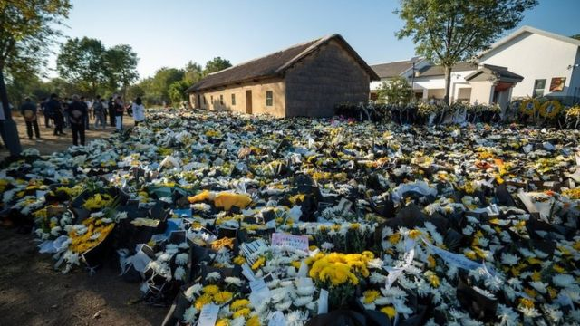
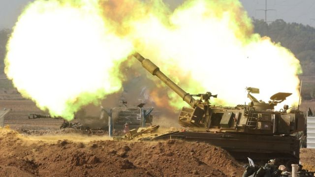
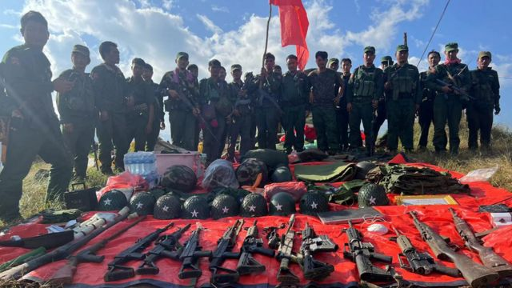
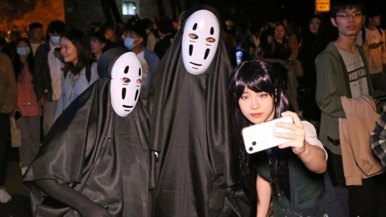
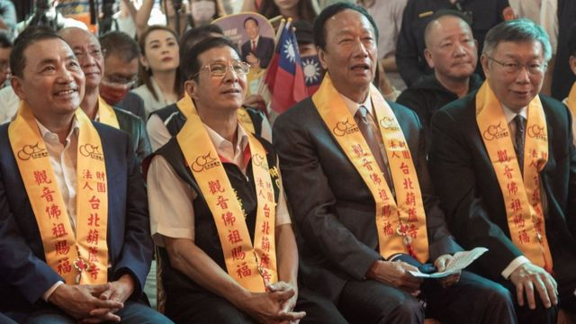

# [Press] 李克强出殡、以色列炮轰加沙持续、缅北战火和本周更多重要故事

#  李克强出殡、以色列炮轰加沙持续、缅北战火和本周更多重要故事

> 图像加注文字，在安徽滁州定远县吴圩镇九梓村的李克强祖居前，悼念民众留下了大量花束。

**中国前总理李克强离开中共中央政治局常委职位刚过一年，离开总理职务七个月之后，因突发心脏病骤逝。这个星期，他的丧礼在北京举行，中共中央总书记兼中国国家主席习近平率领官员告别李克强遗体。**

中共当局将之视为敏感事件处理的情景继续出现：北京长安大街旁，民众在警察严密布防下目送灵车离开；在李克强家乡安徽首府合肥，工作人员想方设法阻止悼念群众与BBC记者对话。

以色列与巴勒斯坦哈马斯武装之间的武装冲突即将满月，以色列声称已开展地面攻势，军事专家质疑以色列对战后处置是否毫无打算，而在中国接任联合国安理会轮值主席之际，北京在这场冲突能扮演什么角色再受关注。

缅甸北部硝烟再起，以当地华裔民族武装为首的叛军以“打击电信诈骗”为名与政府军激烈交战，内比都军政府承认有城池失守，BBC了解到有成立于2021年军事政变后的反政府武装有意加入民族武装阵营参战。

刚刚过去的一周，BBC中文以上新闻内容受到读者的关注。如果你错过了它们，我们带你一一回顾。

##  1\. 李克强出殡 中国民众在政府监控下悼念前总理

11月2日，中国前总理李克强的遗体在北京火化，天安门广场上下半旗致哀。

李克强的突然离世引发中国民间缅怀浪潮，从他工作过的河南，到家乡安徽，民众自发献花累积成山丘，与公众对上一位前总理李鹏离世的反响有天壤之别。

但是，民众对于这位前二号领导人的赞赏与怀念牵动起当局的敏感神经。BBC记者在合肥采访时，尽管受访者多表达的是正面态度，但无处不在的工作人员要求民众三缄其口。

回看李克强的两任总理任期，数据上无疑很辉煌——十年间，中国的GDP从53万亿元人民币增长到121万亿元（17万亿美元；532兆元新台币；130万亿港元），年均增幅6.2%；医保改革下，覆盖人群从5.4亿增加到13.6亿；“简政放权”的改革使政府行政审批事项缩减到三分之一。

也有分析提到他未尽的改革——从上任伊始就着力“去杠杆”，但在他离任时，中国实体经济债务杠杆率，比十年前不降反升；李克强着力推进营业税改征增值税，再用房地产税作为地方政府主要税源，地方政府依然未能摆脱土地财政，债务问题悬而未决。

##  2\. 以色列—哈马斯战争进入“第二阶段” 专家质疑战后计划全无

> 图像来源，  EPA
>
> 图像加注文字，内塔尼亚胡声言不会现在停火。

10月28日晚，以色列总理内塔尼亚胡（Benjamin Netanyahu）表示，以色列在加沙地带（Gaza Strip）的地面行动标志着与哈马斯的战争进入了“第二阶段”，且将会是“艰难且长期的战斗”。

加沙最高领导人，哈马斯组织政治局主席辛瓦尔（Yahya Sinwar）本周首次表示愿意释放所有被扣押在加沙的人质，以换取以色列释放监狱中所有哈马斯囚犯。

但以方表明不会现在考虑停火。内塔尼亚胡在特拉维夫演讲称，“要求停火就是要求以色列向哈马斯投降，向恐怖主义投降”，“现在是战争时期”。

然而，除了运用压倒性的军事力量外，如何实现将哈马斯从加沙地带连根拔起这一前所未有的雄心壮志，以色列还未说清楚。

特拉维夫大学摩西·达扬中心（Moshe Dayan Centre）巴勒斯坦研究论坛负责人迈克尔·米尔施泰因博士（Dr Michael Milshtein）曾任以色列军事情报局巴勒斯坦事务部部长。他对BBC说：“你不可能在没有后天计划的情况下，推动这样一个历史性行动。”

米尔施泰因担心，有关规划才刚刚开始。

冲突进入第三个星期之际，正好来到了中国接任联合国安全理事会轮值主席国的月份。中国迄今并未点名谴责或支持任何一方，其角色与立场备受议论。

##  3\. 缅北武装冲突“为清剿电信诈骗”再起 果敢华人武装攻陷政府军据点

> 图像来源，  The Kokang
>
> 图像加注文字，同盟军官方媒体称，一些政府军据点守军集体弃械投降。

缅甸北部撣邦（Shan）与克钦邦（Kachin）华裔少数民族武装近日与执政军阀交战，据称有炮弹落入中国云南境内。来自当地的消息称，一些城镇的政府军投降。

民族武装还宣称攻下了一些政府军据点。缅甸军政府星期四（11月2日）首次证实，与中国云南接壤的撣邦果敢老街清水河镇（Chinshwehaw, Lao Cai, Kokang）政府“已不存在”。该处为中缅贸易主要通道之一。

由总司令彭德仁领导的缅甸民族民主同盟军（MNDAA）声称，此举旨在清剿果敢地区的中国电信诈骗集团。联合国人道主义部门称，自冲突于10月27日爆发以来，至少6000人流离失所。中国一侧已传出过炮弹落入云南德宏州境内的消息，德宏瑞丽市有学校停课避难。

BBC缅甸语（BBC News Burmese）报道，多支自2021年军事政变后成立的反军政府游击队据报有意加入战斗，声援华裔民族武装一方。

##  4\. 新冠防疫放开后首个万圣节 上海年青人以百花齐放来记念

> 图像来源，  Getty Images
>
> 图像加注文字，许多人打扮成中国传统的妖魔鬼怪或神话人物，还有一些人天马行空地将自己的装束与当前政治，社会议题联系起来。

从做核酸检测的“大白”，到质问观众“哪里贵了”的网红“李佳琦”和《甄嬛传》里的安陵容……在万圣夜到来之际，中国上海的一条马路意外成为年轻人放飞和表达的舞台。

中国没有庆祝万圣节的传统，但在过去几天晚上，大批年轻人身穿“脑洞大开”的服饰在上海巨鹿路狂欢的照片和影片席卷了中国社交媒体。

据中国媒体报道，由于参与人数众多，当局不得不关闭周边的地铁站，并且部署大批警察到场。

##  5\. 台湾大选报名在即 “蓝白配”提上日程能否撼动绿色？

> 图像来源，  AFP
>
> 图像加注文字，侯友宜（左）与柯文哲（右）能否跨党派组建“蓝白配”仍无定案，对独立参选的郭台铭（中右）有何影响同样未知。

距离台湾2024年总统大选不到三个月，有关国民党参选人侯友宜与民众党柯文哲，是否会合作竞选正副总统大位，也就是“蓝白合”的议题，持续成为当下台湾政坛最大热点之一。

10月30日，“蓝白”双方首次展开政党协商，国民党主席朱立伦与柯文哲会面，但会后仅发表“四点声明”，表达希望将国会席次最大化，要求新任总统“下放权力”等理念，但仍未确认是否合作竞选总统大位。

11月1日，台北传出双方再次会面，据台媒报道双方仍旧未决定是否正式合作，但柯文哲有提及，冀盼国民党提出两党都同意的民调与合作办法之后，“再约下次会面；如果没有提出来，那可能也不需要再见。”

“蓝白”合作似乎仍然困难重重。

