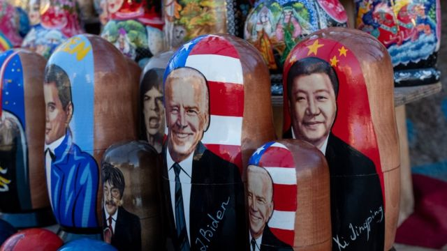
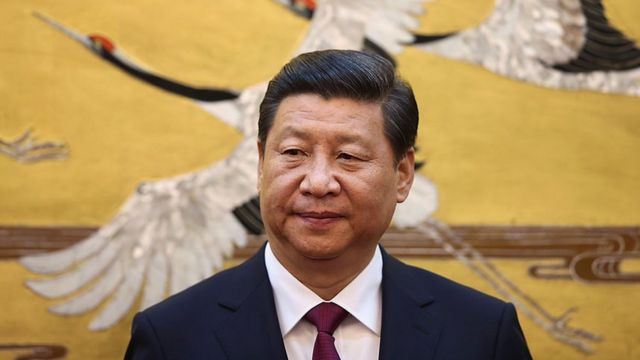
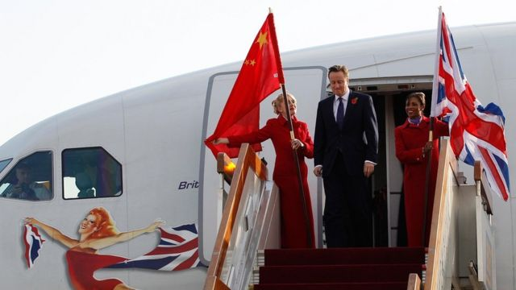
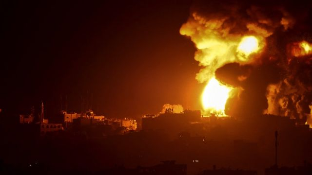

# [Press] 习拜会、卡梅伦任英国外相、台湾大选和本周更多重要故事

#  习拜会、卡梅伦任英国外相、台湾大选和本周更多重要故事

> 图像来源，  Getty Images

**美中关系是这周的焦点新闻，美国总统拜登与中国国家主席习近平在旧金山会面，双方在军事交流、禁毒等议题取得实质成果，但在台湾问题上没有突破。**

英中关系也备受关注，英国首相苏纳克（Rishi Sunak；辛伟诚）请前首相卡梅伦（David Cameron）复出担任外交大臣，后者曾提出英中“黄金时代”构想。

在中国，第三季度外商投资出现118亿美元（96亿英镑）的赤字，是1998年有记录以来首次。这表明外国公司正将资金撤出中国。

台湾方面，随着总统大选进入倒数阶段，中国间谍案件也引起关注。

刚刚过去的一周，BBC中文以上新闻内容受到读者的关注。如果你错过了它们，我们带你一一回顾。

##  1\. APEC拜习会的进展与争议

美国总统拜登与中国国家主席习近平在旧金山举行峰会，取得了一定成果，包括恢复两国高层军事方面的交流，并同意就人工智能和禁毒合作创建合作。

但双方就台湾问题没有突破，习近平表示美国应停止武装台湾，并措辞强硬说：“中国终将统一，也必然统一。”

峰会上的发言也仍有一些不和谐之音，引发媒体关注。拜登再次重申他认为习近平是“独裁者”，称因为“他管理的国家是一个共产主义国家”。

几乎可以肯定，这种言论必定遭到中方反感，有分析认为，北京很可能会再次指责美方做事“心口不一”。

##  2\. 中国外商直接投资首次转负 外企对中国失去兴趣了吗？

> 图像来源，  Getty Images
>
> 图像加注文字，中国国家主席习近平于本周三会见美国总统拜登。

在第三季度，中国的外商投资出现了118亿美元（96亿英镑）的赤字，这是自1998年有记录以来的首次，表明外国公司将资金从中国撤走。

经济学人智库全球贸易首席分析师尼克·马罗（Nick Marro）说：“对地缘政治风险、国内政策不确定性和增长放缓的担忧，正促使企业考虑其他市场。”

他认为，随着中美之间的紧张局势加剧，美国对制造先进芯片所需的原材料和技术实施了新的出口限制，今年有更多企业开始响应多元化的号召。

此外，企业也在考虑利率的影响。去年，在世界上许多国家大幅加息之际，中国却逆势降息。

中国欧盟商会表示，那些在中国有多余现金和收入的企业，越来越多地将这些资金转移到海外，与在中国投资相比，它们在海外获得的投资回报更高。

##  3\. 卡梅伦复出任外相，如何影响中英关系？

英国政坛因前内政大臣卷入声援巴勒斯坦人示威争议而波涛汹涌，首相苏纳克（Rishi Sunak；辛伟诚）请前首相卡梅伦（David Cameron）复出担任外交大臣，并为此请国王册封他为勋爵，给西敏寺抛下了一枚震撼弹。

这让卡梅伦成为自1970年代以来首位重返政府内阁的英国前首相。

他此前在首相任内提出了英中“黄金时代”构想，但在苏纳克上台后被称为“天真”且“已经结束”。伦敦唐宁街10号首相府表明，卡梅伦将维持苏纳克政府的对华政策方针。

> 图像来源，  Reuters
>
> 图像加注文字，卡梅伦长期予人亲华形象。

##  4\. 台湾大选逼近，“中共间谍”再引发关注

> 图像来源，  Getty Images
>
> 图像加注文字，台湾明年1月举行大选

台湾大选进入倒数阶段，台湾当局选前将矛头对准了“中共间谍”，过去10个月有大量间谍案件，其中一些也已定罪。

前美国海军陆战队高层分析指，台湾很容易成为中国间谍的目标，因为地理上台湾靠近中国，大多数台湾人都说中文，加上台湾对间谍活动的惩罚“并不严格”，且至今没有一套健全系统去保护机密数据。

有政治学者表示，这次民进党在信息战的作战计画，是对大众公开间谍案，这对民进党而言是“良好的公关”。

但也有专家认为，当局公布间谍案是一把双刃剑，它在后端增强了人们对台湾反间谍能力的信心，但代价是削弱了外界对其前端能力的看法。

“人们会想，台湾能抓到间谍是好事，但为什么台湾不能从一开始就防止这些间谍渗透到系统中，或预防他们被敌方吸收呢？这可能会引起其他潜在合作夥伴和友好国家的警觉，使他们未来不敢与台湾合作。”

##  5\. 以巴冲突的最新发展

> 图像来源，  Getty Images
>
> 图像加注文字，有估计称， 以色列在加沙可能只动员了3万名士兵，这相对而言是以色列总兵力的一小部分。

以色列发动对加沙（Gaza；加萨）的地面进攻已接近两周，对哈马斯进行密集空袭已经超过一个月。

从一开始以色列声称的军事目标来看，他们致力于在军事和政治上摧毁哈马斯。但是，以色列离实现这个目标有多远？

对以色列而言，现在还只是开始阶段。以军一再表示这个军事行动将是漫长而艰难的。一位接受BBC采访的以色列国防军（IDF）高级官员用拳击比赛的比喻说“这只是15回合中的第四回合”。

以色列内部没有人确切说明这场战争会持续多久。但有些人指出，2017年西方支持的伊拉克军队花了九个月的时间从伊斯兰国手中重新夺回摩苏尔市，这可能是一个参考。

尽管它可能无法完全掌控时间表，以色列也许想再打上几个月仗，因为国际上对停战或休战的压力正在增加。

##  本周其他重要故事：

