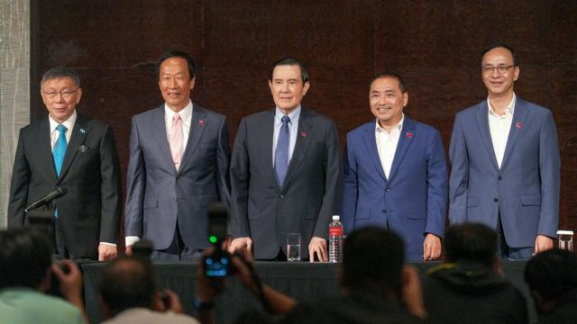
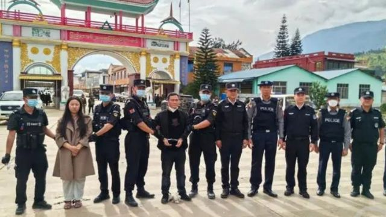
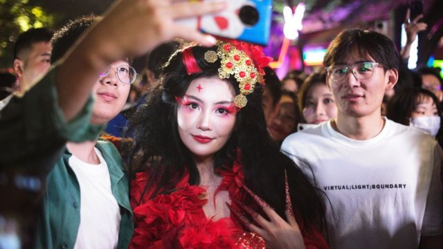
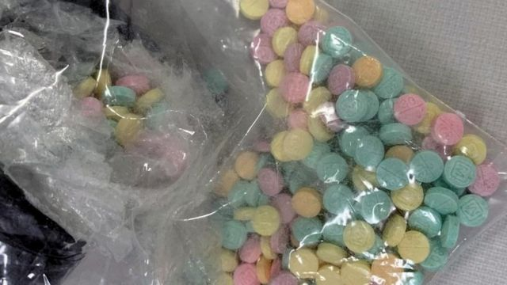
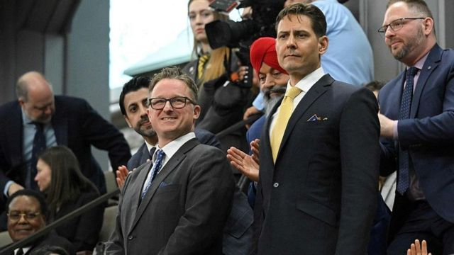
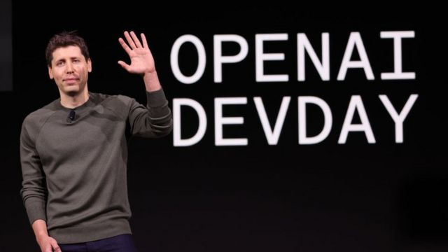
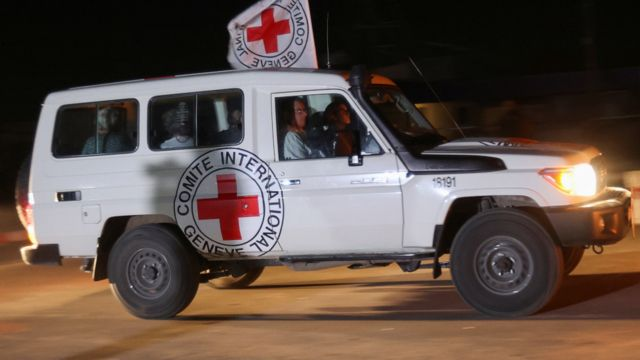

# [Press] 台湾大选“蓝白合”破局、缅北华裔电讯诈骗、中国年轻人职场人设和本周更多重要故事

#  台湾大选“蓝白合”破局、缅北华裔电讯诈骗、中国年轻人职场人设和本周更多重要故事

> 图像来源，  EPA
>
> 图像加注文字，柯文哲、郭台铭、马英九、侯友宜和朱立伦在最后关头会面商讨，但“蓝白合”始终未能成事。

**台湾2024年总统选举提名进入最后关头，在野阵营酝酿了一段时间的“蓝白合”能否成事成为焦点。最终谈判未能达成协议，“蓝营”中国国民党与“白营”台湾民众党各自报名参选，本已取得足够提名独立参选的商人郭台铭则宣布放弃参选。**

缅甸北部华裔武装以清剿果敢地区电信诈骗活动名义进攻军政府据点将近一个月，上周中国公安部公布，牵涉其中的果敢明氏家族其中三人被缅方抓获并移交中方，另一人“畏罪自杀身亡”，但有消息称其尸首也被移交中方。BBC记者本周尝试重组背后故事。

在经济不景气和就业市场竞争激烈的情况下，许多中国年轻人正在用古怪的图片或插画来表达他们对职场环境的失望。BBC中文记者带你了解这些“职场人设”。

刚刚过去的一周，BBC中文以上新闻内容受到读者的关注。如果你错过了它们，我们带你一一回顾。

##  1\. 台湾大选提名最后关头：“蓝白合”破局 绿营征召驻美代表

> 图像来源，  Reuters
>
> 图像加注文字，台湾执政民进党总统参选人赖清德（左）确定起用台湾驻美国代表萧美琴（右）为竞选搭档，萧美琴随即返台向外交部辞职。

距离台湾总统大选约50天的星期五（11月24日）是台湾总统大选候选人登记日的最后一天，但攸关在野两党结合竞选的“蓝白合”正式宣告破局。国民党候选人侯友宜宣布副总统搭档为台湾知名统派人物、媒体大亨赵少康；民众党候选人柯文哲与现任立法委员、台湾大财团新光集团第三代吴欣盈搭档。

在此之前，民进党参选人赖清德星期一（20日）宣布其副手人选是台湾驻美代表萧美琴。赖清德在社交媒体发文说，这是他“最好的决定”，又说相信萧美琴绝对是“现今台湾外交工作中的佼佼者”。

在分析“蓝白合”最终为何失败时，英国诺丁汉大学台湾研究学程客座研究员丘琦欣对BBC中文表示，该联盟从一开始就似乎注定不会成功。

##  2\. 缅甸果敢明氏家族落网移送中国 回顾缅北“四大家族”的过去

> 图像来源，  Chinese Ministry of Public Security
>
> 图像加注文字，明珍珍和明国平已经被中国警方扣押。

由中国警方公布的照片显示，警员正押着被戴上手铐的一男一女，站在边境大门前面。

两人是刚从缅甸一方移送过来的，是明国平和明珍珍。他们是过去14年一直统治着老街镇（Laukkaing）的大军阀的儿子和孙女。

缅甸冲突的突然升级标志着中国黑手党——类似“教父”的“四大家族”——在这个臭名昭著、无法无天的边境小镇走向终结。

这是一个不同寻常的故事一个不光彩的结局，它开始于战争和革命年代，却演变为充斥毒品、赌博、贪婪和马基雅维利式对抗的故事。

##  3\. 中国“职场人设”如何帮助上班族“脱苦海”

> 图像来源，  China News Service
>
> 图像加注文字，给自己一个“人设”，在“内卷”持续的中国职场有何作用？

27岁的Lac（化名）是一名广告设计师，她把自己在职场上的形象打造成“神婆”，意思是每当遇到不合理的要求，就运用玄学知识来应对。

和她一样，许多中国年轻人正在用古怪的图片或插画来表达他们对职场环境的失望——这被称为“职场人设”。在经济不景气和就业市场竞争激烈的情况下，这成为年轻人表达挫败感的一种方式。

“就像艺人经营自己的人设一样，打造职场人设是一种自我保护，也是对职场生活的自我调侃”，这名广告设计师解释说。

##  4\. 芬太尼与洪都拉斯白虾——“习拜会”后仍在左右中美关系的那些事

> 图像来源，  Reuters
>
> 图像加注文字，走私芬太尼进入美国案件近年日趋常见。

在刚刚过去的美中首脑峰会上，中国国家主席习近平与美国总统拜登（Joe Biden）达成协议，将合作打击毒品贩运。中国同意打击化学品公司，以阻止非法芬太尼流入美国。这一项协议被认为是本次峰会上一项重要实质性成果。

而在忙于选举的台湾，洪都拉斯（宏都拉斯）白虾价格涨了20%——美国协助斡旋不果，洪都拉斯今年3月与台北断交，转与北京建交后，台宏自由贸易协定于9月正式终止。如今洪都拉斯养虾户间接成为了中美外交角力的“受灾户”。

一种药品，一种食品，中美两国要解决的事情，不止于此。

##  5\. 加拿大“中国间谍”风波再生枝节

> 图像来源，  Reuters
>
> 图像加注文字，2021年9月24日，康明凯（Michael Kovrig；中右）和迈克尔‧斯帕弗（Michael Spavor中左）获中国释放返国。在此之前，加拿大释放了原被美国通缉的华为创办人任正非女儿孟晚舟。

加拿大人康明凯（Michael Kovrig）和迈克尔‧斯帕弗（Michael Spavor）曾因被控从事间谍活动而被中国羁押了1000多天，但在他们获释回加拿大后，这一牵动加中关系的事件似乎有了新的余波。

加拿大媒体《环球邮报》（The Globe and Mail）报道，在回到加拿大两年多后，斯帕弗正在向加拿大政府索赔数百万美元作为赔偿。

该报道援引未透露姓名人士的话称，斯帕弗指他“无意中”与康明凯分享了朝鲜相关信息，但不知道这些信息会被传递给加拿大政府及其“五眼联盟”的情报合作伙伴。

他声称，正是康明凯的行动导致两人都身陷囹圄。BBC无法独立证实该说法。

##  6\. OpenAI乱局：山姆·阿尔特曼戏剧性的一周

> 图像来源，  Getty Images
>
> 图像加注文字，山姆·阿尔特曼被董事会罢免一周后返回OpenAI公司岗位。

OpenAI公司表示，在被董事会解雇几天后，该公司联合创始人山姆·阿尔特曼（Sam Altman）将重新担任公司老板。

这家科技公司还称，该协议“原则上”涉及任命新的董事会成员。

阿尔特曼上星期五（17日）被解职，这一消息令行业观察人士感到震惊。员工威胁董事局，除非让阿尔特曼复职，否则将集体辞职。

“我期待着回到OpenAI”，阿尔特曼在“X”（前身为Twitter）上的一篇帖子中表示。

他还说：“我爱OpenAI，过去几天我所做的一切都是为了保持这个团队和它的使命在一起。”

上周，董事会决定解除阿尔特曼的职务，导致联合创始人格雷格·布罗克曼（Greg Brockman）辞职，这家人工智能明星公司陷入混乱。

##  7\. 以巴暂时停火四天 哈马斯、以色列互相放人

> 图像来源，  Reuters
>
> 图像加注文字，获释以方人质由红十字会车辆接回。

在卡塔尔斡旋下，以色列与巴勒斯坦哈马斯武装达成为期四天的休战协议，换取哈马斯释放在加沙被劫持的50名人质，以及以色列释放150名巴勒斯坦女性及青少年囚犯，并允许更多救援物资进入加沙。

经过延误，休战协议当地时间星期五早晨正式生效。 哈马斯释放了一批人质  ，当中有以色列、泰国和菲律宾公民； 以色列释放一批被拘押的巴勒斯坦人  ，并将他们送到约旦河西岸。

美国总统拜登表示，有关协议将结束人质“难以言表的折磨”，并且“减轻无辜巴勒斯坦家庭的痛苦”。

哈马斯枪手10月7日突袭以色列南部，杀死1200人，绑架200多名人质。以色列其后对加沙发动密集的空中和地面攻击，哈马斯在加沙的政府称已造成1.4万多人死亡。

