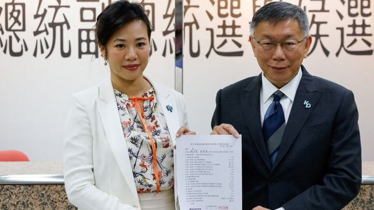
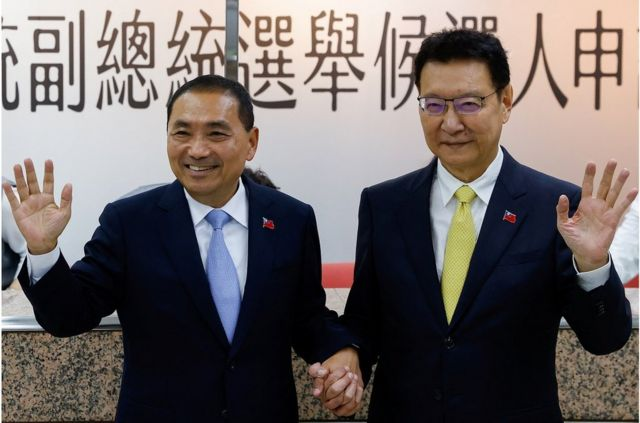
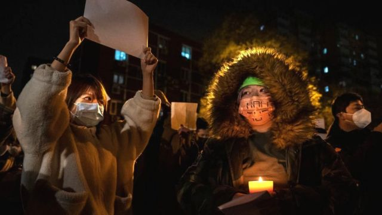
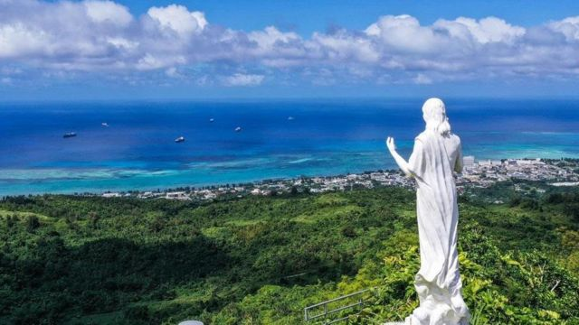

# [Press] 台湾大选、基辛格逝世、白纸运动一周年和本周更多重要故事

#  台湾大选、基辛格逝世、白纸运动一周年和本周更多重要故事

> 图像来源，  Reuters
>
> 图像加注文字，民众党总统参选人柯文哲宣布，副总统竞选搭档为吴欣盈。

**距离台湾大选投票日只剩下四十多天，“蓝白合”破局后，民众党柯文哲与国民党侯友宜各自公布副手人选，震撼政坛。**

在中国，“白纸运动”届满一周年，这波示威浪潮被外界认为是中国自1989年“六四”事件后最大规模的公民行动，BBC中文采访几位年轻参与者，了解他们的感受与一年来的社会变迁。

而疫情后中国人“润”出去的潮流仍在继续，距离中国最近的美国领土塞班岛成为了新据点。

另一方面，美国前国务卿、著名外交家基辛格逝世，终年100岁，他有时被称赞为一个以美国利益为重的现实派外交家，但也被指应为一些海外暴行负有责任，甚至被批评是“战争犯”。

刚刚过去的一周，BBC中文以上新闻内容受到读者的关注。如果你错过了它们，我们带你一一回顾。

##  1\. 台湾2024总统大选：蓝白公布副手

> 图像来源，  Reuters
>
> 图像加注文字，国民党总统候选人侯友宜（左）宣布中广董事长、台湾媒体大亨赵少康（右）担任副手搭档。

距离台湾2024总统大选投票仅剩四十多天，上周“蓝白合”破局，鸿海创办人郭台铭宣布退选后，民众党总统参选人柯文哲宣布其副总统搭档为该党现任立委吴欣盈，在野党国民党总统候选人、现任新北市长侯友宜则宣布赵少康为副手候选人。

这两个消息，都引发台湾政商界骚动。

1978年在美国出生的吴欣盈是台湾五大财团之一的“新光集团”第三代长孙女，被媒体称为“新光公主”，一直是台北商界及社交界的名人。有分析称，民众党选择吴欣盈是希望凭藉吴女士的国际及性别背景，扩大该党的女性及年轻族群选票。

另一方面，来自国民党军人家庭的赵少康以“外省”及“深蓝”的背景加入大选，成功召唤了国民党深蓝“铁票”归队，协助侯友宜民调攀升。

##  2\. “白纸运动”一周年，给中国留下什么？

> 图像来源，  Getty Images
>
> 图像加注文字，白纸运动后，活动人士希望越来越多的国际谴责将导致被拘留的抗议者获释。

去年此时，中国多地爆发反封控示威。乌鲁木齐居民小区发生大火，疑似因封控导致救援延误，将不满群情推至高点，其后南京传媒学院学生在校园举起白纸，悼念遇难者并抗议疫情封控政策。示威浪潮随后蔓延到中国至少21个省，包括39个城市、超过百家高校。

这一轮示威浪潮被称为"白纸运动"，虽然抗议只持续了数天，但被外界认为是中国自1989年“六四”事件后最大规模的公民行动。

一年过后，中国社会渐渐复常，疫情与抗议的记忆开始消退。当时参加抗议的年轻人境遇不尽相同——有的遭到拘捕或失联，甚至被投入精神病院，也有一些人的辗转到海外，继续发声。

BBC中文访问了四位白纸运动参与者，瞭解一年来他们的感受与抉择，及其折射的社会现实。

至于“白纸运动”给中国留下什么？伦敦大学亚非学院中国研究院院长曾锐生向BBC中文表示，比较直接的一点是，由于封控带来的痛苦经历，使习近平失去部分民望。

“在疫情之前，我敢说，如果中国有一场公开公平的选举，习近平会以压倒性优势胜出。” 曾锐生表示，但今天情况不再如此，在新冠疫情结束后，“人们经历这一切，这不可能了。”

##  3\. 美国前国务卿基辛格逝世

美国前国务卿、著名外交家亨利·基辛格（Henry Kissinger，季辛吉）逝世，终年100岁。

他曾在尼克松（Nixon，尼克逊）和福特政府担任美国最高外交官及国家安全顾问，被认为是二战后权力最大的美国国务卿。

他有时被称赞为一个以美国利益为重的现实派外交家，在各大国之间穿梭捭阖，但他也被指应为一些海外暴行负有责任，甚至被批评是“战争犯”。

他被指将美苏竞争置于人权之上，并且在世界多地支持高压政权，包括智利的奥古斯托·皮诺切特（Augusto Pinochet）政权。有人指责他默许了智利推翻左派政府的血腥政变，对于阿根廷军队对人民发动的“肮脏战争”也视而不见。

他在1971年两次出访北京，其中第一次是秘密进行，由此开启了美中关系正常化的进程，但基辛格谈判下形成的“战略性模糊”政策被美国奉行至今，直至近年支持强硬路线的美国政客开始寻求逐步改变。

##  4\. 塞班岛、关岛为何成为中国人“润美”新据点？

> 图像来源，  Zhang Sengqi
>
> 图像加注文字，塞班岛，作为离中国最近的美国领土，从上海直航约需5小时。

疫情解封后，通过移民或偷渡“润”（run在中文的音译，指离开中国）的人越来越多。

塞班岛是离中国最近，而且是唯一给予中国公民为期两周的落地签证的美国领土，中国人可以轻易抵达塞班，然后选择逾期滞留。

特别是在疫情解封后，出自于经济压力及各方团体要求，塞班岛开始发工卡，甚至有风声传出会接受政治庇护或暂缓递解的申请。这让越来越多人开始考虑润到塞班岛，不管是以逾期拘留或是求学的方式——塞班岛的学费比起美国大陆便宜许多。

BBC中文采访几位当事人，了解他们为何愿意冒险润到塞班岛，以及在当地生活的苦与乐。

##  本周其他重要故事：

