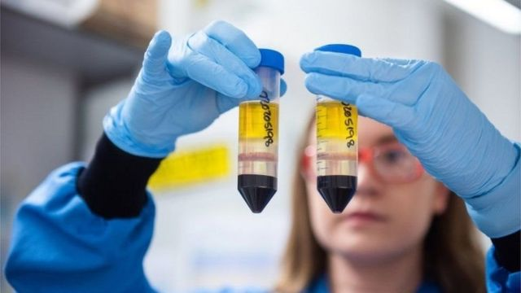
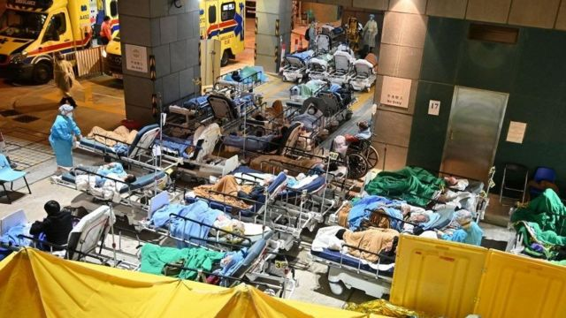
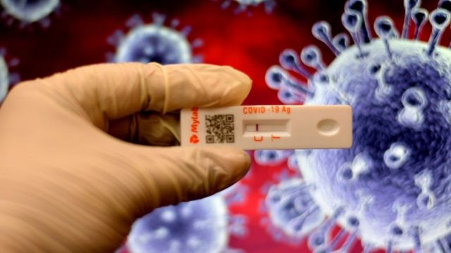

# [Science] 清零或与病毒“共存” ：新冠疫情可持续防控还需做些什么

#  清零或与病毒“共存” ：新冠疫情可持续防控还需做些什么

> 图像来源，  PA Media

**世界卫生组织（WHO）总干事谭德赛对中国政府的新冠感染“清零”政策表示忧虑，认为“不可持续”；而彭博通讯社引述上海复旦大学一项最新研究结果称，假如中国政府放弃“清零”，使奥密克戎变异株得以肆意传播，结果很可能是一场吞噬160万人生命的“新冠海啸”。**

谭德塞博士5月10日在媒体吹风会上说，WHO认为，考虑到病毒变异、传播和免疫逃避能力，中国的新冠“零感染”政策难以为继，且已经把这个看法与中方专家沟通，希望促成变化。WHO还提到“零新冠”政策的经济和人权影响。

复旦大学的研究报告经同行评审发表在《自然医学》杂志上。鉴于老年人的疫苗接种率低，以及新冠病毒变异株对现有疫苗的免疫逃避能力，中国 3 月份启动的大规模接种行动获得的免疫程度“不足以”避免可能导致重症监护能力无法应对海啸般袭来的新一波奥密克戎株疫情。

不过，即使大多数国家已基本解除旅行禁令和防疫限制措施，日常生活几乎与寻常无异，一个必须正视的事实是，新冠病毒依旧活跃，变异仍在继续，今后若干年 Covid 很可能与我们“共存”。

那么，我们应该怎样与新冠“共存”？生活怎样“回归正常”？除了疫苗更新、接种和药物研发，我们还需要做些什么？

##  新冠病毒可能怎样“存在”？

伦敦大学学院（UCL）临床运筹学部门负责人 克里斯汀娜·佩格尔（Christina Pagel）指出  ，生活回归正常轨道有前提条件。

一方面，病毒在不断变异过程中日趋温和，疫苗和治疗方式与时俱进；

另一方面，我们在心理上和认知层面要“接受世界已经不同这个事实”，建立相应的监测和防疫系统，重构生活方式，使得新冠病毒传播得到有效控制，而包括易感染群体在内的所有人的生活都“更自由、更健康”。

新冠不是“超级流感”，她指出，新冠感染死亡率即使在疫苗、治疗和自身免疫力作用下逐渐降低，但它对心脏、肺和心理健康的长期影响比其他呼吸系统疾病更严重，长期症状发病率更高。

而疫苗可以有效减少严重病症和死亡，但对避免感染和轻症则效力较弱，现在全面解除限制的做法“可能导致今后若干年许多人将面临重复感染风险”，她补充道。

> 图像来源，  Getty Images
>
> 图像加注文字，确诊者如果都涌向医院，容易导致医疗资源崩溃。

BBC 健康事务主编休·皮姆（Hugh Pym）引述英国专家说， 一般认为病毒随着时间推移会变得更温和，但并不是必然如此。

华威大学教授迈克·蒂尔德斯利（英国新冠病毒传播主要建模者之一）说，变化将是个长期过程，而未来二到五年将“不确定”。

东英吉利大学教授保罗·亨特则认为，新冠病毒突变产生新的“杀手变异株”的可能性不大，“新冠病毒将永远与我们同在，但即使感染更多，疾病症状也不会太严重。”

医学界的一个共识是，易感人群，包括免疫抑制患者，感染新冠后出现重症甚至死亡的威胁仍然存在，长新冠也是“与病毒共存”的挑战之一。

> 图像来源，  Getty Images

##  我们怎样与新冠病毒“共存”？

在基本上全面解除防疫限制的地方，比如英国和欧洲几个国家，一旦发现自己有感染症状，无论是新冠还是流感，都应该呆在家里，避免感染别人，尤其应该远离易受感染的和脆弱人群。

皮姆报道说，疫苗持续更新，针对变异株的疫苗也呼之欲出，大规模接种可能以某种形式常规化，比如每年流行季节前接种新冠疫苗，就像打流感疫苗一样，或者“二合一”，增强免疫力。

UCL 的佩格尔教授在 《对话》杂志上撰文  指出，过去150年来，人类在公共卫生保健领域的进步巨大，针对营养不良、传染病流行、环境污染、被动吸烟和交通安全等公共问题制定的法律和政策解决方案不断改进。新冠也一样。

她列出实现与新冠长期共存世界需要做出的八个改变：

  * 改进室内空气质量，尽可能像在户外一样安全。这涉及建筑设计和基础设施的更新，改善通风、过滤和空气清洁程度。 
  * 疫苗始终至关重要。不但需要尽快全球普及接种，还需要不断研发、更新疫苗，能够有效应对病毒变异，效力更持久、免疫保护更高。 
  * 建立和完善对新冠病毒及其变异株和其他新的传染疾病的全球监测系统，这样才能及时发现并应对疫情变化。 
  * 在已有传染病常规监测和防疫系统中增加对Covid 感染的永久监测，类似于流感和麻疹等疾病的监测防疫。 
  * 对新冠长期症状深入研究，加深理解，在此基础上完善预防和治疗方案。 
  * 改进现有医疗卫生系统，提高在秋冬季节流感、新冠等流行高峰时段的应对能力。 
  * 为弱势群体建立完善的保护系统。这涉及对健康、住房、工作场所、病假工资和教育培训等领域的投资，减少医疗保健领域的不平等，从而达到减少病毒大规模传播风险和死亡、提高公共卫生整体水平的目的。 
  * 建立应对未来新冠大流行的统筹方案，包括国家级别的监测系统，能够快速识别疫情及其造成的公共健康问题、免疫逃避等，使应对疫情的行动更及时、有效，避免长时间的旅行禁制、居家隔离、封城等紧急措施。 

历史表明，病毒不会迅速从人类社会消失，但生命科学进步和公共卫生方案的与时俱进使得人类应对疾病挑战的能力也不断提高。

