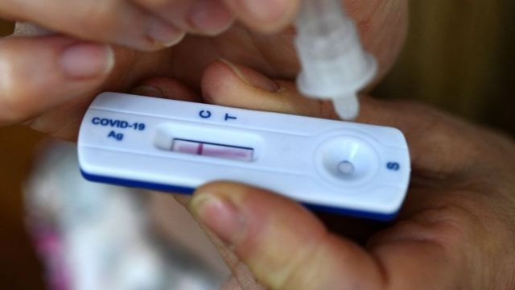
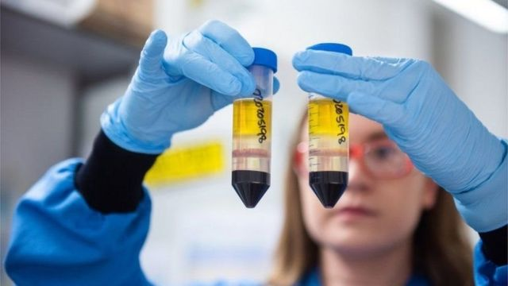

# [Science] 你问我答：新冠长期症状（长新冠）会传染吗？最新研究侧重哪些方面？

#  你问我答：新冠长期症状（长新冠）会传染吗？最新研究侧重哪些方面？

> 图像来源，  Getty Images

**编者注：BBC中文近期推出《你问我答》栏目，以方便读者更多参与，也使我们的选题和报道更切合受众需求。我们会在热点新闻或要闻中加入互动窗口，读者可以借此联络我们，提交问题。**

新冠疫情进入第三年， Covid-19 已经不再是一种陌生传染疾病，人们对它的了解在不断加深，疫苗、药物研发和防疫机制也在逐渐与时俱进。不过，病毒还在继续变异，世界大部分地区在陆续解除防控限制的同时，局部仍有反复，对于新冠、疫苗、药物和后遗症仍有许多未解之惑，不少读者在 BBC 中文《你问我答》栏目中提到希望得到解答的问题。

“长新冠”（新冠长期症状、新冠后遗症）是最多人提到的问题之一。我们整理了三个最普遍的问题尝试解答。

##  问：有“长新冠”症状的人是否属于病毒携带者？会不会传染给别人？

很可能不会。

目前对新冠长期症状的了解仍较少，尤其是诱发因素、最终结果、症状表现和变化等研究都还在进行，但一般认为过了病毒活跃期后就不太可能具有传染性，除非再次感染，比如感染了不同的变异株。

医学界普遍认为，新冠患者出现症状后五天之内最具传染性，虽然在长达83天的时间内PCR测试有时仍会在鼻咽或粪便样本中测出冠状病毒遗传物质，但病毒本身未必仍活跃并具传染性。

圣安德鲁大学传染病学研究人员在 《柳叶刀》杂志上发表的论文 30172-5/fulltext) 说，研究显示患者出现症状第一周到10天内具有很强传染性，但之后就不会传染他人了。“长新冠”通常是指症状持续了大约一个月仍未消除的情况。

疫苗和现有药物是否能减少“长新冠”发病率，目前正在研究。有小规模研究结果显示，曾有突破性感染的人痊愈后接种疫苗，可能只会将出现"长新冠"症状的风险减半，或者根本没有影响。

当然，疫苗会降低感染新冠，从而降低“长新冠”风险，

> 图像来源，  Getty Images

##  问：如有长新冠症状，应该看哪科？症状会消退吗？

“长新冠”有几种常见症状，包括异常疲倦、呼吸困难急促、思维迟钝不清（“脑雾”），以及情绪低落，但具体表现、程度和持续时间因人而异。一般认为症状持续可长达数月，患者可能同时出现几种病症，状况每天在变化。

也就是说，应该根据自己最明显的症状去相应门诊求医。

新冠后遗症是否会消退，多长时间消退，则取决于具体病案和治疗效果。

在英国，如怀疑自己可能是“长新冠”症状，首先要见普科医生问诊。医生可以建议患者联络长新冠诊所，如果符合要求，会接纳患者加入NHS的“ 与新冠共存康复计划  ”，有专人协助制定个人康复计划并开始治疗和护理程序。

这个计划包括联网的手机应用程序跟踪、测量和评估康复程度，护士或理疗师用电脑“控制板”（Dashboard）跟踪患者健康状况和康复进度，发送信息，调整护理措施；这一切背后有一个NHS团队，针对不同患者的康复需要有专人负责。

当然，这只是第一步，还有许多不知道的事情，需要进一步研发新的治疗方案。

> 图像来源，  Getty Images

##  问：是否可以介绍一下新冠后遗症方面的最新研究情况？

长新冠（又称新冠后遗症）的发病原因和它的定义一样，至今仍无定论，也不清楚，因此被视为最重大的医学挑战之一。

据 《自然》杂志报道  ，科学家们认为两种最有可能的情况是：1）大量冠状病毒在急性感染后继续潜伏在人体各种组织中——如肠道、肝脏或大脑——继续造成伤害；2）最初感染引发的广泛免疫反应触发针对人体组织的抗体和其他免疫反应，这些反应在新冠感染被清除后继续引起并发症。

围绕这种新出现的疾病，已经启动的科研项目数不胜数。下面只是英国的几个例子。

英国政府2021年7月拨款资助15个“长新冠”研究项目，从“长新冠”定义到免疫系统反应是否与“长新冠”症状有关、“长新冠”对心血管、肺部和其他器官的影响，以及“长新冠”患者康复的最佳护理方案，等等，范围广泛。

由牛津大学、威斯康星大学医学院和公共卫生学院、伦敦皇家布朗普顿医院和帝国理工学院以及瑞士苏黎世大学的研究人员组成的 “长新冠”研究  团队分析了从最初感染的直接影响（如心肌梗塞或心肌炎）到长期症状（如心理健康和疲劳）的整个过程。 研究报告2022年春发表在《欧洲心脏杂志》上  。

> 图像来源，  PA Media

伦敦大学学院（UCL）的 UCL冠状病毒急性感染后的长期影响  课题为期三年，有四个主题：“长新冠”定义、诱发风险因素、临床深度表型分析、“长新冠”后果。

  * 定义“长新冠”——寻找常见症状组和症状持续时间长短，确定具体症状和发生频率，系统描述，为临床诊断和治疗提供依据，为进一步研究患病几率、诱发风险因素和患病后果提供基础。 

  * 诱发风险因素——社会人口因素、大流行前的健康状况，以及初始新冠病症的严重程度；“长新冠”可能代表了一组复杂而多样的病原学因素，这些因素未必所有的“长新冠”患者都有，或成为引发病症的决定因素。确定导致长期症状个体的不同机制将为新的治疗方法和潜在的患者分层提供途径。 

  * 临床深度表型分析——将使用可穿戴设备和智能手机进行深度表型分析和远程评估，以识别新冠长期患者的亚临床损伤或功能障碍，验证新冠感染将与多器官病理学相关。包括多器官成像（脑、肺、心脏、肝脏和肾脏）、人体多项指标测量、心肺运动、视网膜、认知功能、血液和尿液样本采集，以及远程评估、可穿戴设备测试等十多个项目。 

  * “长新冠”后果——新冠感染对身体的短期和长期健康、心理健康和社会影响，以及长期症状持续时间；了解这些对人类身心健康的影响以及患者与医疗保健系统互动的方式，旨在设计针对最需要的人群的干预措施。 

**免责声明：** 本文内容仅供参考，不应被视作可以代替医生或其他健康护理专业人士的医疗建议。如果用户根据本文内容做出任何自我诊断BBC概不负责。BBC也不对任何外部网站内容负责，也不认可任何外部网站所提供的商业产品和服务。如果你对自己健康有任何担忧，请务必咨询你的医生并遵循医嘱。

