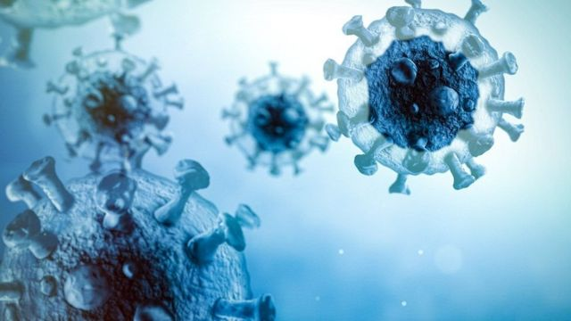
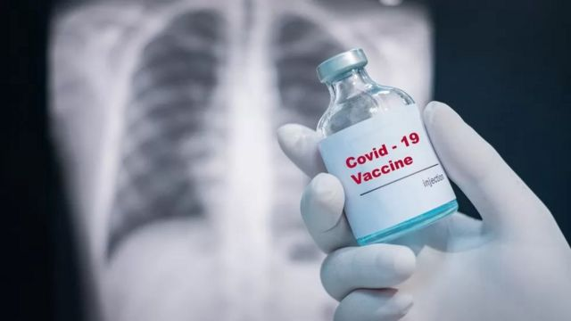
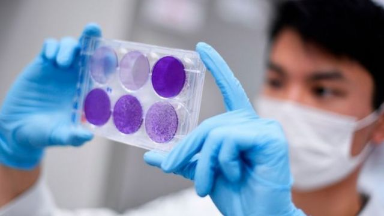
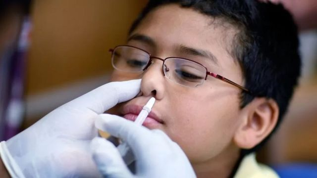
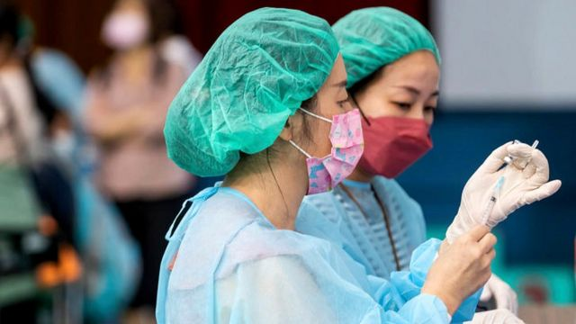
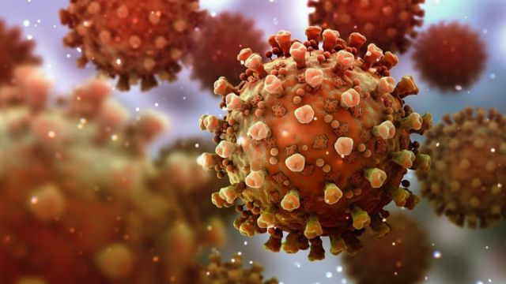
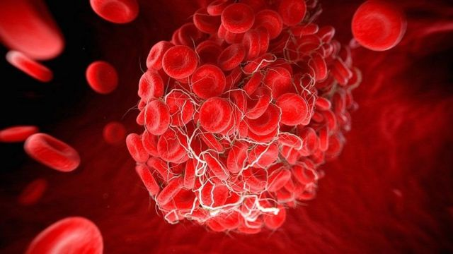
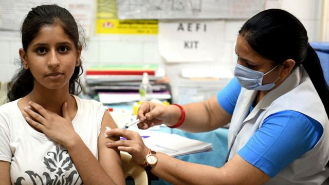

# [Science] 新冠疫苗：无论吸入、吞咽还是注射 加强剂要一直打下去吗？

#  新冠疫苗：无论吸入、吞咽还是注射 加强剂要一直打下去吗？

最近更新： 2022年9月16日

> 图像来源，  Getty Images

**英国9月初启动新冠疫苗第四针计划，渐次推广接种第二针加强剂，为秋冬时节可能出现的疫情反复做准备。不少国家已经或正在开始类似的群体接种新冠疫苗加强剂计划。**

中国康希诺（CanSino）和印度巴拉特（Bharat） 两家生物制药公司的吸入式新冠疫苗2022年9月4日和6日先后获本国政府批准紧急使用，领先全球。

不用注射的黏膜疫苗激发新冠病毒消除性免疫，是目前许多人的愿望和努力目标，已有的动物试验数据支持这个观点，但人类试验数据仍很少。

那么，喷入、吸入试粘膜疫苗可是不是新冠疫苗的未来？它比肌肉注射接种有哪些优点？

##  什么是黏膜疫苗和“杀菌免疫”保护？

到目前为止，世界各地有 100 多种吸入式新冠疫苗正在研发，其中约 20种已进入人类试验。

理论上讲，作用于鼻子、口腔黏膜的疫苗或许能够将病毒拦截在入侵人体的第一道防线，激发先天性和适应性免疫反应，在病毒入侵点击杀，阻止病毒传播，防止感染，达到所谓“杀菌免疫”效果。

一些专家指出，黏膜免疫反应和疫苗进入体内后激发的细胞免疫、体液免疫共同组成“三重保护”。

目前至少有九种黏膜疫苗被批准用于人类，针对脊髓灰质炎病毒、流感和霍乱等病毒在内的病原体，其中八种疫苗口服，一种针对流感的鼻腔喷雾疫苗。

> 图像来源，  Getty Images
>
> 图像加注文字，目前，所有新冠疫苗都需要冷藏。但这种情况可能即将改变

##  黏膜疫苗比肌肉注射疫苗好在哪里？
 《自然》杂志解释说  ，粘膜疫苗相对于肌肉注射的常规疫苗可能更好，主要原因是它能够在免疫第一线激发免疫反应，从而防止哪怕是轻微的症状，阻止传播。

目前使用的新冠疫苗可以有效降低病症严重程度和减少住院治疗病例，但并不能有效防范病毒传播或预防感染。

这是因为肌内注射疫苗进入人体后引发免疫反应，T细胞破坏受感染的细胞，B细胞产生“中和”病原体的抗体。这些细胞和抗体在血液中循环，但它们在鼻子和肺部的含量不够高，无法提供快速保护。

这个时间差为病毒传播，感染者发病提供了机会。

黏膜疫苗既可以促进全身免疫反应，也可以激活鼻子和呼吸道粘膜组织中的免疫细胞。

《自然》杂志引述耶鲁医学院医生本杰明·戈德曼-以斯列洛（Benjamin Goldman- Israelow）说，这些局部黏膜免疫细胞相当于站在感染部位的“哨兵”，可以第一时间采取行动，快速阻止病原体。

中国康希诺生物制药公司研发的雾化吸入版克威莎（Convidecia Air）作为加强剂获中国药品监管机构批准紧急使用，是全球第一款。它和注射版疫苗相同，但被包装成气溶胶，并以注射版本剂量的五分之一通过雾化器经口腔吸入。

另有一些正在开发的黏膜疫苗采用药丸吞咽方式。

研究人员还在测试用于首剂接种的黏膜疫苗。

> 图像来源，  Getty Images

##  黏膜疫苗效力如何？能不能产生消除性免疫？

消除性免疫（sterilizing immunity）是指由中和抗体引发的免疫力，免疫系统会在任何感染发生之前消除感染性粒子，对再感染产生完全的抵抗力，从而达到预防感染和传播。

这个要求对所有疫苗来说都是很高的。动物试验结果显示新冠黏膜疫苗达到这个标准是可能的，但黏膜疫苗在人体中的杀毒灭菌式防感染效力如何，目前缺乏数据，不清楚预防感染和传播所需的抗体和其他免疫反应水平。

> 图像来源，  Getty Images
>
> 图像加注文字，新冠疫苗很可能像感冒疫苗一样，不能终生免疫。

衡量肌肉注射疫苗效力的主要方式是测量血液中的中和抗体水平，水平越高免疫保护越强，而这条定律建立在数十年肌肉注射疫苗对抗不同疾病所积累的数据基础上。

黏膜疫苗，尤其是它们引发消除式免疫的效力，缺乏明确的参照，研发人员必须以其他方式衡量功效。

巴拉特生物制药公司的做法是把鼻腔黏膜疫苗试验中测到的血清中和抗体与肌肉注射疫苗引发的中和抗体水平做比较——相当或超过后者，则说明黏膜疫苗成功，但并不代表它预防感染和传播的效力。

康希诺的方式与此相似，比较血清中和抗体水平，得出吸入加强剂产生的抗体水平高于肌肉注射版引发的。克威沙在唾液中产生的 T 细胞和抗体测试数据无法确定产生消除式免疫所需的反应水平。

针对其他病毒的黏膜疫苗显示，这种接种方式有局限。它并不适用于一切疾病或所有人。

不适用或失败的原因不同，有时是因为不能产生足够强烈的免疫反应，有时是因为引发严重副作用，或者对成年人的免疫效果不如儿童。

比如喷雾式流感疫苗在成年人鼻腔引发的黏膜免疫反应可能会阻止减毒疫苗起作用，因为许多成年人不止一次接触流感病毒，自身已经具备免疫力，会阻拦疫苗中包含的灭活病毒，而孩子自身免疫力较低。

> 图像来源，  Getty Images

##  “消除性免疫”是不是意味着新冠疫苗加强针不必一直打？

不过，通过鼻、口接种疫苗获得“消毒免疫”成为主流之前，是不是仍需要不断打加强剂？为什么其他一些疾病的疫苗接种一次可以终生免疫，比如小儿麻痹症、麻疹疫苗？

接种疫苗加强剂的频率和次数多少，部分取决于对应的病毒或病菌的演变速度，

比如，绝大多数人童年时接种过两次麻疹疫苗，产生的免疫力可以持续一辈子，一个主要原因是麻疹病毒变化不大。接种疫苗后，人体免疫系统认识了这种病毒，之后几十年都能识别它，因为它大体上会保持原样，至多有些细小的改变。

流感病毒正相反，变得很快。接种疫苗后，人体免疫系统认识了一个病毒毒株，对它有了识别、防范和灭杀能力，但一年后，又一个流感季节到来时，流感病毒可能变化巨大，与疫苗提供的毒株大相径庭，对人体免疫系统来说就是一种陌生的病毒。

因此，不少国家每年秋冬流感季节会提醒年老、体弱的人接种流感疫苗，加强免疫力。

迄今为止已经又不少研究和数据显示，新冠病毒经过无数次变异，免疫逃避能力已经足以削弱现有疫苗第一轮接种提供的保护。

不过，疫苗对预防住院重症的有效性基本得以保持。英国健康安全署（HSA）数据显示，完整剂次加第三针加强剂对预防住院重症的有效力大致可以保持在 90% 的程度。

南非国家传染病研究所表示：“疫苗加强剂可以提高抗体水平。”

抗体，尤其是中和抗体，帮助人体抵御疾病、杀灭病毒变异株活性。

> 图像来源，  Getty Images

##  有些病毒留下的记忆更长久

有证据显示，感染新冠或接种疫苗提供的防疫力减弱的速度相对较快，但对预防重症的效力持续较长。

具体持续多长时间现在不清楚，还在进一步研究。

即使一种病毒变化不是很大，人体免疫系统对它的记忆也会逐渐淡化，产生的抗体和其他物质会逐渐减少。

至于人体免疫系统为什么对某些病毒的记忆比较深刻、长久，具体原因现在也不清楚。

微生物学家西蒙·克拉克（Dr. Simon Clarke）博士认为，部分原因可能跟个人免疫系统的免疫反应程度有关。

对有些病毒，感染和疫苗激发人体免疫系统产生的抗体消退速度较快，因此过一段时间预防感染的能力会明显降低，但这个过程中产生的 T 细胞会存在较长时间，消减的速度也较慢，而这种 T细胞可以防止感染后引发严重疾病。

他说，也有可能跟人体产生免疫反应的部位有关。

新冠病毒通过鼻子和呼吸系统进入人体。入侵途中会激发一定程度的免疫反应，但接种疫苗后产生的抗体大部分在血液里。

因此，你有可能再次感染，但血液里的抗体会阻止来犯病毒在你体内扎根、繁衍，让你生重病。

> 图像来源，  Getty Images

##  这是一种陌生的新病毒

还有一个应该考虑的因素是多经常暴露在一种病毒面前。

有的人可能一辈子没有接触过破伤风病毒，而疫苗就是自身免疫系统学习识别、抵御这种病毒的唯一机会。这个记忆过几年后会减弱，淡化，因为没有自然感染，也没有再次接种疫苗。

另一方面，一种普通的呼吸道病毒，比如呼吸道合胞病毒（RSV），儿童感染了会生重病，成年人却顶多有极轻微的症状，或者没有任何症状。因为无数次暴露在这种病毒面前，你的免疫系统早已学会如何有效防御和杀敌。

而新冠病毒，2019 年之前没有人接触过；血液抗体检测结果表明，初次接触时，人体对新冠病毒没有免疫力。

现在，大部分人多次、经常暴露在新冠病毒面前，重复感染，且疫苗接种极大程度普及。来自巴西、瑞典和英国的数据显示，自然感染加上疫苗接种产生的免疫力合在一起提供的可能是最强的免疫保护。

不过，也有科学家担心，这种状况可能会导致更多人变成“长新冠”患者，长期受新冠后遗症的困扰，而疫苗只能略微减轻这个风险。

> 图像来源，  Getty Images

##  那么，新冠疫苗是不是需要不断打加强针？

疫苗的免疫保护持续时间有限，对不断出现的变异株或许无效或较小，而加强剂的作用就是增强免疫保护。

世卫组织 2022 年 1 月表示，反复接种用初始病毒研发的疫苗可能“既不妥当也难以持续”，建议限制在一定范围内。

许多高收入国家全民接种第三针加强剂，但只对易感染和高危人群提供第四针或额外剂次。不过，这个政策也在反复的重审、调整。

是否不断接种疫苗加强剂，不仅是传染病学和免疫学问题，也可能涉及行政决策。

> 图像来源，  Getty Images

##  吸入版疫苗什么时候能够普及？

科学界希望，吸入，口服版疫苗问世能够有助于大规模普及加强免疫保护、防控疫情，使得新冠疫苗接种更易被接受，更易操作。

世界各地许多公司都在研究通过鼻子和口腔提供新冠免疫保护的创新方法。

克威莎是目前 WHO批准紧急使用的 12 个疫苗  之一，通过相关的质量、安全性、疗效、风险管理规划、方案适用性和现场生产情况评估，对预防新冠有症状感染的有效率为64%，对预防新冠重症的有效率为92%。

康希诺公司称，在确保加强免疫保护的前提下，与肌肉注射疫苗相比，吸入式给药方法可以节省疫苗剂量。

吸入式克威莎用雾化器将液体疫苗变成气体，然后喷入口腔，可以自己给药。

公司在声明中表示，无针疫苗“可以在一次呼吸后有效触发全面的免疫保护”，包括针对奥米克戎变异株BA.1的免疫。

目前还没有针对吸入式疫苗对于当前全球流行的奥密克戎BA.4和BA.5变异株的中和作用的研究数据。

瑞典制药公司 Iconovo 和免疫科技初创公司 ISR 也在合作研发干粉状新冠疫苗。

