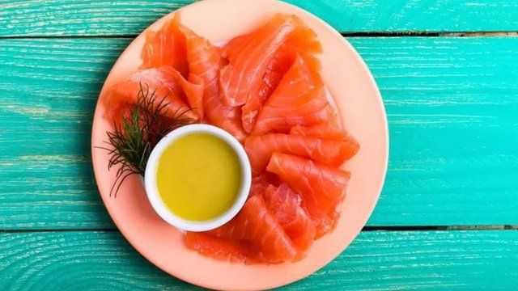
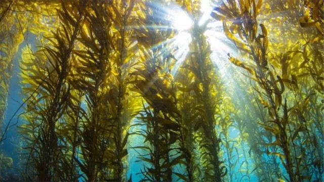
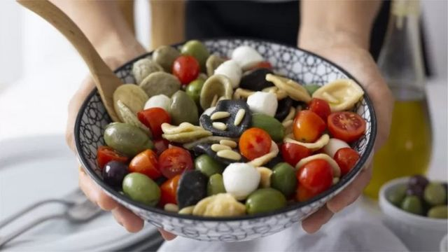

# “媲美地中海饮食” 北欧饮食你了解多少？

#  北欧饮食：爱好者称其健康益处堪比地中海饮食

  * 杜安·梅勒和艾卡维·格奥尔古索普鲁(DuaneMellorandEkaviGeorgousopoulou) 
  * 《对话》 

2022年8月9日

> 图像来源，  Getty Images
>
> 图像加注文字，油性鱼是北欧饮食的一部分。

**每个月网上似乎都流行一种新的饮食时尚。最新流行的饮食潮流之一是北欧饮食（Nordic diet），有人称它对健康的好处可能胜过地中海饮食（Mediterranean diet）。**

研究开始显示，它至少跟地中海饮食有类似的益处。

##  什么是北欧饮食？

北欧饮食以北欧国家传统饮食为基础。包含的核心食物为全谷物（特别是黑麦，也称裸麦、大麦和燕麦）、水果（尤其是浆果）、根茎类蔬菜（比如，甜菜、胡萝卜和萝卜）、油性鱼（包括三文鱼、金枪鱼和鲭鱼）、豆类以及低脂乳制品。

但同具有悠久历史、并一直在人口研究和调查中被认为是对健康有益的地中海饮食的不同之处在于，北欧饮食实际上是由营养和食品专家委员会以及厨师、食品历史学者和环保人士共同开发的一种饮食。

其背后的动力是以可持续性方式来改善北欧国家的饮食指南；与此同时，寻求创造一种与食品和文化相关的具有当地特色的饮食。

尽管如此，北欧饮食与地中海饮食有许多相似之处，它们都含有更多的全天然食品（也称全食，wholefoods），以及较少或没有经过高度加工的食品。

这种饮食还鼓励人们多吃植物性食品，少吃肉。

> 图像来源，  Getty Images
>
> 图像加注文字，北欧饮食中还有许多海藻和海带类，它们富含碘、欧米茄-3脂肪酸，甚至维生素D等。

或许北欧饮食的主要特点是，它鼓励人们多吃当地多样化食品，例如苔藓类、籽实类、蔬菜和香草（包括野生的）等。

这就是为什么像越橘这样的浆果类（lingonberries）是北欧食品的核心元素，而柑橘以及热带水果则不是的原因。

虽然北欧和地中海饮食大部分是以植物为主，但其植物类型非常不同。

例如，遵循北欧饮食的人会被鼓励多吃海藻和海带类(富含碘、欧米茄-3脂肪酸，甚至维生素D等)，以及其他一些当地所有的蔬菜和水果。

而地中海饮食中则包括诸如菠菜等绿叶类蔬菜、洋葱、西葫芦（也称小胡瓜）、西红柿及青椒等全部为当地产的蔬菜。

##  证据何在？

> 图像来源，  Getty Images
>
> 图像加注文字，一方水土养一方人，地中海饮食中则包括许多橄榄和西红柿等。

北欧饮食相对来讲仍然较新，它于2010年首次公布，这意味着现在就说它是否具有减少慢性疾病风险的功效可能还为时过早。

而另一方面，研究人员自从1950和1960年代就开始研究地中海式饮食 - 意味着我们对其对降低心脏病、二型糖尿病以及某些癌症之间的联系有着更好的了解。

但一些针对人们饮食习惯的回顾性研究已经发现，那些吃与现在被称为北欧饮食类似饮食的人往往更健康。

这些研究发现，北欧饮食模式跟北欧国家人群患心脏病和二型糖尿病风险较低有关。

然而，从其他国家来看，降低疾病风险与北欧饮食之间的联系相对没有那么强，这一原因目前尚不清楚。

关于北欧饮食人口研究的困难在于，他们研究的是一种当时在技术上还不存在的饮食 - 因为直到他们参与这些研究之后才被定义。这就意味着参与者未必刻意遵循北欧饮食模式 - 因此很难真正了解他们所说的这些健康益处是否归功于北欧饮食本身。

然而，最近（但规模较小）一项对北欧饮食研究的评审发现，它可以降低疾病的一些风险因素 - 包括减肥和减少LDL低密度胆固醇（通常称“坏”胆固醇），但对血压和总胆固醇并未有明显的改善。

但目前来讲，判断北欧饮食是否对健康有长期好处，以及它是否比地中海饮食对我们健康益处更大可能还为期过早。但已知的一些研究，似乎显示北欧饮食大有希望带来健康益处。

研究还表明，北欧饮食当中的一些主食部分（包括全谷物和油性鱼）本身就与健康更佳相关 - 包括降低心脏病风险。这显示，在遵循北欧饮食时把这些食品组合在一起可能会带来类似的健康好处。

##  吃本地食品

> 图像来源，  Getty Images
>
> 图像加注文字，像越橘这样的浆果类（lingonberries）是北欧食品的核心元素

北欧饮食不仅仅关乎于健康，它还通过使用当地和可持续食品让饮食更健康来帮助（拯救）地球。

目前，阻碍人们采纳北欧饮食的一些主要障碍是口味偏好和成本问题。如果能克服这些障碍，北欧饮食很可能成为北欧国家人们一种更可持续的饮食方式，同时也可能为其他人提供一种本地所产的（健康）饮食结构。

虽然现在说北欧饮食是否比其他更知名的饮食，比如地中海饮食更健康或许为时过早，但它有可能激励我们审视一下如何能调整饮食结构，把精力集中在更多消费当地产的全食食品上。

然而，多吃地中海饮食和北欧饮食两者当中的常见食物，比如，蔬菜、籽实类、豆类、全谷物和鱼，同时少吃红肉和加工肉类，可能是健康饮食的基础。

这一点，加上饮食多样化和试着以植物性饮食为主，对健康而言可能比单纯追求一种特殊饮食更重要。

_注：杜安·梅勒（Duane Mellor）是阿斯顿大学阿斯顿医学院实证医学（也称循证医学）和营养学负责人。艾卡维·格奥尔古索普鲁（Ekavi Georgousopoulou）是堪培拉大学营养与营养学助理教授。_

_本文原文发表在知识共享网站《对话》上（_ The Conversation  _）。_

