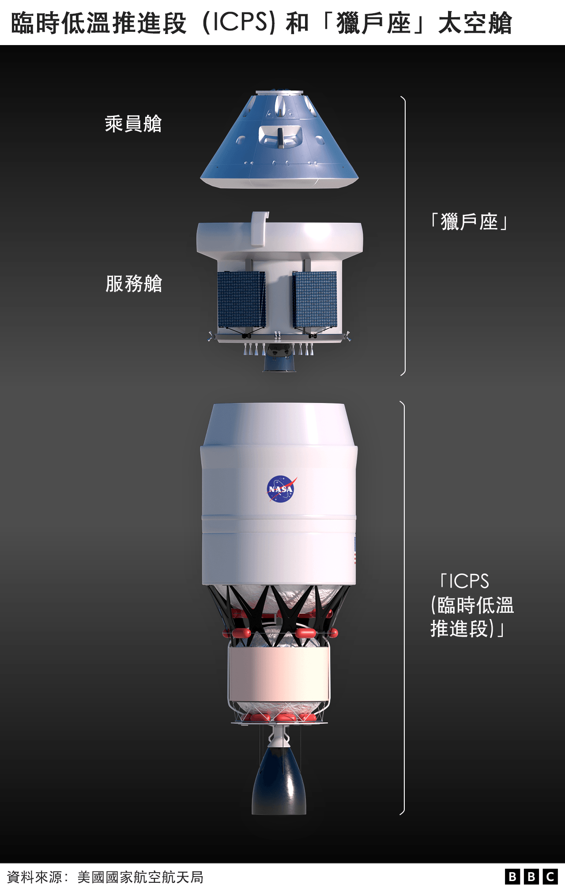
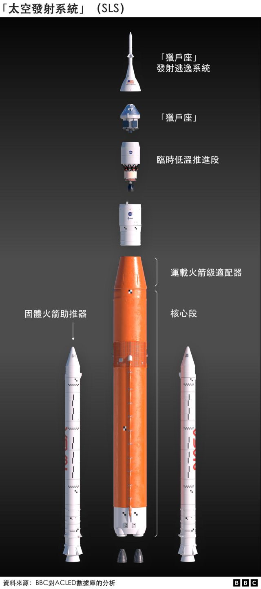
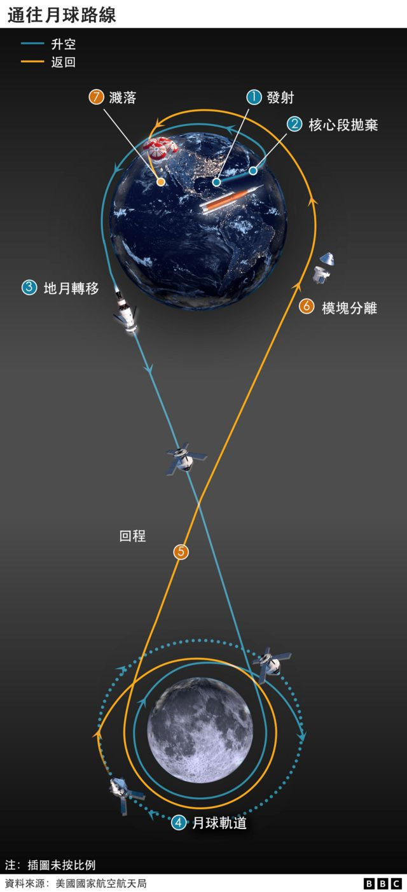
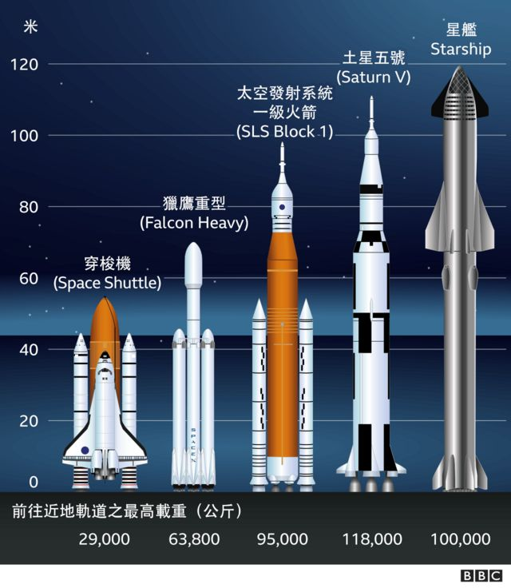

# “阿尔忒弥斯”：美国准备重启载人登月计划

#  美国“阿尔忒弥斯”计划：NASA准备重启载人登月新时代

最近更新： 8 小时前

> 图像来源，  NASA
>
> 图像加注文字，T-38教练机是美国宇航局用来训练宇航员的飞机。图为几架T-38教练机在肯尼迪航天中心发射台39B上空飞越即将发射的“太空发射系统”重型火箭。

**美国宇航局（NASA）正在为返回月球的旅程做准备，其新月球火箭——“太空发射系统”（Space Launch System，SLS）的升空准备进入最后阶段。**

“太空发射系统”是美国宇航局开发的最强大的飞行器，并将成为“阿尔忒弥斯”（ Artemis）计划的基础，该项目旨在让美国宇航员缺席50年后重新登月。

“太空发射系统”重型火箭原定于当地时间周一 （8月29日）08:33（格林尼治标准时间 12:33；英国夏令时 13:33）从肯尼迪航天中心升空。

但是在升空前最后一刻，美国宇航局宣布推迟发射计划。

控制人员未能将引擎温度降低到正确的运行指标。

此前他们还曾担心火箭上端是否出现裂痕，但最后判定那只是结霜。

NASA在宣布取消29日的发射计划的推文中还说，将适时发布下次计划发射的时间。

##  登月预演

“阿尔忒弥斯”计划被视为美国重返月球的第一步，也就是在2年后送太空人登月的预演。

按原定计划，高达322英尺的“太空发射系统”将把“猎户座”（Orion）测试太空舱载离地球。这艘飞船将围绕月球绕一个大弧线，然后在六周后返回太平洋溅落。

“猎户座”测试太空舱这次没有载人，但假设所有硬件都能正常工作，宇航员将从2024年开始登上太空舱，执行未来一系列更复杂的任务。

美国宇航员兰迪·布雷斯尼克（Randy Bresnik）解释说：“我们对‘阿尔忒弥斯一号’飞行所做的一切，都是从我们可以证明什么，以及我们可以证明什么可以降低‘阿尔忒弥斯二号’载人任务风险的角度来观察的。”

> 图像来源，  Reuters

美国航天局在下周有几次发射机会，但得抓住时机。每年这个时候，佛罗里达州的天气非常活跃，经常有电子风暴从发射站上空掠过。

事实上，最近几天，该发射站的避雷塔已经被击中数次。清晨是天气通常最平静的时候，这使得星期一成为飞行的好日子。

气象学家麦洛迪·洛文（Melody Lovin）说：“基本上，发射窗口的开始，或者早上08:30之后，有80%的机会出现有利天气。”

但是，如果技术问题将发射推到分配的两小时窗口的后面，则概率会下降到60%，因为可能会出现阵雨。火箭不允许在雨中升空。

##  分析：“阿尔忒弥斯”是新一代的“阿波罗”吗？

**BBC科学事务编辑** **丽贝卡** · **莫雷尔（Rebecca Morelle）**

1969年，当尼尔·阿姆斯特朗（Neil Armstrong）和巴兹·奥尔德林（Buzz Aldrin）在月球上迈出第一步时，他们迎来了太空探索的黄金时代。“阿波罗计划”（The Apollo programme）改变了我们看待地球和我们自己的方式。现在，50年过去了，月球再次出现在人类的视线中。对于那些从未亲眼目睹阿波罗任务的人来说，希望“阿尔忒弥斯”（Artemis）能够激励新一代。

新的任务将有所不同。美国国家航空航天局正计划让第一位女性和第一位有色人种登上月球——这表明太空探索对所有人开放。而月球表面仅仅是个开始。美国国家航空航天局的野心更远，它的目标是火星。这确实将是体验的巨大飞跃。

