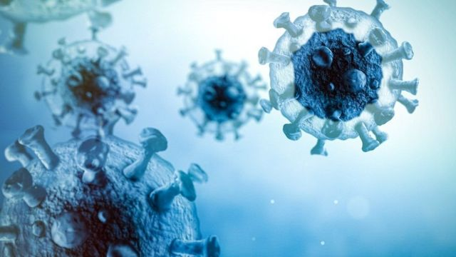
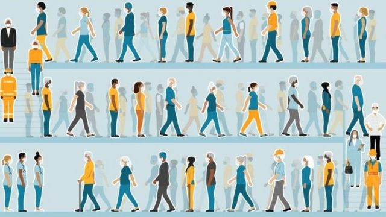
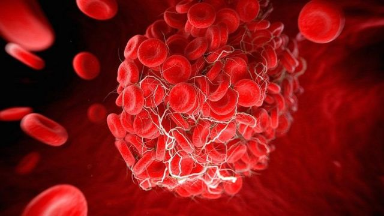

# [Science] 各国新冠疫情渐次“收尾” 大流行怎么定义？

#  各国新冠疫情渐次“收尾” 大流行怎么定义？

> 图像来源，  Getty Images

**美国总统拜登近期宣布，美国新冠疫情大流行结束。**

除了实施严格防疫政策的中国，大部分国家和地区虽然没有正式发布此类声明，但基本上都显示进入尾声阶段，开始讨论新冠免疫和治疗在“后疫情”时代的国家医疗保健系统中的位置等问题，包括再次普及接种疫苗加强剂。

日前，台湾、香港、日本、韩国也都宣布 进一步放松管控  。

此前，9月14日，世界卫生组织（WHO）发布最新新冠疫情政策简报。其时正值一周新冠病死率降到2020年3月以来最低水平。

世卫组织总干事谭德赛称，曙光就在眼前，结束大流行指日可待，但前提是必须坚持最后冲刺。他警告说，现在是关键时刻，绝不可松懈，否则可能将面对持续不断的疫情反复。

“大流行”（pandemic）这个词过去三年中被无数次使用，人们耳熟能详。

谭德赛提到新冠疫情时曾多次使用“大流行”一词，其中两次至关重要。第一次是2020年3月11日，媒体齐声说WHO宣布新冠疫情属于“大流行”，主要根据是疫情全球扩散，以及持续上升的感染和死亡人数。

第二次就是2022年9月14日，谭德赛说“大流行”的终点就在前方，应该一鼓作气作最后冲刺。

那么，“大流行”的开始和结束的具体标准是什么？

##  “大流行”的定义

其实，“大流行”仍无精确的官方定义和量化标准。

尽管这个词目前还没有一个被普遍接受的量化界定标准，但自2020年春季以来被广泛使用，且不尽严谨，经常模棱两可。

但是，“大流行”的定义对疫情爆发风险的定量评估影响重大，从而对公共政策的制定影响重大。

发表在 《自然》杂志上的一份研究报告  指出，“大流行”的不同定义会推导出不同的风险预计，而不同的定义会导致科学家、公众和政府对“大流行”的理解不同，造成混乱。

国际流行病学协会的《流行病学词典》将大流行定义为：“在世界范围内或非常广泛的地区发生的流行病，跨越国际边界，通常影响大量人群”。广泛到什么程度、世界范围包括全球多少国家或地区、大量人群是多大比例等量化标准，并不清楚。

文章作者指出，从科研角度看，目前大部分人熟悉的“大流行”概念，本质上都属于“定性的”，基于“非常广泛的区域”和“大量人口”之类描述。

世界卫生组织等国际卫生组织尚未提供“大流行”一词的任何正式定义，世卫组织也不再将其用作任何疫情的官方状态。

也正因此，2020年3月谭德赛总干事用这个词形容新冠疫情严重程度，引起媒体极大关注。

他当时解释，一个原因是为了提醒世人关注他所称的“令人震惊的不作为程度”，强调疫情爆发和蔓延重大风险，号召立刻采取行动抗疫。

但是， 流行病学研究和分析需要量化的定义。
 《自然》杂志文章  作者通过新的建模探讨不同的“大流行”定义是否会改变政府抗疫决策中的三个关键问题的答案：旅行限制会不会降低大流行风险？交叉免疫（一部分人已有免疫力）如何影响大流行爆发风险？大流行爆发风险是否受区域传播差异影响？

结果是肯定的，有影响但并不始终如此。这表明在评估输入性病原体风险时，需要明确所采用的大流行的量化定义，以免围绕公共卫生风险的交流出现含混误解。

论文作者指出，这方面还需要更多研究。

> 图像来源，  Getty Images

##  “大流行”之后如何与新冠“共存”？

大流行结束并不意味着新冠疫情结束，更不意味着新冠病毒从人世间消失，不复存在。

新冠病毒是新病毒，但传染病全球大流行不是新事物，如何应对、如何防范，可持续的长期疫情应对系统应该包括哪些要素，经过人类历史上几次疾病大流行，已有丰富的经验教训可供借鉴。

非盈利国际社团全球基金（Global Fund）指出，正规医疗保健机构和社区保健网络的完善是有效预防和应对流行病疫情的基础。它过去20年来致力于艾滋病、结核病和疟疾等知名传染病的防治。

这个基金的“大流行预防和应对”框架有四大支柱：准备（prepare）、预防（prevent）、检测 （detect ）、应对（respond）。这四个支柱也适用于未来对新冠疫情的预防和应对。

权威医学杂志《柳叶刀》（Lancet）2022年9月14日发布 研究报告  ，就如何将预防和应对未来新冠大流行疫情融入可持续发展计划提出八条政策建议：

  * 各国在可持续的基础上实施“疫苗接种+战略”，将大规模疫苗接种、检测的可得性和可负担性、新感染的治疗以及保护人口的公共卫生和社会经济措施结合起来； 
  * 世界卫生组织（WHO）、各国政府和科学界加紧寻找病毒的起源，调查可能的人畜共患起源和可能的相关起源； 
  * 世卫组织扩大世卫组织科学理事会，将紧急科学证据应用于全球卫生重点； 
  * 各国政府在应对新出现的传染病方面建立更密切的合作、更有效的协调方式； 
  * 世界卫生大会（WHA）与20国集团（G20）国家共同制定并通过一项十年全球战略，加强世卫组织各区域的药物研发和商品化生产能力，包括疫苗； 
  * 各国促进以人权和性别平等为基础的全民保健网络，并扩大大流行防范计划，以预防和应对新出现的传染病； 
  * 设立一个新的全球卫生基金，为低收入和中等收入国家的疾病控制、大流行防范和应对以及初级卫生系统加强商品增加新的资金； 
  * 联合国成员国，特别是G20，采用新的金融架构，扩大对低收入和中等收入国家的融资，以改善大流行防范，并帮助实现《巴黎协定》和可持续发展目标。 

> 图像来源，  PA Media
>
> 图像加注文字，一些国家和地区先后放松了疫情管控搓丝

##  让“死亡浪潮”成为历史

谭德塞把抗击新冠疫情比作马拉松，既然冲刺终点指日可待，更应把握住当前的机会。

世卫组织9月14日发布了6份政策简报，概括了各国政府现在必须采取的关键措施来“结束这场长跑”。

这些政策简报基于疫情爆发以来 32 个月左右时间内积累的数据、证据和经验，向各国提出的建议包括为高危人群接种疫苗，对病毒进行持续检测和基因测序，并将对2019冠状病毒病的有效治疗纳入基础医疗保健体系当中。

政策简报同样敦促各国政府为未来可能出现的病毒感染激增制定计划，保障相关物资和设备的充足，并为此配备额外数量的卫生工作者。

简报还包含信息沟通方面的建议，如培训卫生工作者识别和处理错误信息，以及创建高质量的科普材料。

世卫组织的玛丽亚·范·柯克霍夫（Maria Van Kerkhove）博士强调，新冠病毒仍在世界不同地区“密集传播”，汇总上报的病例数据其实低于实际。

世卫组织预计，未来还会出现大批感染浪潮，可能是不同时间出现在世界不同地点，导致感染浪潮的可能是奥密克戎变异株的亚变体，甚至也可能是其他需关切的变异株。这背后的部分包括病毒传播时间越长、范围越广，变异的概率大。

但是，和疫情初起时的一个重大区别是，现在人类已经掌握了有效的应对工具，包括疫苗、抗病毒药物，以及相应的对策，因此卷土重来的新冠疫情大概率不会导致“死亡浪潮”。

