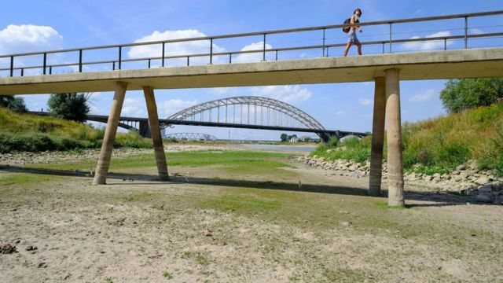
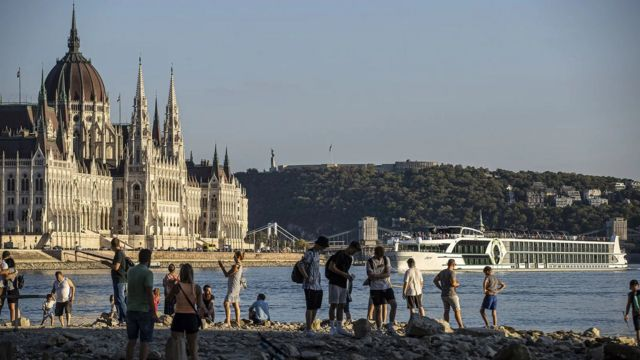
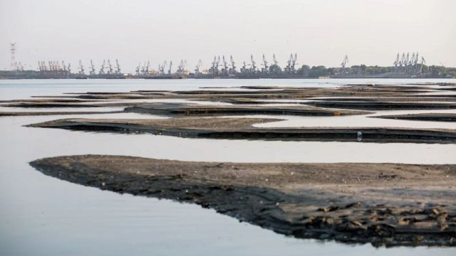
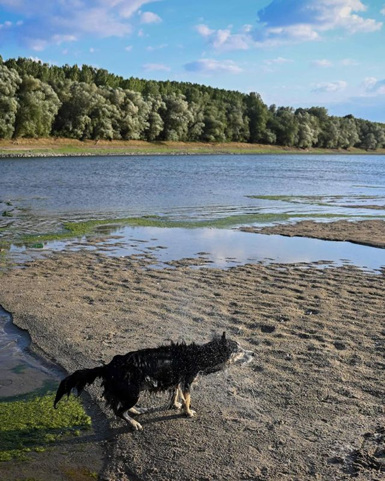
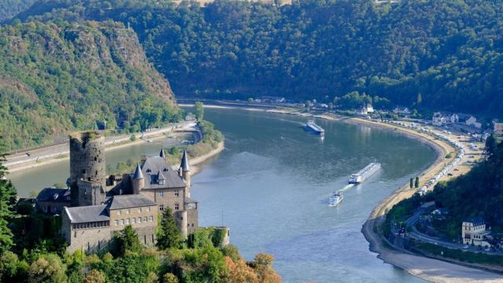

# [Science] 气候变化：欧洲河流干涸对我们预示的警告

#  气候变化：欧洲河流干涸对我们预示的警告

  * 保罗·豪肯诺斯（Paul Hokenos） 
  * BBC Future 

> 图像来源，  Getty Images
>
> 图像加注文字，一名妇女走过干涸河床上的桥

**多瑙河（Danube River）从德国的黑森林（Black Forest）蜿蜒而下1800英里（2898公里），在罗马尼亚流入黑海。多瑙河沿岸许多城镇依赖这条水道，比如罗马尼亚靠近保加利亚边境的小港口兹姆尼欣（Zimnicea）。**

但今年夏天的空前干旱和高温，已经进入第五个月，耗干了曾经强大的多瑙河，颠覆了兹姆尼欣居民世世代代赖以生存的一切，包括港口工人、农民、航运业、垂钓者、餐馆老板和家庭。

在人们的记忆中，这条河的水位从来没有这么低过，兹姆尼欣的海岸线上有大片的泥裂河底暴露出来，死去的软体动物证明了水生动物遭受毁灭性损失。

今年多瑙河的流量不到以往夏季的一半，数十艘驳船一动不动地躺在兹姆尼欣的港口，等待着使用唯一足够深的通道。当地人收集少量的雨水用于家庭用途，以免从多瑙河的汲取更多饮用水。孩子们沿着水退去后露出的新河滩玩耍。

整个欧洲今年夏天的大部分地区和多瑙河沿岸一样，紧急疏浚队都被召集起来，加深河道，疏散水运货物堵塞。尽管如此，乌克兰的许多黑海港口都由俄罗斯控制，多瑙河是这个饱受战争摧残的国家出口粮食的另一条路线，许多从乌克兰出发的粮食运输船被迫减轻货物重量，以便在多瑙河水道还没有完全干涸的情况下通过。

在罗马尼亚南部，大部分地区都依赖多瑙河提供饮用水，数百个村庄正实行定量供水，并限制玉米、谷物、向日葵和蔬菜的灌溉。在这条标志性水道上运送游客的游轮不得不停靠在码头。在2022年的前六个月，罗马尼亚水力发电公司Hidroelectrica的发电量比正常情况下减少了三分之一。罗马尼亚是欧洲最大的小麦生产国之一，但罗马尼亚的小麦种植者说，干旱造成收成五分之一的损失。由于俄罗斯对乌克兰小麦出口的封锁，罗马尼亚对国际市场的重要性超出以往。

“在多瑙河上下游的城镇，干旱和气候变化具有存在的意义，”《多瑙河: 从黑海到黑森林的上游之旅》（The Danube: A Journey Upriver from the Black Sea to the Black Forest）的作者尼克·索普（Nick Thorpe）解释道，“与城市居民相比，他们眼睁睁地看着这场灾难在他们眼前展开。”

> 图像来源，  Getty Images
>
> 图像加注文字，在匈牙利著名的议会大厦附近，干旱使多瑙河水位下降到人们记忆中的最低点

欧洲近三分之二的地区今年遭遇了干旱，是500年来最严重的一次。科学家表示，全球变暖在这场危机中扮演了重要角色。从卢瓦尔河（Loire）到莱茵河（Rhine），热浪对欧洲大陆的大大小小的水道造成了严重破坏，对欧洲的食品供应、商业、水源获取、能源系统和生态造成了广泛的连锁反应。科学家警告说，如果炎热干燥的夏季成为一种长期趋势，其中一些水道可能永远无法恢复。

在莱茵河沿岸，为数百万人供应煤炭、石油和大宗商品的驳船无法航行。到7月，意大利波河（Po）的水位非常低，政府宣布意大利北部进入紧急状态，大片农田无法灌溉。在法国，隆河（Rhône）和加隆河（Garonne）温暖的河水在冷却核电站系统方面效果不佳，许多核电站因此降低发电量。大河流的数百条支流情况更糟，几近干涸。

8月初，法国总理伊丽莎白·博尔内（Élisabeth Borne）表示，法国正经历该国历史上“最严重的干旱”，干旱严重侵蚀了包括卢瓦尔河、杜布河（Doubs）、多尔多涅河（Dordogne）和加隆河在内的河流，以至于数百个市政局现在要用卡车运送饮用水。

德国亥姆霍兹环境研究中心（Helmholtz Centre for Environmental Research）的卡斯丹·林克（Karsten Rinke）说，“就干旱强度和持续时间而言，今年情况不同寻常，但这是新常态。欧洲存在着巨大的水资源缺口，而且由于没有得到补充，这种情况每年都在恶化。”林克说，过去五年中有四年的干旱状况使地下水枯竭，为河流提供水源的冰川进一步缩小，并改变了长期滋养社区和生态系统的景观。

> 图像来源，  Getty Images
>
> 图像加注文字，多瑙河水位下降，河床出现新的沙岛，使得航行更加困难

维也纳自然资源和生命科学大学（University of Natural Resources and Life Sciences）的托马斯·海恩（Thomas Hein）说，“也许今年最令人担忧的是从巴伐利亚到黑海的整个多瑙河流域都处于低水位。”该流域面积超过80万平方公里（30万平方英里），包括19个国家，占欧洲大陆面积的10%。“整条河都受到了影响，这意味着我们不能从一段抽水到另一段来弥补缺水问题。”

塞尔维亚第二大城市诺维萨德（Novi Sad）位于多瑙河畔，河水非常低，人们可以涉水过河——就连这座城市最年长的居民也从未见过这种情况。整个码头和他们的船只都被困在干涸的河床上，而从未见过的岛屿出现在浅水区。诺维萨德周围富裕农业地区的农民要求政府宣布紧急状态。过去的一个可怕的象征已经显现出来：几十艘二战时期沉没的德国军舰，其中一些还藏有实弹，现在可以在诺维萨德下游的普拉霍沃镇（Prahovo）附近的河流中看到。

干旱对商业造成了巨大影响：欧洲的水路运输每年平均为每位欧盟居民运送约一吨货物，仅运输一项就为经济贡献了约800亿美（695亿英镑）。莱茵河如今变得如此瘦弱，巨大的沙洲出现在水道中央，以至于满载的驳船无法将煤炭、柴油和其他商品运输到德国鲁尔区的工业城市。

由于俄罗斯对欧洲停止出口天然气和煤炭，流经莱茵河和其他河流的煤炭和燃料就尤为重要。此外，由于缺乏冷却水，法国核电站减产也导致了法国电力价格飙升至每兆瓦时900欧元，是去年价格的10倍多，这闻所未闻。

科学家们表示，河流水量低引发的经济问题只是一部分。奥地利因斯布鲁克大学（University of Innsbruck）的生态学家加布里埃尔·辛格（Gabriel Singer）解释说，作为一个整体，水系中的水越少，盐越无法稀释，流动就越慢，这导致了更高的含盐量和水温，对许多河流生物来说是致命的，如多瑙河鲑鱼、倒钩鱼和欧洲灰鱼等。

辛格解释说，高温也助长了藻类的繁殖，这对河流系统可能是有毒的。德国的几条河流就发生了这样的事情，包括莫泽尔河（Moselle）和内卡河（Neckar），也许还有奥德河（Oder）。8月中旬，在一周之内，有超过100公吨的死鱼——其中有鲈鱼、鲶鱼、梭子鱼被冲上了河岸，专家们目前正在调查原因。

> 图像来源，  Getty Images
>
> 图像加注文字，人和动物在这片新沙洲上玩耍，但不断下降的水位将给该地区的农民带来巨大的问题

科学家们指出，虽然欧洲大河的困境占据了新闻头条，但受到严重影响的却是较小的河流。林克说，“很多小河已经完全干涸，一滴水都没有了。当这种情况发生时，它们会永远失去整个生物群落。下次下雨的时候也无法恢复。”

科学家表示，数千年的工程和欧洲河流沿岸的人类活动也起到了一定作用。曾经蛮荒的河流被拉直，森林砍伐，筑坝，工业污染，废水排放，以及农业对海岸线和湿地的侵占，使得欧洲的河流更容易受到热浪、低水位以及洪水的影响。

辛格说，“所有的河流系统都是高度分散和脆弱的。”他强调，虽然多瑙河下游受干旱困扰，但德国和奥地利的上游地区可能面临洪水的风险，就像去年7月在德国和比利时的莱茵河地区发生的那样，令人震惊。他说，潜在的问题本质上是一样的：高度改造的河流流域无法较长时间保持水流。他说，“健康的自然生态系统就像吸水的海绵，但我们的生态系统已经失去了这种能力。”

维也纳大学（University of Vienna）的湖沼学家克里斯汀·格雷伯乐（Christian Griebler）解释说，“我们失去了大量的水，因为雨水无法渗透进硬化的地表，而干旱后的大雨也不会渗透到干燥的土壤中。地表溢流进入河道，很快流走，很难与周围的含水层沟通。”

因此，辛格和格雷伯乐说，当局的反射性反应，即清理河道，并没有解决根本问题。事实上，使情况更加恶化。

要解决今夏欧洲河流危机，当然需要长期努力以减缓全球变暖。科学家表示，从短期来看，各国政府需要解决其他影响大陆水道的因素，包括加强对湿地的保护。

> 图像来源，  Getty Images
>
> 图像加注文字，在德国西部，莱茵河等河流水位不断下降，导致了河流运输和旅游业的大幅下滑（Credit: Thierry Monasse/Getty Images）

辛格说，在这方面已经取得了一些进展。去年，教科文组织沿着穆拉河（Mura）、德拉瓦河（Drava）和多瑙河建立了世界上第一个五国生物圈保护区——总面积近100万公顷（3860平方英里）。

多瑙河三角洲是欧洲最大的湿地，自1998年以来一直受这样的保护。但三角洲的特殊地位并没有使它免受极端天气的影响。今年8月，三角洲的勒提亚森林（Letea Forest）的淡水泉水干涸，危及罗马尼亚著名野马的生命。官员们用推土机铲平了沾满泥浆的泉水，使水重新流动起来，马才能喝到。

海恩说，“幸运的是，我们仍有冰川，在降水较少的时候，可以作为大型河流的储备 **。** 但气候变化建模者表示，冰山将在30年内消失。这非常令人担忧。”

驻维也纳的欧盟多瑙河地区战略（Strategy for the Danube Region）协调员罗伯特·利希特纳（Robert Lichtner）说，适应措施最终必须成为多瑙河流域未来的一部分。“我们希望减缓这些过程，但（极端天气）不会消失，”他说，“我们必须适应它，学会适应它。”

请访问 BBC Future  阅读 英文原文  。

