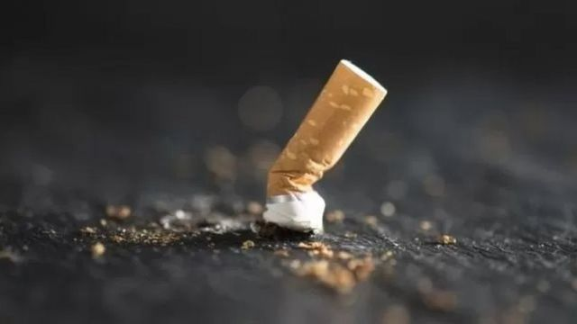
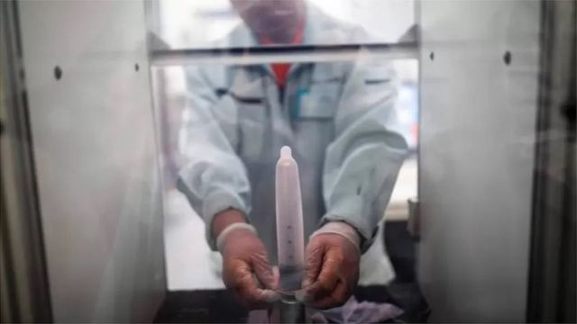
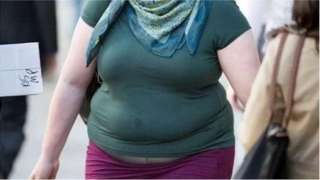
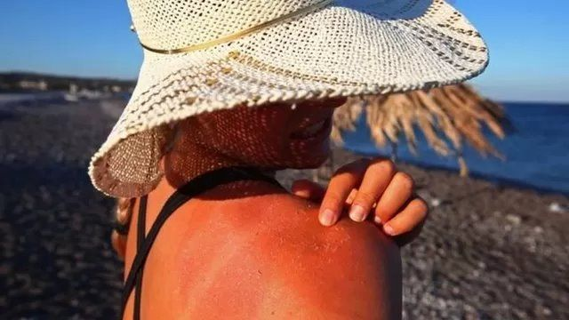

# [Science] 健康小贴士：降低日后癌症风险 年轻人应该做的五件事

#  健康小贴士：降低日后癌症风险 年轻人应该做的五件事

  * 莎拉·艾琳森（Sarah Allinson） 
  * 兰卡斯特大学高级讲师 

> 图像来源，  Getty Images
>
> 图像加注文字，要想以后不生癌最好从年轻时就养成健康生活习惯

**大多数人在二、三十岁时都不会想患癌症的事。但最近一项研究显示，1990年代以后出生的人比他们之前任何一代人都更可能在50岁之前罹患癌症。**

说到癌症，虽然有些事我们无法改变 - 例如我们继承的某些基因 - 但多达一半的癌症是可以避免的。这意味着我们早期生活方式的选择对以后患癌风险有重大影响。

以下是你现在能做的几个最重要的生活方式改变，以帮助减少癌症风险。

##  一，不吸烟

> 图像来源，  Getty Images
>
> 图像加注文字，吸烟是诱发癌症的最大风险因素之一

吸烟不仅是每年导致肺癌的主要原因，它还与其他14种癌症有关，其中包括口腔癌和喉癌。

现在年轻人不太可能吸烟，部分归功于电子烟的流行。但研究仍然表明，经常吸烟者当中十个人中有九个是在25岁之前就开始吸烟的。如果你希望显著降低许多类型癌症的风险，就不要吸烟 - 或者赶紧戒烟。

尽管电子烟的危害肯定比吸烟少，但其长期影响并未得到研究。出于这一原因，英国癌症研究基金会建议只应该使用电子烟来帮助戒烟。吸食大麻对癌症风险也不为人所知，尽管有一些证据表明使用大麻与增加睾丸癌风险之间有微小联系。在获得更多研究结果之前，最好也避免这两者。

##  二，安全性行为

> 图像来源，  Getty Images
>
> 图像加注文字，使用安全套是安全性行为重要一环。

能引起生殖器疣的HPV（人乳头瘤病毒）是全球最常见的性传播感染。它可以引起一系列癌症，包括宫颈癌、阴茎癌、口腔癌和咽喉癌。

与HPV相关的癌症在年轻人中尤其普遍。仅在英国，宫颈癌最常见于30-34岁的女性。同时，据信HPV发病率上升可能解释了最近在年轻男性当中口腔癌激增的原因。

接种HPV疫苗以及安全性行为将有助于保护你免受该病毒的感染。对女性而言，宫颈筛查（巴氏涂片检查）同样重要，因为它可以检测到是否有HPV感染，这样就可以在它有机会引起癌症之前采取措施。因此，25-64岁的女性应该每5年定期做筛查。

##  三，保持健康体重

> 图像来源，  PA Media
>
> 图像加注文字，女性肥胖尤其增加患癌症风险

体重过重或是肥胖与13种不同癌症风险增加有关，包括肠癌、乳腺癌、子宫癌和胰腺癌等。过多脂肪会导致体内炎症，从而促进肿瘤生长并帮助癌细胞分裂。

脂肪细胞还会产生雌激素，雌激素能够刺激乳房和子宫的肿瘤生长。因此，女性癌症风险更加突出。与体重超重或肥胖有关的癌症正变得越来越普遍，尤其是在年轻人中。

不仅如此，仅饮食不良本身就能增加更大患癌风险。例如，吃太多红肉和加工肉食与增加肠癌风险有关。但另一方面，越来越多的证据显示，吃富含纤维以及各种蔬菜和水果的健康、均衡饮食实际上可以减少几种不同类型癌症的风险。

因此，吃正确饮食和保持健康体重都是降低以后罹患多种癌症风险的很好方式。

##  四， 少饮酒

> 图像来源，  Getty Images
>
> 图像加注文字，研究显示，少喝酒或是不喝酒将有助于降低患癌风险。

众所周知，酒精可以引起包括肝癌、乳腺癌和食道癌等几种癌症的风险。虽然喝的越多，风险越大，但据信，甚至适当饮酒也会增加全球每年癌症病患多达10万例。

虽然对酗酒影响的研究不多，但有一项研究显示，经常酗酒的适度饮酒者患乳腺癌的可能性高达50%。喝酒时抽烟还可以增加吸烟的致癌作用。

少喝酒或是彻底不喝酒将有助于降低患癌风险。英国国民保健系统NHS推荐每周饮酒不要超过14个酒精单位（大约6品脱啤酒或10小杯葡萄酒），而且尽量每周有几天不喝酒。

##  五，涂防晒霜

> 图像来源，  Getty Images
>
> 图像加注文字，烈日炎炎，一定要涂防晒霜

皮肤癌是40岁以下人最常见的癌症之一。过去几十年这种癌也变得越来越普遍。

皮肤癌最主要的原因是紫外线辐射 - 无论是来自太阳还是由于日光浴床的紫外线辐射。由于紫外线辐射的影响是日积月累的，最经常暴露在太阳下的皮肤部分，比如说脸部，最可能患皮肤癌。

除此之外，如果年轻时曾被太阳严重晒伤，也会特别增加患上最危险类型皮肤癌的风险。

在烈日下外出时，可以用防晒霜保护自己。可以戴帽子、穿长袖衣服，并涂抹至少SPF（日光防晒指数）15的防晒霜，但记住没有任何防晒霜可以提供百分之百的保护。

这对那些属于高风险皮肤癌的人群尤其重要，比如皮肤颜色较浅和容易长雀斑的人。

总体来说，降低多种癌症风险的最佳方式也跟保持更好的健康相关。改善总体健康、预防癌症的其他方式还包括积极锻炼和避免空气污染。

**注：本文作者莎拉·艾琳森（Sarah Allinson）是英国兰卡斯特大学高级讲师。本文发表在知识共享网站** **《对话》（** The Conversation  **）** **上。**

