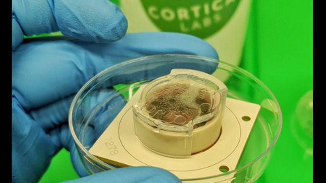
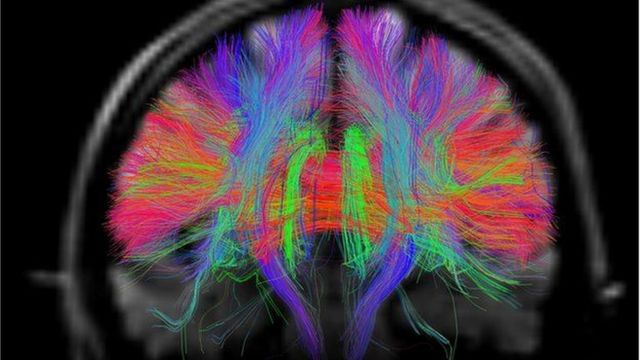
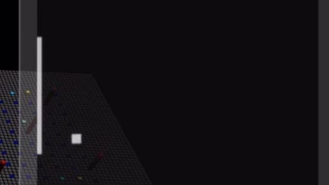

# [Science] 实验室培养皿里“长出”会玩电子游戏脑细胞

#  实验室培养皿里“长出”会玩电子游戏脑细胞

  * 帕拉卜·戈希 （ Pallab Ghosh ） 
  * 科技事务记者 

> 图像来源，  Cortical Labs
>
> 图像加注文字，这 80 万个脑细胞是实验室培育出来的，它们的智能达到玩1970年代一款电子游戏的水平，虽然成绩很差

**研究人员在实验室中培养出脑细胞，这个在培养皿中长成的脑组织已经学会玩1970年代流行的一款电子游戏。**

科研人员说，这个“迷你大脑”可以感知并对周围环境作出反应。

澳大利亚脑科学公司 Cortical Labs 的布雷特·卡根（Brett Kagan）博士宣称，他在培养皿中创造了第一个"有知觉"的实验室培养的大脑； 论文发表在《神经元》杂志上  。

同行们承认这"令人兴奋"，但同时也表示把培养皿中长成的脑细胞称为有知觉，可谓言过其实。

卡根说：“我们找不到更好的术语来形容这个组织。”它能够从外部来源获取信息，对其进行处理，并作出实时回应。

> 图像来源，  Van Weeden
>
> 图像加注文字，人类的大脑比目前的人工智能（AI）系统更具适应性，学习速度更快。它能成为下一代计算机的更好模型吗？

“迷你大脑” 最早于 2013 年问世，当时主要用于研究一种被称为小头症的遗传疾病，属于神经发育障碍，患者的脑围比正常平均值小至少三个标准差。后来，实验室培育的脑组织一直用于大脑发育方面的研究。

这是“培养皿大脑”第一次进入外部环境并与之互动。首次互动的具体形式是玩电子视频游戏。

研究团队做了下面两项工作：

  * 用干细胞和一些从小鼠胚胎中生长出来的人类脑细胞培养成一个有 80 万细胞集合而成的脑组织； 
  * 将这个“迷你大脑”连接到《乓》视频游戏，通过电极显示球在哪一边，离球拍有多远 

> 图像来源，  Cortical Labs
>
> 图像加注文字，《乓》（Pong）被称为电子游戏的鼻祖，诞生于 1972年。

这个“培养皿大脑”作出回应，产生自己的脑电活动。

随着比赛的推移，脑细胞消耗的能量相应减少。

但是，当球错过球拍，游戏从球的随机位置重新开始时，它们的重新校准活动增加，以应对并适应新的不可预测的情况。

这个迷你大脑五分钟就学会了玩这个游戏。

它经常错过球 —— 但成功率远高于随机概率。

不过，研究人员强调，它并没有意识，不知道自己正在以人类玩家的方式玩《乓》游戏。

##  啤酒乒乓？

卡根博士希望这项技术最终可用于阿尔茨海默氏症等神经退行性疾病的治疗方法的测试。

“当人们看着盘子里的纸巾的那一刻，他们看到的是有没有活动。而脑细胞的目的是实时处理信息，” 他说。“挖掘它们的真正功能可以解锁更多可供全面探索的研究领域。”

卡根下一步计划测试酒精对迷你大脑玩《乓》的能力有什么影响。

如果它以类似于人脑的方式做出反应，那将进一步显示这个脑组织作为实验替代品的有效性。

> 图像来源，  SPL
>
> 图像加注文字，研究人员表示，他们的迷你大脑比目前的人工智能系统更具适应性，因此可能为适应性更强的机器人提供基础。

不过，卡根形容他培养的脑组织“有知觉”与许多字典的定义不同；根据字典定义，有知觉意味着有能力拥有感觉和感受。

卡迪夫心理学学院名誉研究员迪恩·伯内特（Dean Burnett）博士更倾向于用“思维系统”一词。

他说：“有信息被传递和使用，由此引发变化，所以他们受到的刺激以一种基本方式被‘思考’。”

随着研究进一步深入，迷你大脑很可能会变得更加复杂。但卡根博士的团队正在与生物伦理学家合作，确保不会出现培育出有意识的大脑的意外，以及随之而来的所有伦理问题。

"我们必须把这项新技术看作类似萌芽时期的计算机行业那样，当时第一批晶体管是简陋的原型，很不可靠，但经过多年的深入研究，它们给世界各地带来巨大的技术奇迹，“他说。

人工智能（AI）专家已经开发出能够击败国际象棋特级大师的设备。

但是，与卡根博士合作的伦敦大学学院教授卡尔·弗里斯顿（Karl Friston）：”迷你大脑的学习是自学，没有人教它，因此适应性和灵活性更强。

