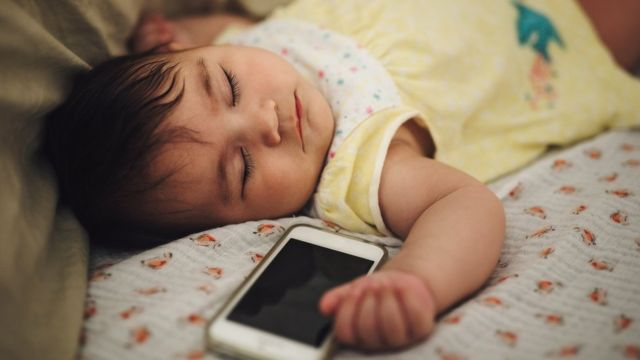

# [Science] 布朗噪音（“棕色噪音”）和白噪音有何却别？为什么可能帮助多动症者？

#  布朗噪音（“棕色噪音”）和白噪音有何却别？为什么可能帮助多动症者？

  * 哈列特·奥莱尔(HarrietOrrell) 
  * BBC国际部 

> 图像来源，  Getty Images

**你有没有想过为什么低沉的雨声，或是浪花轻拍海岸的声音听起来如此舒心？**

最近几个月，随着用户发现和分享布朗噪声（也称布朗噪音、棕色噪音、红色噪音或随机移动噪音，brown noise）的好处，这种浑厚低音频率的声音在TikTok上成为热门话题。相对于其“表亲”白噪音（white noise），布朗噪音相对鲜为人知，而且对其研究也比较少。

越来越多迹象表明，人们正求助于这种“棕色噪音”来逃避现代生活的干扰，或是自己的万千思绪。

据说这种声音可以帮助集中精力，有助睡眠，甚至可以帮助那些患有神经多样性病症，例如注意力缺陷多动症（俗称多动症，ADHD）的人自我调节。

但它工作的原理是怎样的，为什么最近变得如此火爆呢？

##  布朗噪音（棕色噪音）是什么？

> 图像来源，  Getty Images
>
> 图像加注文字，棕色噪声的特点是深沉的低频——例如瀑布的声音

与白噪音（是指一种功率谱密度为常数的随机信号。这种信号在各个频段上的功率谱密度是一样的，由于白光是由各种频率（颜色）的单色光混合而成，故叫白噪音，它类似于废弃无线电或电视台的静电声音，由于同时发出均匀声频，人耳可以察觉到）不同的是，“棕色噪音”更强调人耳可以听到的较低声调。由于缺少高频率，因此跟白噪音相比，“棕色噪音”听起来嘶嘶声不太明显。

这种声音在我们周围世界许多地方都可以找得到，比如，飞机内部的嗡嗡声以及许多自然现象。

但英文brown noise中的“brown”在这里并不是指棕色（虽然后来也有人把它称为棕色噪声），而是指布朗运动（Brownian motion）。几乎在200年前的1827年，植物学家罗伯特·布朗(RobertBrown)首次发现花粉在水中做（不规则）运动。

后来证实其他微细颗粒如灰尘也有同样的现象，虽然他并没有能从理论上解释这种现象，但后来的科学家用他的名字命名为布朗运动，因为该声音信号的图形表现跟布朗模式一摸一样，故此得名。

布朗噪音有时也被称为红噪音，其来源于光的类比，红光比白光有更多低频波谱，就像布朗噪音比白爆音具有更多低频波一样。

布朗噪音火爆，主要是因为ADHD群体在社交媒体上讨论和分享的结果。由于用户分享其音频的好处，让#布朗噪声标签在TikTok上有超过8600万次的点击和收看。

##  布朗噪音和神经多样性

> 图像来源，  Getty Images
>
> 图像加注文字，科学家们认为，背景音频，如棕色噪音，可以提高大脑唤醒水平，让神经多样性的大脑更好地工作。

精神病学家和睡眠医学专家迪米特里乌博士(DrAlexDimitriu)说，“神经正常和非ADHD的人听任何类型的噪音都会感觉受到干扰。”

但迪米特里乌博士对BBC表示，ADHD人的大脑“几乎生来就能在某种程度的混乱或压力下发挥更佳。”

他说，“有一种观点认为，有一点背景噪音能够提升大脑的唤醒程度，因为大脑现在要比平时寂静无声时多了一点刺激。”

他还说，患有ADHD的人往往需要更高程度的刺激，才能更投入和专心。

对布朗噪音没有对白噪音研究的更广泛，但对白噪音的研究发现，它也会对ADHD患者有一定程度的好处。

但迪米特里乌博士认为，同白噪音的“刺耳音调”相比，布朗噪音听起来更顺耳些。

他说，“它也许是个人喜好问题，但我认为人们更喜欢布朗噪音，因为它与小河流水的背景噪音相似。”

而在TikTok上获得“点赞最多”的一个视频显示了一位名为娜塔莉亚·巴布的用户第一次听到布朗噪音后的反应，她患有ADHD。

她惊讶的问：“这是真的吗？” “那些思绪都跑到哪去了？”而在其后的一个视频中，她宣称布朗噪音“彻底改变了我的学习方式。”

##  其他颜色的声音

> 图像来源，  Getty Images
>
> 图像加注文字，据说白噪声可以通过模仿子宫内生命的声音来帮助安抚婴儿

尽管布朗噪音是时下人们关注的焦点，其实还有其他一些具有不同频率的所谓不同颜色的噪音，其中包括粉红色、紫色，当然还有白色。

它们之间的区别在于其声音在多大程度上是由更高和较低频率组成的。

这些噪音或许有很多好处，虽然不是人人都会感觉如此，许多人会觉得背景噪音是一种干扰。就像迪米特里乌博士所说的那样，它取决于个人喜好。

人们经常用发出白噪音机器来安慰新生婴儿，因为据说它可以模拟子宫里生命的声音。

有耳鸣的人（他们听到的嗡嗡声或噪音来自耳朵内部，而不是外面）有时可以从紫色噪音中得到安慰。

这种颜色的噪音是声音的强度集中在更高频率上，布朗噪音正相反是集中在较低频率上。

沉稳、有环境杂音作用的粉红色噪音频率比白噪音低，但又高于布朗噪音，据说有助于听众更快入睡。

##  “这是我所发现的最有帮助的东西”

> 图像来源，  Getty Images
>
> 图像加注文字，布朗噪音通常被比作自然界中的声音，如下雨和海浪

尽管许多人声称不同背景噪音的种种好处，但科学家和专家们对它们到底是什么，或者它们甚至是否存在无法取得一致看法。

2020年一项对38项研究的评估发现，白噪音对睡眠有好处的证据很有限，而对现时越来越流行的布朗噪音的研究就更少。但对那些信奉背景噪音有益的人来说，绝对有铁粉发誓它提供实实在在的好处。

慈善工作者佩克说，她自从上大学起就依赖于听咖啡店背景声音来集中精力。

她说，“我觉得寂静无声太让人分心，它让我大脑有太多空间思维过度。像咖啡店这样的布朗噪音程度正合适，因为它无法让人识别或重复性太强，我也无法从声音中分辨出什么模式。”

“这就让我有空间思考任何我想做的事情，”她说。

同样，数据科学家鲍姆博（鲍姆博希望用单数“they”来代指自己。通常，这用于性别不详或任何性别皆可的情况）用视频游戏音乐帮助工作，用波浪声音助眠，并坚称它可以提高自己的工作效率和睡眠效果。

鲍姆博说，“我通常会听大海的声音或是森林篝火的声音让自己昏昏欲睡。我通常在20分钟内左右就睡着了。”

鲍姆博还说，“我还读到过视频游戏音乐有助你集中精力，的确如此。基本上任何重复性的背景噪音都能让我进入聚精会神的模式。”

怀孕近９个月的老师马思兰表示，自己从前就有失眠，怀孕后就更睡不好。

她说，“布朗噪音是我所发现的最有帮助的东西，但不幸的是它无法帮助我保持睡眠状态。”

虽然它背后的科学可能未经证实，但毫无疑问，据说它对那些使用者来说有好处。

戈蒂埃成年以后才被诊断出ADHD，像许多在儿童时期未被确诊的女性一样，她几乎没有得到过任何帮助。

她告诉BBC，“我基本上被告知：‘你一直到现在都应付的不错，所以你不会有事的’。他们没有考虑到随着你年龄增长，责任也越多，要处理的事情也更多。”

她说，“我从未真正得到过任何帮助，直到我自己偶然发现了噪音疗法。”

做IT项目经理工作的戈蒂埃之前曾使用鼓和贝斯帮助自己集中精力，但现在从布朗噪音中找到了慰籍。

她说，“它不仅淹没了周围的噪音，这种重复性声音还能帮助我整理我头脑中纷杂的思绪，并似乎对我身体有一种镇静效果。”

