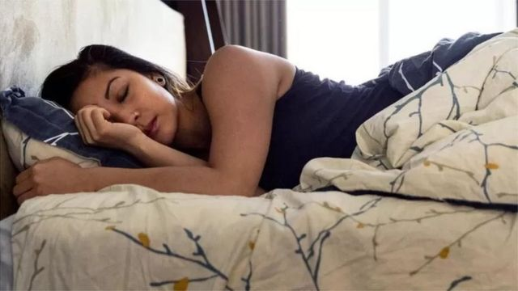
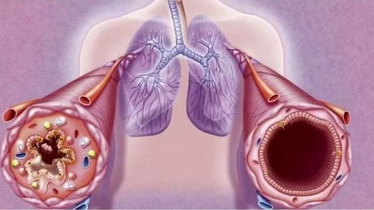
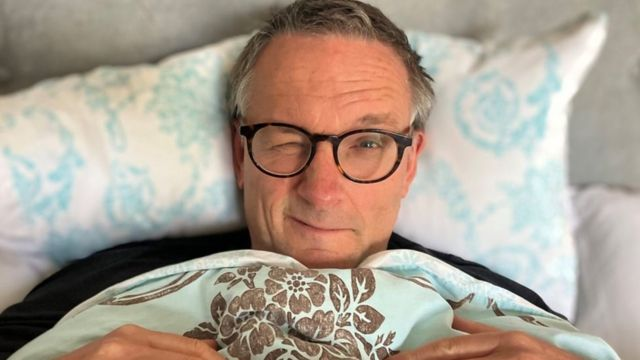
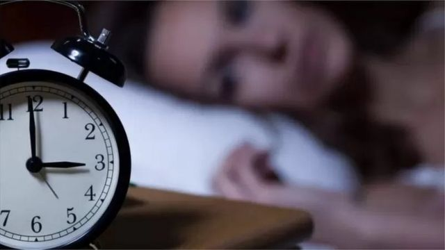

# [Science] 睡眠质量：五个实用小技巧帮你改善睡眠质量

#  睡眠质量：五个实用小技巧帮你改善睡眠质量

> 图像来源，  Getty Images
>
> 图像加注文字，英国睡眠不好的人占三分之一。

**如果你夜不能寐，那肯定不是少数。**

大约三分之一的人每天为睡眠所困，这包括入睡困难、或即使睡着了但又经常醒来，BBC科学节目主持人迈克尔·莫斯利医生（Dr Michael Mosley）也是其中之一。

他根据自己亲身体验制作了五集播客节目，专门探讨睡眠问题与如何应对睡眠不佳。

以下是莫斯利医生总结的改善睡眠质量的五个实用技巧：

##  一，放慢呼吸

> 图像来源，  Getty Images
>
> 图像加注文字，缓慢深呼吸有许多益处，包括对睡眠

先从一种简单但又非常有效的放松方式开始 - 做缓慢的深呼吸。

它的工作原理是，从利用大脑深处统称为蓝斑核（简称蓝斑，Locus Coeruleus）的一小群细胞入手。虽然体积非常小，但蓝斑却对整个大脑功能有惊人的影响。如果你思绪万千、无法入睡，那就是蓝斑太活跃了 - 它正向大脑周围释放一种叫去甲肾上腺素的荷尔蒙（noradrenaline ，一种具有唤醒作用的化学物质）。

都柏林圣三一学院的伊恩·罗伯逊教授（Ian Robertson）和他的团队发现，只要放慢呼吸，就能利用这一原理来减缓蓝斑释放。

可以使用4-2-4呼吸法（吸气时数到四，屏住呼吸数到二，然后呼气时再数到四）。莫斯利医生还建议尝试腹式呼吸，把一只手放到胸口，另一只手放到肋骨处。吸气时应该会感到放到腹部的手会随之起伏，而放在胸口的手则相对保持不动。

难以入眠，或是半夜醒来万千思绪，它是一种能帮人镇静的好办法。

##  二，充分利用早晨自然光

> 图像加注文字，自然光对晚上睡眠至关重要。

莫斯利医生说，在他饱受慢性失眠苦恼时所得到的最好建议之一就是每天在同样时间起床，然后到室外去感受晨光。

研究人员发现,，早晨起床的时间对生物钟的影响要比上床的时间更大。其中很大一部分是由于日光的影响。

当光线照射到眼睛时，它会激发位于眼睛后部的感受器，这些感受器会检测到光，并向大脑称为视交叉上核（suprachiasmatic nucleus）的区域发送信号，即“中央”生物钟。一缕晨光会停止身体生产睡眠荷尔蒙褪黑激素的产生，并向身体发出一天已经开始的信号。

早晨的信号将启动白天一系列的事件，这样12个小时后，到了晚上褪黑色素开始增加，为身体做好了深度消息的准备。

##  三，床是睡觉的地方

> 图像加注文字，莫斯利医生

听上去可能有点违背直觉，但如果睡不着，最好的办法就是起床。这是一种叫刺激控制法（stimulus control）的一部分。许多研究一致显示，这样做可以减少失眠，而且效果是持久性的。

这样做的目的是避免躺在床上醒着，并“睡不着”- 这就会让大脑把床是睡觉的地方重新联系起来。睡不着时，起来，只有在感觉真正困时再上床，这样就可以打破这种负面关联和恶性循环。

卡尼博士(DrColleenCarney)是刺激控制疗法的主要专家之一。这种技术一共有5步，详细方法可在莫斯利医生的 Enjoy Your Bed episode  （享受床上睡眠时光）这一集中找到。如果正确遵循这些步骤，会收到强大的疗效，至少对莫斯利医生效果不错。

##  四，先热后凉

> 图像来源，  Getty Images
>
> 图像加注文字，研究显示，睡觉前洗个热水澡入睡更快，睡得也更好。

上床前淋浴或洗热水澡真的可以帮助快速入眠。根据对最近13个有关研究的汇总发现，上床前洗热水澡的人入睡速度提高了36%，并且睡眠质量也更好，次日也会感觉休息的更好。

通过给身体一些部位加温，尤其是手和脚，能让帮助散发热量的特殊血管扩张。它会把身体中更多血液推到皮肤表面，继而有助于加速散热，以便身体的核心温度下降 - 这就像一种睡眠信号。

随着能源成本上升，好消息是，不必非要洗热水澡或淋浴才能从中获得好处。巴塞尔大学威尔茨-贾斯蒂斯（Anna Wirz- Justice）建议，任何能让血流流向手脚的方法都可以发出睡眠信号。因此，可以使用热水袋或是睡袜，并确保床上铺盖不要过多。

##  五，倾听身体的声音

> 图像来源，  Getty Images
>
> 图像加注文字，专家说，晚上睡不着最好不要盯着时钟看，担心自己睡眠不足。

我们都知道8小时是理想的睡眠时间。但要试图达到8小时目标可能会让人感到有压力，并无助于睡眠。成年人一般每晚需要7-9个小时睡眠，但这只是一个平均数。

有些人虽然睡得少些但也一点问题都没有，有些人则需要更多。同时，在一生不同阶段需求也会发生变化。

其实，8小时的说法相对较新。在前工业化时代，人们在黄昏后几个小时就上床睡觉非常普遍。然后醒来，并开始活动 - 他们可能会做一些诸如跟邻居聊天、学习、或是跟伴侣做爱等事情 - 然后又会上床再睡一会。

莫斯利医生说，这也令他感到一丝安慰，就算他有时半夜醒来，也感觉没有那么可怕了。

华威大学邓洁儿教授（Prof Nicole Tang）则建议，晚上不要看表，并担心自己能睡几个小时。她说，身体会自我调整，如果发现自己在白天日常活动中打瞌睡，那么意味着缺觉了，要再多睡一会。

