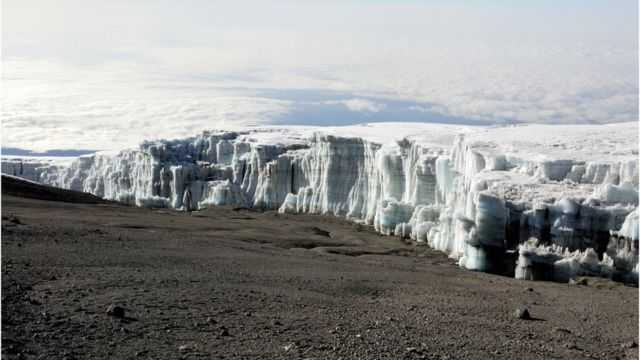
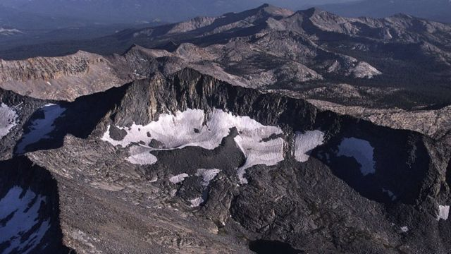
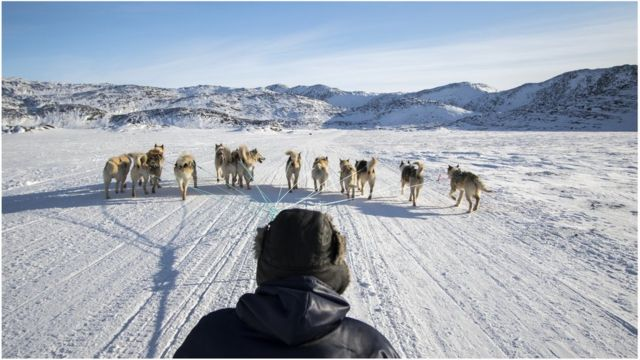

# [Science] 气候变化：联合国警告乞力马扎罗等非洲冰川将在2050年前消失

#  气候变化：联合国警告乞力马扎罗等非洲冰川将在2050年前消失

  * 帕特里克·休斯（Patrick Hughes） 
  * BBC气候与科学新闻记者 

> 图像来源，  Getty Images
>
> 图像加注文字，坦桑尼亚乞力马扎罗山上的冰川到2050年会消失

**联合国的报告说，由于气候变化，全世界许多地方的冰川、包括最后的非洲冰川，都会在2050年前消失。**

联合国教科文组织的一份报告说，联合国世界遗产名录中三分之一地点的冰川将在30年内消融殆尽。

非洲乞力马扎罗山上最后的冰川将和阿尔卑斯山，美国约塞米蒂国家公园（Yosemite）的冰川一样融化消失。

报告的作者说，尽管世界采取措施应对气候变化，这些冰川最终也都会融化消失。

联合国这份报告根据卫星数据做出预测，在世界各国领导人在埃及参加COP27气候变化会议的时候发表。

被联合国列入世界遗产的50个地方约有18,600个冰川，占地球冰川地区的几乎10%，包括著名的旅游景点和被当地人口视为神圣场所的地方。

报告说，冰川缩小或消失“是地球气候正在变暖的最明显的证据”。

联合国教科文组织的项目官员泰斯·卡瓦略·雷森德(TalesCarvalhoResende) 是该报告的作者之一。他说，“冰川是气候变化的一个重要指标，因为冰川明显可见。这是我们真实见证到的正在发生的事情。”

联合国世界遗产地点其余三分之二地区的冰川，只有在世界把全球变暖上升幅度限制在1.5C以下，才有可能避免消失的命运。最近联合国另外一份报告说，在实现上述目标方面目前世界尚未走上“可信的道路”。

> 图像来源，  Getty Images
>
> 图像加注文字，约塞米蒂国家公园的冰川也受到气候变暖的威胁

这些预测的根据是之前的另外一份报告，那份报告有描述世界遗产地点冰川随时间流逝而变化的模型。

美国布法罗大学的地质专家比塔·查托（Beata Csatho）也参加了上述研究。他说，“那是个从未有过的历史记录，显示正在发生快速的变化。”

她说，“在上世纪初，冰川还十分稳定。然后就以难以置信的速度退缩。”

到2050年将消失的冰川所在的世界遗产地点包括：

  * 希尔卡尼亚森林 (伊朗) 
  * 杜米托尔国家公园（黑山共和国) 
  * 维龙加国家公园 (刚果民主共和国) 
  * 黄龙风景名胜区 (中国) 
  * 黄石国家公园（美国) 
  * 肯尼亚山国家公园/自然森林（肯尼亚) 
  * 比利牛斯——珀杜山 (法国，西班牙) 
  * 鲁文佐里山国家公园 (乌干达) 
  * 普托拉纳高原 (俄罗斯) 
  * 瑞士萨多纳地质结构区 (瑞士) 
  * 纳汉尼国家公园(加拿大) 
  * 洛伦茨国家公园 (印度尼西亚) 
  * 弗兰格尔岛自然保护区 (俄罗斯) 
  * 乞力马扎罗国家公园 (坦桑尼亚) 
  * 约塞米蒂国家公园(美国) 
  * 多洛米蒂山脉(意大利) 
  * 科米原始森林(俄罗斯) 

> 图像来源，  Getty Images
>
> 图像加注文字，冰川融化引发洪水会给当地社区和原著民带来灾难

联合国的报告说，2000-2020年观测到的全球海平面上升的4.5%来自世界遗产地冰川减少。这些冰川每年流失的冰雪总量580亿吨，相当于法国和西班牙每年的用水量总和。

英国利兹大学的冰河学者邓肯·昆西（Duncan Quincey）教授参与了上述研究。他说，冰川是很多人的用水来源，包括他们的生活用水和农业用水，冰川减少可能会导致干旱季节供水减少。

昆西教授说“，这会导致食品安全问题，因为灌溉农作物需要水。”

报告作者说，冰川损失引发洪水，附近社区和原著民要承担那些灾难性的后果。他们还敦促建立早期预警和减缓风险、预防灾难的系统。

但是毫无疑问，人类最需要做的就是限制全球变暖。

联合国教科文组织的项目官员泰斯·卡瓦略·雷森德说，“也有可能看到希望的信息。如果我们能设法大幅度减少排放，我们仍然能够挽救许多这些正在消失的冰川。”

“这是对所有不同层次发出的必须采取行动的呼吁，不光在政治层面，从个人层面我们也要采取行动。”

