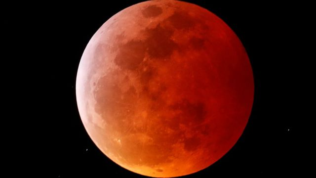
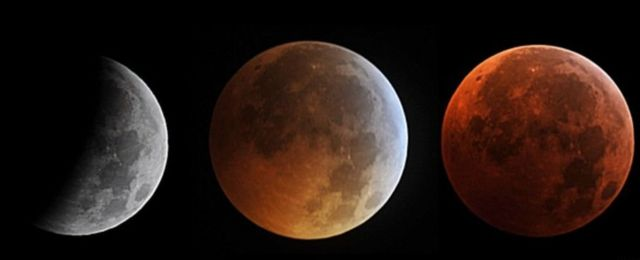
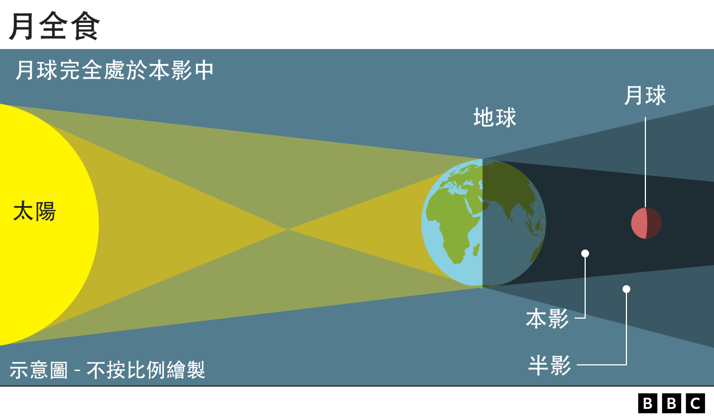
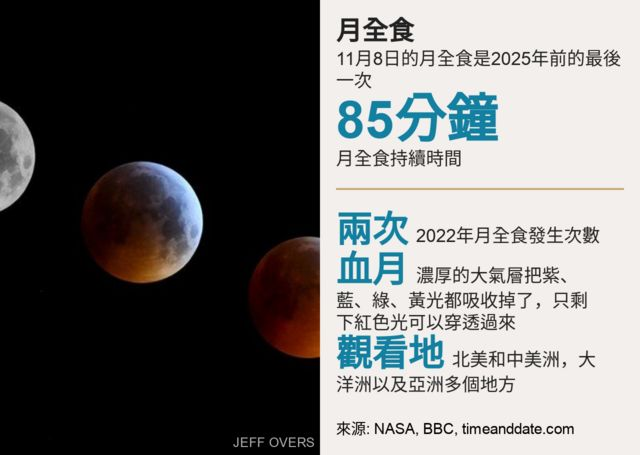
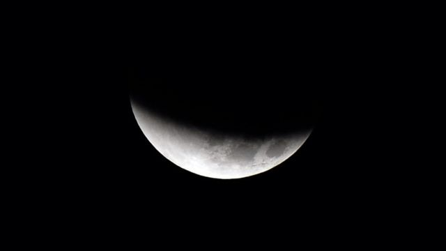
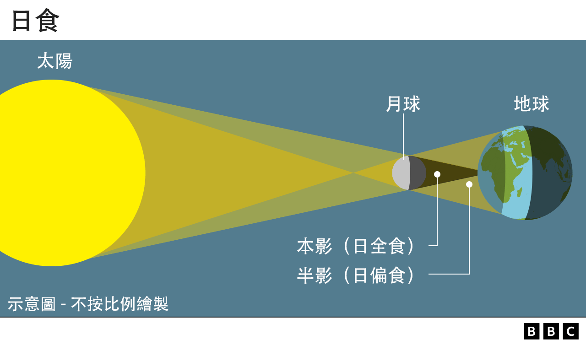
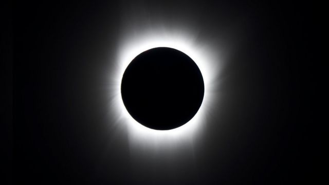

# [Science] “血月”月全食是怎么产生的 日食月食到底有多少种

#  “血月”月全食是怎么产生的 日食月食到底有多少种

> 图像来源，  Reuters
>
> 图像加注文字，2019年在美国加州拍摄到的“血月”

**罕见的“血月”今天上演，这是一种月全食现象。除了月食和日食，还有星食，这些天文现象背后有什么原理？**

11月8日出现被称为“血月”（blood moon）的一种月全食，亚洲、北美洲、中美洲、大洋洲都可以看到。

根据美国国家航空暨太空总署（NASA），这次月全食全长约一个半小时。

有别于日食，观察月全食可以用肉眼直接观看，不需要望远镜或专业设备。若错过这次月全食，下一次要等到2025年3月。

食（eclipse）这个天文现象之所以产生，是由於一个天体进入另一个天体的影子。

##  月食的原理

> 图像来源，  AFP
>
> 图像加注文字，2010年拍摄到的一次月食的不同阶段。

月食的产生，是当地球运行到太阳和月球中间，三者并排一线，月球被地球的阴影（分为本影和半影）覆盖，无法直接被阳光照亮。换言之，我们在月食期间看到的是地球投在月球表面的影子。

月球运行到地球不同的阴影区，会产生三种不同的月食：月全食、月偏食、半影月食。

**月全食**

当整个月球进入地球本影内时，就会出现月全食。部分阳光会穿过地球大气层，过滤掉了大部分蓝光，只剩下红光，让月亮呈现铜红色，就是坊间所称的“血月”。由于地球直径比月球大四倍，其阴影也更宽，因此月食可持续一个多小时。

**月偏食**

当月球部份进入地球本影内，就会出现月偏食。根据月食的大小，月球变暗的区域或变成暗红色丶古铜色或炭灰色，这是由于阴影区和未受阴影影响的明亮月球表面之间的对比所致。月偏食每年至少发生两次。

> 图像来源，  Getty Images

**半影月食**

当月球进入地球半影时，就会产生半影月食。半影月食较难用肉眼分辨，月球进入半影的部分越小，就越难观测，因此这种月食甚少被提及。

##  日食的原理

至于日食，是月球运行到太阳和地球中间时，太阳的光线被月球遮住。换言之，我们会看到月球在地球表面投下的阴影。

根据月球覆盖太阳的程度，日食也可分为三类：日全食、日环食和全环食。

**日全食**

太阳比月球宽400倍，但离地球也是400倍远，当太阳丶月球和地球并列在一起，月球的阴影宽度就刚好可以遮挡整个太阳。发生日全食的地方会在几秒到几分钟内，天空变得像夜晚般黑暗。

> 图像来源，  NASA

**日环食**

当月球离地球较远时，它看起来会“变小”，不能完全覆盖太阳圆盘，太阳没被月亮挡住的部分呈现环形，称为日环食。日环食最长可持续十多分钟，但通常也不会超过5或6分钟。明年10月将在北美和南美看到日环食。

全环食：又称混合日食，是月球刚刚达到可完全覆盖太阳的距离，形成日全食，但其後远离地球并转为日环食，又或者由日环食转为全食。全环食相当罕见，仅占所有日食的4%，上一次发生在2013年，下一次要等到2023年4月20日在印尼丶澳大利亚和巴布亚新几内亚观看。

##  星食

除了太阳和月亮，恒星也会出现星食（stellar eclipse）。

联星（binary star）是两颗恒星组成的恒星系统，互相围绕着共同的质心。部分联星的轨道与地球平面非常吻合，因此在其轨道的某部分，一颗恒星在另一颗恒星前面经过并遮挡了它，就出现星食。

