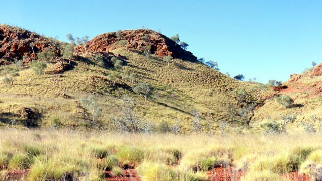
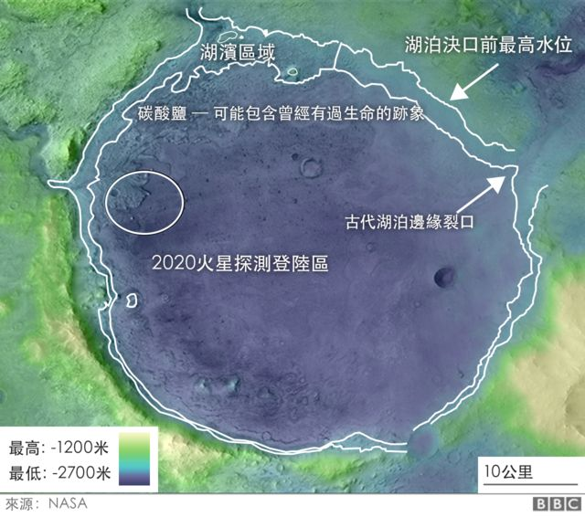
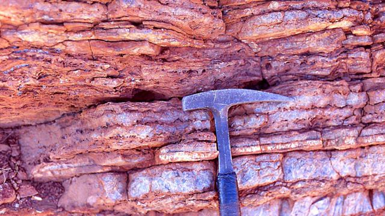
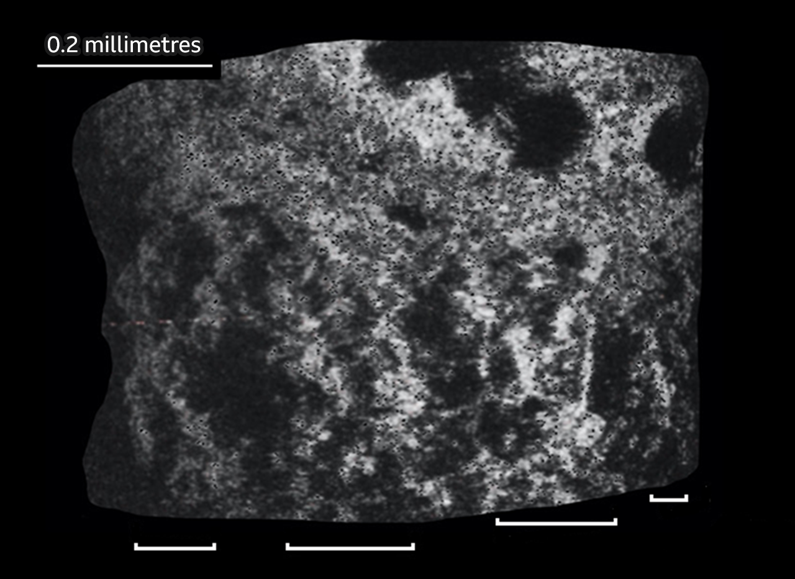

# [Science] 火星生命之谜：地球岩石为火星探测器提供重要线索

#  火星生命之谜：地球岩石为火星探测器提供重要线索

  * 乔纳森·阿莫斯（Jonathan Amos） 
  * BBC科学事务记者 

8 小时前

> 图像来源，  Frances Westall / CNRS Orléans
>
> 图像加注文字，叠层石形成的突丘最早受到居住在法国的英国科学家弗朗西斯·威斯陶尔的注意

**澳大利亚内陆有35亿年历史的岩石可能为科学家提供线索，帮助厘清火星上是否存在过生命。**

研究澳大利亚岩石的科学家说，远古的微生物可能影响了这些岩石的构成。

研究人员说，美国宇航局的“毅力号”火星探测器应该在火星上搜寻类似年代的岩石。

“毅力号”正在寻找生物证据，以期获得有关火星历史的主要线索。

同美国宇航局合作、在伦敦的自然历史博物馆的研究人员对澳大利亚西部大大小小的丘状地带做了一些特征描述，那些岩石特征可能是在古代微生物作用下形成的。

“毅力号”目前正在火星上探索“杰泽罗火山口”（Jezero Crater），据料探测器明年会穿越的地区可能有类似地球上的某些地貌。

> 图像加注文字，杰泽罗火山口: 一条河自西流入湖泊，然后水向东延申

这就是所谓叠层石（stromatolites）存留下来的样本。

经年累月，细菌和沉积物累积构成了很多毫米级的叠层，形成更大的丘形岩石，即所谓的叠层石。澳大利亚内陆地区保存下来数十亿年前形成的这种岩石的样本。

实际上，澳大利亚的一些岩石被地质学者认为是地球最早生命痕迹的样本。

伦敦自然史博物馆专研古代微生物的生物学者凯荣·希克曼-路易斯(KeyronHickman-Lewis)博士和同事正在对这样一些叠层石进行研究。这是迄今为止发现的最早的这类岩石样本，来自澳大利亚西部皮尔布拉（Pilbara）地区的德莱瑟地层(DresserFormation)，这些岩石已经有34.8亿年的历史。

这些样本并不包括能够显示过去存在过生命的微小的微生物化石或任何有机（富碳）复合物。但是自然历史博物馆的研究人员认为他们已经找到了显示岩石生物来源的印记。

> 图像来源，  Frances Westall / CNRS Orléans
>
> 图像加注文字，澳大利亚西部的皮尔布拉岩石至少在34亿年前就开始形成

研究人员利用一系列高分辨率的分析和成像技术探测岩石样本的细部结构，他们说，这种结构之所以存在，只能用过去存在过生命活动来解释，那不是在环境中自然形成的结构。

一个比较大的特征是叠层石顶部表面呈起伏状，光合菌向光的方向生长时就形成隆起部分。起伏形状出现是因为光照射三维物体时强度不一样。

在微观层面，岩石内部有微小的柱状，把形成叠层石的微生物的各个“层垫”连接起来。

希克曼-路易斯博士说，“这些牢固的结构是一种微生物生长形成的机理，我们称其为篱笆结构。”

他对BBC记者说，“我们从现代地球环境中对篱笆结构有充分的了解；能够看到不同大小和类似排列的例子。这种结构经常出现在隆起的生长层。”

> 图像来源，  K.Hickman-Lewis et al
>
> 图像加注文字，发白的微小的柱状体是生长的篱笆结构

这和火星以及“毅力号”探测器是有关系的，卫星图像显示，火星上“杰泽罗火山口”在遥远的过去曾经有过一个湖。在火山口边缘的碳酸盐石可能是岸边沉积物形成的产物。

巨大的杰泽罗平静、富有营养的浅水中，是否会有微生物生长形成的叠层石呢？

那里的时间线和地球并没有不同，只是稍微早一些。研究人员认为那个湖在37亿年前就形成了。

“毅力号”探测器在明年年底可能要走到火山口边缘。那时候探测器就会利用仪器设备寻找那些具有澳大利亚西部皮尔布拉叠层数同样特征的岩石。

> 图像来源，  Getty Images
>
> 图像加注文字，叠层石形成于平静，富有营养的水中

卡罗琳·史密斯（Caroline Smith）教授是自然历史博物馆地球科学藏品的负责人，她和希克曼-路易斯博士一样，也在做火星探测器项目。

她说，研究人员会利用从澳大利亚得到的知识指导火星探测器，寻找能够显示生物印记的样本。

“我们可能用探测器上的成像系统找到一些样本，但这显然取决于是否那里有叠层石，和它们的保存状况。”

她提醒说，“保存状况是微观还是宏观？是普遍存在，还是仅局限在较小区域？如果我们在错误的地方寻找，那就不会找到它们。”

“在杰泽罗火山口一下子找到古代生物印记是个很高的目标。更可能的情况是发现一些岩石样本，为在地球上进一步研究提供良好依据。”

这是“毅力号”探测车的设计初衷，即钻取，存储样本，让后来去火星的探测器把样本取回地球进行分析。

证明有生命存在过将十分困难，但是希克曼- 路易斯博士认为，他们团队的研究已经形成了一个此类研究的样板：“如果考古学者发现了一座城市废墟的地基，他们会知道那是人造设施，因为那显示了所有人工建设的痕迹，门，通道，道路和砖块。同样，叠层石内部的很多结构因素让研究人员能够确认形成过程，并且弄清它们的来源。”

有关地球最古老的叠层石的上述分析发表在《地质学》期刊上。

> 图像来源，  NASA
>
> 图像加注文字，毅力号火星探测器在明年年底的时候应该能够到达杰泽罗火山口的边缘地带

