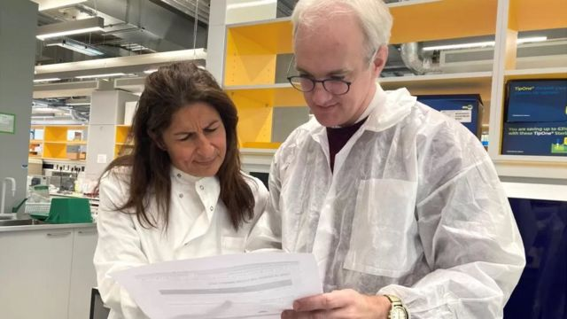
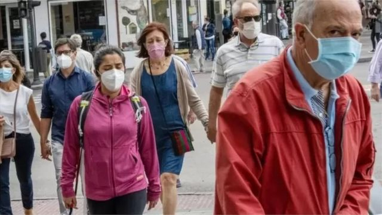
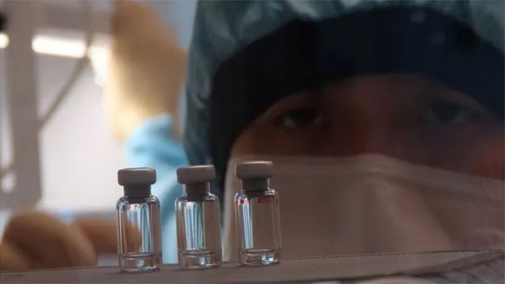

# [Science] BBC健康事务记者：我躲过新冠病毒了吗，这可能意味着什么？

#  BBC健康事务记者：我躲过新冠病毒了吗，这可能意味着什么？

  * 詹姆斯·加拉格尔（James Gallagher） 
  * BBC健康事务记者 

8 小时前

> 图像来源，  Getty Images

**我希望这一小瓶血能帮我找到答案，因为一个问题长期困扰着我 - 我是否躲过了新冠病毒？**

有任何人能躲过新冠看起来都似乎非常了不起。该病毒近三年前在中国出现后，席卷了全球。新毒株的传染性越来越强。就连疫苗也只是能让症状减弱，而无法为我们提供抵挡病毒坚不可摧的盾牌。

疫情期间，我一直在办公室上班，即使在封城期间也没停止。病毒还感染了我其他家人，但我却没有。

经历新冠疫情却没有染病，或是从未检测出阳性的并非只有我一人。根据夏天英国的一项估计，英国大约有十分之一的人从来没感染过新冠病毒。

这到底是怎么回事？是否我的身体，还有那些“从未得过新冠者”身体中有某种秘密武器可以对付这种疾病呢？

如果你认为自己躲过了新冠，大致有三种可能性：

  * 你错了 - 你实际上已经被感染了，但从未意识到 
  * 你从未接触过病毒 
  * 你身体有某种额外防御能力能击退病毒 

萨里大学病毒学家布罗德本特（Dr Lindsay Broadbent）博士告诉我，“许多人说，‘我从未得过新冠疾病’。大多数人可能错了。他们可能已经被感染，但却没有任何症状。”

“但我们的确知道有些人从未感染过，例如，即使是那些在高风险环境中工作的护士，” 她补充道。

一项针对定期做检查者的研究发现，一半感染奥密克戎的人根本不知道自己被感染了，或以为自己较轻的症状是其他病。

我手指挤出的血液将决定我是否也在自欺欺人。我把血液样本密封在小瓶中，寄给实验室去分析它所包含的抗体混合物。

抗体是免疫系统的一部分。它们就像导弹一样粘在病毒上。它会阻止病毒感染我们体内的细胞，并告诉其他免疫系统杀死病毒。不同抗体粘附在病毒的不同部分，该测试主要集中在两方面：

  * 检查粘附在病毒表面的刺突S蛋白抗体（Anti-S antibodies） 
  * 粘附在病毒内层的核衣壳N（nucleocapsid）蛋白抗体（Anti-N antibodies） - 它保护病毒的遗传密码 

英国使用的所有疫苗都是训练身体只攻击刺突蛋白。甚至在我打完上一次加强针一年以后，测试显示我体内仍有高水平的S蛋白抗体。

你身体只有在面对病毒本身时，才会学会攻击病毒的其他部分。如果我体内有N蛋白抗体，则意味着我曾感染过新冠。

> 图像来源，  James Gallagher
>
> 图像加注文字，加拉格尔（右）与病毒免疫学教授麦尼一起研究他的验血结果。

我的测试结果为阴性，说明我已经跨过了“躲避开新冠”的第一道屏障。病毒免疫学教授麦尼（Prof Mala Maini）邀请我到她在伦敦大学学院的实验室里看结果。

她说， “它可能意味着你从未感染过，但也可能是你有过N蛋白抗体，但已经从你血液中消失了。”

但我却从未检测出新冠阳性，尽管：

  * 我疫情期间来办公室工作，每周要做2次快检（lateral flows） 
  * 每次一有症状就驱车去做PCR核酸检测或是用快检方式测试 
  * 当我家人得新冠时我每天都测试 

麦尼教授总结说：“结合你的N蛋白抗体阴性结果来看，你可能属于那些逃过全面感染发病者。你可能是那种我们称之为‘顿挫感染’（abortive infection）者。”

##  免疫优势？

> 图像来源，  Getty Images
>
> 图像加注文字，一些人是否有免疫优势呢？

顿挫感染的意思是你接触到了病毒， 它甚至已经进入你身体中正确部位开始入侵，但在它得逞之前你的身体就将其控制住了。

我们从那些故意让人感染新冠病毒的研究中知道这一情况确实发生。这些人体试验把病毒喷入健康志愿者的鼻子中，但在第一批参加试验的34人当中，只有一半人被感染。

第一道保护防线是人们的先天免疫系统。这是我们身体的预置防御机制。它不能学习或是“记住”感染，所以每次都像第一次一样。但它动作非常快，可以迅速抑制感染。

布罗德本特博士通过使用从人体细胞中培养的微型肺（类器官）试验来证明这一点 - 她试图用病毒来感染类器官。

她告诉我，“我们发现有一个我们无法感染的人，我们将大量病毒粘在这些细胞上，但就是感染不了。”

免疫系统的另一半被称为后天免疫系统（也称获得性免疫系统，adaptive immune system），它会通过练习来学习并变得更好。这就是疫苗帮助身体抗击新冠的方式。

麦尼教授说，“也可能是疫苗对你非常有效，并为你提供非常好的保护作用。”

但疫苗在预防感染方面似乎只能起到有限以及快速消失的保护作用。而且，新冠疫情第一年还没有疫苗。

但这部分免疫系统还有其他方法阻止感染。

在新冠大流行之前，从一些医院工作人员身上所采纳的血液和肺部样本表明，一些人已经有了保护性的T细胞。它们就像哨兵一样，检查其他细胞有无感染迹象，如果它们发现受感染细胞，就会摧毁它们。

甚至在英国出现第一批新冠病例之前，一些人体内就已经有了抗新冠的“哨兵”。它们可能是感染了与新冠病毒有密切关系的其他普通感冒冠状病毒的结果。

麦尼教授表示， 如果你家中有小孩在学校的话，你很可能在过去几年就已经接触过这些病毒。

她补充说，“如果你已经让这些早就存在的T细胞做好待命准备的话，它们可以更迅速采取行动，在你测试呈现阳性之前就消灭感染。”

科研人员希望可以培养出能模仿这种之前就存在的免疫力新一代疫苗。

麦尼教授表示，如果你能制造出针对病毒内部区域的T细胞，并在鼻子、呼吸道和肺部产生预期的反应，那就能把握在病毒肆虐之前将其消灭的更好机会。这就是目标。

我的直觉是，每个从幼儿园回到家中的小孩都会给本来已经身心疲惫的父母带来大量病毒，这些病毒帮助我躲过了新冠。

##  其他解释？

> 图像来源，  Reuters
>
> 图像加注文字，新冠疫苗虽然不能预防人们不受感染，但却能大大降低其严重程度。

还有两种可能性，但它们要么并不适用于我，要么非常罕见。

有些人从未接触过该病毒，因为他们尽量不与他人接触。我采访过一些超级自我防护者，他们由于免疫系统较弱让他们更容易受到伤害而自我隔离将近1千天。

但这不是我的情况，我每天要坐火车去上班，甚至还和家里的病孩子睡在同一张床上。

另外一个解释就是遗传原因，免疫功能比较强大，在其他一些疾病上确实有这样的情况。

最有名的例子可能就是艾滋病（HIV）了。极少数人生来就有幸运的基因突变，这让他们不受艾滋病毒的感染。

他们遗传基因密码的一部分发生突变 - 一种叫CCR5的密码 - 改变了身体细胞上的锁，让HIV无法进入。这已经被用来治愈一些艾滋病患者，类似的突变已经显示可以把新冠病毒锁在人体细胞之外。

布罗德本特博士说，“具有某种遗传抵抗的人极少极少。”

##  那么，我这个冬天安全吗？

对我们任何尚未感染过新冠病毒的人来说，我们是否可以信心满满地过圣诞呢？抑或，我们实际上风险最大？

来自疫苗的保护意味着即使它无法阻止感染，但患重病的几率也大大降低。

包括瑞士的一项研究显示，感染过新冠病毒并接种了疫苗的人 - 被称作混合免疫（hybrid immunity） - 具有最强的免疫反应。

麦尼教授警告说，“因此，这有可能意味着你所面临的风险更大些。”

布罗德本特博士对此表示赞同：“如果你认为自己迄今为止还未感染过病毒，它并不意味着有抵抗力… 很可能就是你幸运。”

我想，我写这篇文章或许就是在故意冒险，会不会意味着我到圣诞节时肯定躲不过去了？

