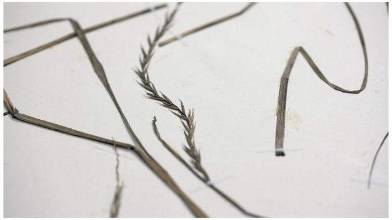
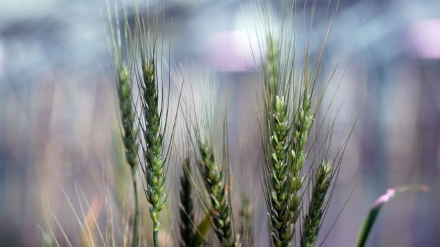
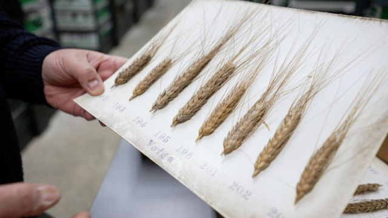

# [Science] 气候变化：数百年前的小麦品种能帮助解决世界粮食供应问题吗？

#  气候变化：数百年前的小麦品种能帮助解决世界粮食供应问题吗？

  * 丽贝卡·莫雷尔（Rebecca Morelle）与阿利森·弗朗西斯（Alison Francis） 
  * BBC气候与科学报道 

9 小时前

> 图像来源，  BBC/Tony Jolliffe
>
> 图像加注文字，自然历史博物馆收藏品当中有从库克船长航行时开始就搜集的不同的小麦品种

**在气候变化当中确保全世界有充足粮食供应的答案可能在博物馆中有300年历史的藏品中找到吗？**

研究人员抱着这个希望在自然历史博物馆的藏品中筛查12,000个小麦及其近亲植物的样本。

最有希望的样本是那些取得基因组定序的小麦，研究人员以此寻找小麦当中生存能力更强的品种。

气候变化、害虫和疾病为农作物生存带来巨大压力。

在数百个纸箱中保存的过去的不同种小麦的样本在博物馆的地下室被整齐排列。每种小麦都有干叶，干枝，或谷物的穗，有的样本枝，叶，穗俱全，这些都是好几百年前的谷物样本。

这些样本都有准确的标签说明，许多标签是用过去那种漂亮的铜板印刷体书写而成，记录了发现的时间和地点。这些都是十分有用的信息。

拉里莎·维尔顿（Larissa Welton）是研究团队的成员，她负责将藏品数字化，在网络展示。她说，“藏品的时间能够上溯到1700年代，里面有库克船长首次航行去澳大利亚时收集的样本。”

英国皇家海军军官、探险家和制图师詹姆斯·库克（James Cook）收集的是一种野生小麦植物。这些小麦看上去像野草，和现在农田中的小麦品种差别很大。不过让研究人员感兴趣的恰恰是这种差别。

“我们拥有的样本是来自各种农业技术诞生之前的时代，因此它们能告诉我们小麦在野生状态生长的情况，或使用诸如人工肥料之前的生长状况。”

> 图像来源，  BBC/Tony Jolliffe
>
> 图像加注文字，全世界消耗的卡路里总量当中1/5来自小麦

##  为什么小麦如此重要？

小麦是世界上最重要的农作物之一，是许多食品的原料，如面包，面条，早餐麦片，糕点等等，在我们饮食当中占重要地位。

乌克兰是主要的谷物生产国，现在乌克兰战火令全球粮食供应受到威胁。

除此之外还有气候变化的问题，极端天气产生冲击，按照科学家的估算，全球气温升高一度就会导致幅度高达6.4%的全世界农作物减产。

病虫害也构成主要的挑战，每年造成1/5作物减产。

现代小麦品种也遇到困难。1950和1960年代的绿色革命导致农场侧重高产的品种。这种方式带来丰收，但意味着多样性减少，包括那些能够应对极端天气的品种，小麦品种的多样性减少。

自然历史博物馆的基因专家马修·克拉克（Matthew Clark）博士说，“我们希望能够发现一些已经消失的品种，那样我们就能让这些品种加入到现代小麦的多样性品种中。”

这一点十分重要：随着人口增加，世界需要更多的小麦，预计到2050年世界人口将增加50%。因此研究人员需要发现多样化的小麦品种，能够在目前不能种植小麦的地方种植、而且需要能够应付环境改变的小麦作物。

克拉克博士说，“例如，通过研究能够在更边缘地区存活的作物品种，即酷热，干旱的地区，将有助于帮助发展中国家增加粮食供应。”

他解释说，这些可以通过传统的作物杂交，基因改变或基因编辑来实现，基因编辑是准确添加或移除、或替代基因的技术。

> 图像来源，  BBC/Tony Jolliffe
>
> 图像加注文字，挪威约翰英纳斯中心的研究人员在研究100多年前的小麦样本

挪威约翰英纳斯中心（John Innes Centre）的研究人员也在古老的小麦品种中进行搜索。

他们的藏品被称为瓦特金·兰德雷斯（Watkins landrace）收藏，里面有历史逾百年的样品，包括了世界各地不同地方的品种。这些藏品被保存在4度的低温环境中，因此这些种子还可以用，即种植后可以生长。

正在研究这些藏品的西蒙·格里菲斯（Simon Griffiths）博士说，“我们想做的是寻找新的、有用的不同基因。”

“目的的是能抵抗疾病，对付环境压力，增加产量，增加吸收肥料效力。”

约翰英纳斯中心的团队正在用一些古老的品种同现在的品种进行杂交，他们已经取得了一些进展。

格里菲斯博士说，“小麦黄锈病是一种主要的疾病，这是个全球性的问题，而且应对它的难度越来越大。”

“在老的小麦品种里面，发现了能够对付这种小麦疾病的新的抗体，培育人员用这种抗体来解决小麦种植面临的威胁。”

研究团队也希望找到更富有营养的不同类型的小麦品种。

格里菲斯博士说，“比如，小麦里面包含什么？我们知道我们能够增加小麦里的纤维成分、矿物成分。”

我们种植的小麦也将发生改变，研究人员希望，研究过去，重新发现那些消失的品种，是向前发展的最佳途径。

