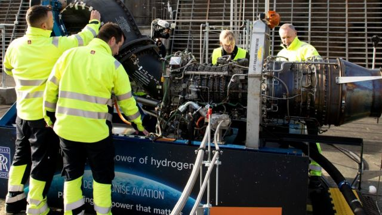
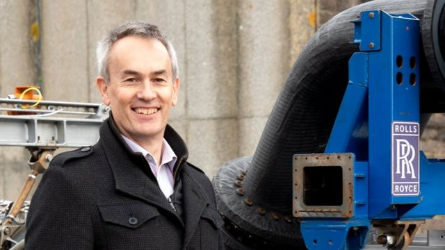
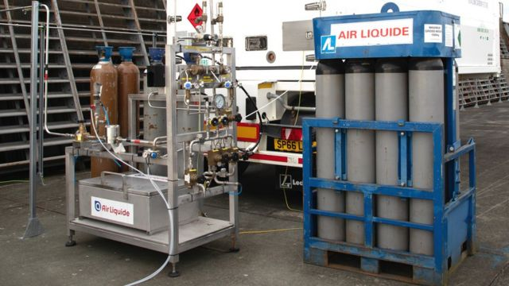
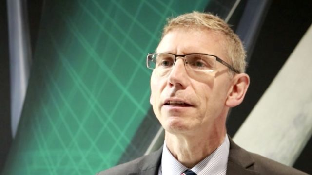

# [Science] 英国测试用氢燃料驱动航空喷气发动机

#  英国测试用氢燃料驱动航空喷气发动机

  * 西奥·莱格特（Theo Leggett） 
  * BBC新闻商务记者 

9 小时前

**索尔兹伯里平原上角落的一家军事基地里正在测试一种小型飞机喷气引擎，这是一次可能给航空业带来巨大变化的测试。**

引擎本身几乎和常规引擎没有两样。这是一款罗尔斯·罗伊斯AE-2100A汽轮机，广泛用于世界各地的支线飞机。

但不同寻常的是这种引擎使用的燃料。这是现代飞机引擎首次以氢做燃料运转。

这个引擎没有外壳，里面复杂的线路和管道都裸露在外面。引擎被固定在一个坚固的测试台上，工程师们在安全距离以外的控制室里通过屏幕监测。

这次引擎测试由罗尔斯·罗伊斯公司进行，之前他们同易捷航空合作在德比郡（Derby）已经进行过研发。

> 图像来源，  Rolls-Royce
>
> 图像加注文字，在目前发动机测试中，发动机以低速运动

最初的目的很简单，即展示可以用氢燃料、而非常规的航空燃料驱动和控制喷气发动机。

长期计划是让氢能发挥主要作用，让航空业继续扩展，而同时又能大幅度减少排放。

罗尔斯·罗伊斯（Rolls-Royce）宇航技术和未来计划主管阿兰·纽比（Alan Newby）说，“我们研究氢能的原因是要真正努力实现零排放。”

“通常我们会用煤油驱动这种发动机。煤油是碳氢化合物，燃烧时会产生二氧化碳。”

“用像氢这样燃料的妙处是它不含任何碳，因此在燃烧的时候不会产生二氧化碳。”

这个项目得到易捷航空的支持，该航空公司已经资助了数百万英镑进行初期实验。

> 图像来源，  Rolls-Royce
>
> 图像加注文字，易捷航空公司首席运营官大卫·摩根称氢燃料是令人兴奋的选项

该公司认为氢能是减少短途航运排放的最佳途径。

易捷航空公司首席运营官大卫·摩根(DavidMorgan) 说，“我们几年前开始研究未来飞机可能使用什么燃料的问题。”

“我们研究了电池技术，但很明显电池技术可能不适用于我们飞行的大型商用飞机。”

“我们于是得出结论，认为氢能将是个令人兴奋的选项。”

比较电池，氢能燃料的优势是每公斤提供更多动力。电池对于大飞机来说过于沉重。

不过要实现氢能航行仍然有很长一段路要走。到目前为止的测试只是展示了喷气发动机能够使用氢燃料启动，并且低速运行。

> 图像来源，  Rolls-Royce
>
> 图像加注文字，氢燃料比常规航空燃油需要更大，更复杂的存储空间

从目前阶段达到能够建造全新的发动机，用它驱动客机安全飞行，需要进行大量研究和大量投资。

飞机本身也需要重新设计。氢燃料即使在液体状态，和能够驱动飞行同样距离的煤油相比，占用空间约为煤油燃料的4倍。

把氢转化成液态，需要把温度降低到-253°。在燃烧的时候，又需要把氢转化成气态。

罗尔斯·罗伊斯公司的阿兰·纽比说，“从这个角度看，飞机设计需要很大的改变。”

“飞机将需要装氢的燃料箱。而且需要把燃料箱保持在很冷的低温。”

“然后还有如何将氢燃料注入发动机的问题。”

> 图像来源，  Rolls-Royce
>
> 图像加注文字，罗尔斯·罗伊斯公司的宇航技术和未来计划主管阿兰·纽比说实现用氢燃料驱动航空发动机，还需要解决许多工程问题

另外一个关键问题是从哪里得到氢燃料，因为这会影响到氢燃料本身可能带来的巨大的环保好处。

测试中使用的氢来自苏格兰奧克尼（Orkney）岛上的欧洲海洋能源中心。

他们用电分解水产生氢和氧。所需的电能来自海浪和风能。这样这种氢就是十分清洁的能源。

不过现在工业用途的大部分氢都来自某种高温蒸汽混合高压天燃气的加工程序。

但是这种过程产生大量的二氧化碳，这些气体被排放到大气中。另外这个过程也需要耗用大量能源，能量来源是化石燃料。

另外一个获取途径就是所谓的蓝色氢。其生产过程相同，但是二氧化碳被捕捉、储存并再次利用。

在理论上说，这个过程产生的氢能更清洁，更低碳。但是去年康纳尔大学和斯坦福大学的研究人员发表论文对此提出了挑战。

他们认为使用蓝氢对地球造成的损害实际上大于使用化石燃料。

英国环境与运输部官员马特·芬奇（Matt Finch） 说，“目前存在很多关于氢的乐观情绪。”

“很多人说我们能使用氢，我们需要氢。你能听到各种说法，即它能应用于轿车，卡车，轮船，飞机上，还能用于家庭取暖，还有化工。”

“目前英国生产的绿氢实际上为零。要满足所有人的需求，完全不可能。”

芬奇认为绿氢供应在未来数十年都要受到限制，而且他说航空在这方面可能并非政府的重点。

所有这些都说明，零排放的氢动力用于飞机、成为日常生活的一部分，可能还要等几十年才能实现。

即使到那时候，氢能源的使用仍然可能局限于短途航运，至少在初期时。许多人认为，长途飞行更实际的解决方案是使用合成的可持续燃料。

不过在索尔兹伯里平原上进行的初步试验可能在将来某一天会被看作是为航空业的技术革命迈出的第一步。

