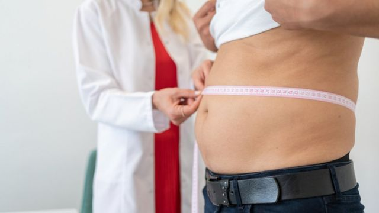
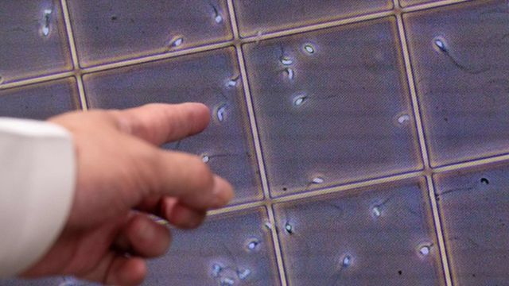

# [Science] 男性生育研究：全球男性精子数量下降的5个原因

#  男性生育研究：全球男性精子数量下降的5个原因

  * 毕尔纳斯（Andre Biernath） 
  * BBC记者 

> 图像来源，  Getty Images
>
> 图像加注文字，研究发现， 过去50年里，男性在射精时的精子浓度下降了51%。

**在过去50年里，男性在射精时射出的精子浓度下降了51%。**

这是以色列耶路撒冷希伯来大学（Hebrew University of Jerusalem）和美国西奈山医学院（Mount Sinai School of Medicine）最近研究的主要结论之一。

这个研究团队计算出，在1970年代，男性每毫升精液中平均有1.01亿个生殖细胞。此后，这一数字下降到4900万。

除了数量之外，还有证据表明男性在配子（生殖细胞；gamete）的质量也在下降：在过去50年里，男性在射精时的精子浓度下降了51%。

“我们看到，最引人注目的事是精子运动的丧失，”巴西辅助生殖协会副主席、泌尿科医生拉达利（Moacir Rafael Radaelli）说。“缺乏这一运动属性，受精能力就会下降。”

这种持续下降的情况已经在公共卫生专业人员中敲响了警钟。

另一位巴西泌尿外科协会米蓝达医师（Eduardo Miranda）表示：“这令人担忧，因为我们看到这种恶化的速度在加快，我们真的不知道它将在哪里结束。”

此外，近年来，男性失去精子的速度也在增加。

根据在以色列和美国进行的研究，在1970年代和1990年代之间，配子的浓度每年下降1.16%。但是，从2000年代开始，下降比率上升到2.64%，等于是下降了了一倍多。

这是个全球性的现象。

科学家已经观察到所有男性配子都在减少。尽管在欧洲、非洲、中美洲和南美洲的数字更快。但这一现象的背后原因是什么呢？专家告诉BBC，至少有五个原因。好消息是，有办法扭转或减轻它们。

##  1\. 肥胖症

可以证实的是， 多余的体重会带来对精子有害的变化。

储存脂肪的组织的增长，也会释放出炎症物质，直接影响了睾丸激素（Testosterone 睾固酮），后者是生产男性配子的最重要激素之一。米蓝达医师解释，过重也会产生所谓的氧化压力，这是一个身体内各种细胞受到伤害的过程。他又强调，此外，肥胖的人在生殖器区域有更多的脂肪，这对精子来说是很糟糕的。

> 图像来源，  Getty Images

制造和储存生殖细胞的睾丸需要在低于人体温度1C到2C之间才能正常运作，这就是为什么阴囊在人体体外的原因。

但脂肪的增加使生殖器官升温，从而停止工作。

据世界卫生组织（WHO）计算，全球有39%的男性超重，11%的男性则有肥胖问题。这一统计数字有助于解释过去50年来精子比例的下降。

##  2\. 药物滥用

酒精、烟草、电子烟、大麻、古柯碱、合成代谢类固醇……您知道所有这些药物的共同点是什么吗？ 它们都会影响雄性配子的健康。

“其中一些物质直接破坏产生精子的生殖细胞，”米蓝达医生总结道。

其他药物则间接地影响刺激睾丸运作的一些激素的产生。专家们最常提到的例子是通过药片、凝胶和注射剂来进行替代睾丸激素的治疗并不加选择地将其用作增加肌肉。

“这是一个近年来疯狂和可怕地增长的市场，”拉达利医生警告说。

他解释说，当这种激素无缘无故被替换时，身体被告知“不再需要生产生它”，结果甚至导致睾丸萎缩，或精液中的精子数量最终为零，这种情况称为无精症。

##  3.性病

由细菌引起的衣原体和淋病等疾病会导致附睾发炎。附睾与睾丸的顶部相连接，负责储存精子。在该部位发生任何问题都会对配子的生存构成风险。

WHO估计，仅在 2020 年，男性和女性就有 1.29 亿新的衣原体病例和 8200 万新的淋病病例。 近几十年来，这一比率一直保持稳定或呈上升趋势。

拉达利医生在列表中添加了第三种病原体：人类乳突病毒，也称为 HPV。他说，众所周知，它还会影响精子的产生甚至 DNA。

##  4.膝上电脑

由于睾丸需要保持在比身体其他部位温度低 1 到 2 摄氏度之间，过去十年发表的研究表明，将笔记本放在膝盖上工作的习惯会给“配子工厂”带来额外风险。

> 图像来源，  Getty Images

那是因为设备的电池会变热——最终可能会“煮熟”了精子。

米蓝达指出，与高温有关的其他习惯也会对生殖造成风险——例如长时间的热水浴或桑拿。

然后是技术——医生列举了电磁波、电话信号甚至无线互联网可能带来的负面影响。他说，“在实验室进行的实验研究中，wi-fi 和电磁波等因素会影响精子，但仍然无法确定这些技术是否真的会损害这些细胞。”

##  5.内分泌干扰物

最后，专家们提请注意一系列通常称为内分泌干扰物的有毒化合物。

该清单包括在大气中检测到的污染物，以及塑料和杀虫剂。

它们的分子结构与我们体内的激素非常相似，因此能够适应细胞受体并触发“不再需要生产激素”的过程。在最近的研究中，发现其中一个过程似乎会影响男性的生育能力。

“但我们仍然不确定这个问题的严重程度，并且正在进行许多研究来确定这一点，”拉达利 说。

##  未来情况

除了精子数量下降背后的环境和行为因素外，还有两个内在问题也导致了这种现象。

其中第一个是遗传学。 据估计，有 10% 到 30% 的生育困难案例与男性 DNA 的问题有关。

> 图像来源，  Getty Images

第二个原因与衰老，以及男性晚育这一事实有关。

“我们知道生育能力在整个生命过程中都会下降。虽然男性的下降不如女性明显，但对于配子的制造很重要的激素却在减少，”拉达利解释道。

不过，如果我们考虑到精子数量在 50 年内下降了 51%，并且在过去二十年中这种情况发生的速度加快了，那么这个数字会越来越接近零吗？

如果这种下降速度真的继续保持目前的水平，到 2050 年，精液中的生殖细胞浓度将几乎为零。

但米蓝达医生并不认为这种世界末日的情景会成为现实。

“趋势是情况变得更糟，但在某个时候这个过程将停滞，我们将达到一个境地，也许在新技术的帮助下可以改上情况”他预测。

##  该怎么办？

想要孩子的男性可以通过改变生活方式来扭转对睾丸造成的任何伤害，从而增加成功的机会。

例如，他们可以通过均衡饮食和规律的体育锻炼来减轻体重，并完全减少或戒除酒精、香烟和其他药物。

如果为了刺激与非固定性伴发生关系并且也没有怀孕的打算，那么使用避孕套以避免感染如衣原体和淋病是值得的。 在青春期早期接种 HPV 疫苗的人也能更好地免受病毒对身体造成的影响。

如果即使改变了所有这些生活方式，生育孩子的困难仍然存在，那么就建议去看医生。

医学指南认为，寻求专家帮助的时间取决于女性伴侣的年龄。

米蓝达医生解释：““如果女性未满 35 岁，这对夫妇应该尝试在一年间受孕，每周定期性交大约 3 次，并监测生育期。”

但是，如果伴侣超过 35 岁，而且超过 6 个月的受孕仍无法怀孕，应该是个警告信号了。

这是因为那个年龄段的卵子储备开始下降得更快——米蓝达说， 12 个月后才想找到答案可能是浪费了关键的时间。

“为发现可能的原因并找出最佳治疗方法，相关夫妇的参与是必要的，”拉达利解释。

若问题出在男性身上，专家通常会开出富含抗氧化剂的维生素补充剂，以帮助保护睾丸。或可能还需要通过补充剂来调节荷尔蒙。

米兰达则告诉BBC，当然，有可能通过药物和手术治疗一些导致问题的疾病。

譬如“细菌感染可以用抗生素治疗，生殖系统的解剖学缺陷可以通过外科手术治疗，”他总结道。

作为最后的手段，这对夫妇可以使用辅助生殖技术，例如体外人工受精（vitro fertilisation ）。

