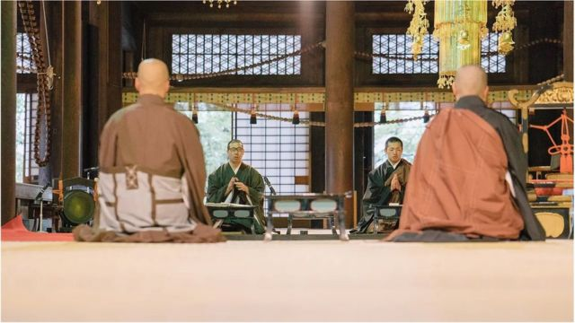

# [Science] 健康：冥想如何帮助调节情绪、增强记忆力和免疫系统

#  健康：冥想如何帮助调节情绪、增强记忆力和免疫系统

8 小时前

> 图像加注文字，莫斯利医生正在练习冥想

**如果你时间紧迫，并难以放松，可以尝试一下冥想（meditation），或许会有帮助。**

近年来，正念冥想（Mindfulness meditation）越来越受欢迎，许多人对冥想的好处非常信服。

有证据显示，每天做一点冥想练习可以改善睡眠、调节情绪、增强免疫力，甚至能从物理上重新调节身体对压力和疼痛的反应。

BBC科学节目主持人迈克尔·莫斯利医生（Michael Mosley）在他《就一件事》播客中，探讨了冥想这一古老而貌似简单的练习如何能带来强大的好处。

##  僧侣是对的

> 图像来源，  Getty Images
>
> 图像加注文字，冥想是僧侣以及印度教、道教和佛教传统的一个重要组成部分。

冥想并非新鲜事物，它历史久远。西藏僧侣每周冥想打坐许多小时，他们的这种做法可以追溯到公元七世纪。

同时，它也是印度教、道教和佛教传统的一个重要组成部分。

直到1970年代，正念冥想才被美国认知科学家乔·卡巴金（Jon Kabat Zinn）介绍到西方。从那时起，已有超过8千多项涉及正念冥想的研究，指出了一些显著的效果。

研究发现，如果每天花一点时间专注呼吸并检查身体的话，就可以改善工作记忆力、甚至可以改变大脑的结构和功能。它可以降低压力水平，并改变免疫系统 - 而且，无需是长期冥想修炼者或是专家也能看到积极效果。

##  意念力量

> 图像来源，  Getty Images
>
> 图像加注文字，一项研究发现，只要8周的冥想，杏仁核就会变小 - 这对缓解压力是好消息。

一项研究还发现，不到2个月的冥想练习就能改善参与者的免疫反应。经过8个星期练习后，治疗组的那些人对流感疫苗有更强的抗体反应。

那么，为什么一种看似只针对心灵的练习却对身体和免疫系统产生如此大的影响呢？关键是压力减轻了。

##  追根溯源

大脑中的杏仁核（amygdala）部分是负责启动战斗或逃跑（fight or flight）反应的区域。在压力下，它会让身体产生更多压力荷尔蒙皮质醇，它会让免疫系统变得迟钝。令人神奇的是，研究显示冥想可以完全重塑和改变这一整个过程。

一项研究发现，只要8周的冥想，杏仁核就会变小 - 这对缓解压力是好消息。它还可以导致大脑工作方式的长久改变，包括它如何控制疼痛、记忆力和注意力的方式。

##  控制大脑

> 图像来源，  Getty Images
>
> 图像加注文字，即使一周几次，每次甚至短短的10分钟冥想就会有益处。

哈佛医学院心理学副教授萨拉·拉扎尔（Dr Sara Lazar）博士解释说，这就像加强身体肌肉（锻炼）一样，可以训练大脑额叶执行网络 - 即大脑的主要控制器 - 更好地控制它所关注的东西。

这可以改善工作记忆力，它是“记住信息并可以熟练使用它的能力。 它也是解决问题的一项非常重要技能。” 它还能改变体验疼痛的方式。

##  疼痛控制

正念冥想可以改变对身体疼痛的反应。大脑扫描研究显示，这主要是因为冥想可以帮助训练大脑，把疼痛反应与身体感受分离开来。

对一些人而言，特别是那些患有慢性疼痛的患者，疼痛是不可避免的 - 但冥想真能改变对疼痛的反应，无论是行为上，还是在头脑中。

##  冥想与记忆力

> 图像来源，  Getty Images
>
> 图像加注文字，一些瑜伽中也有冥想和呼吸练习的部分

新数据显示，冥想可以在大脑回路中产生长久性改变，而它对长期记忆力很重要。

拉扎尔博士让一些65到80岁的没有任何经验的人学习冥想。仅仅在8周后他们发现，对长期记忆力很重要的区域，即海马体的容量增加了。他们还发现这种记忆力效果可以维持一年或更长时间。

##  我该如何开始？

很明显，即使一周几次，每次甚至短短的10分钟冥想就会有益处。

随着冥想练习越来越受欢迎，触手可及的资源也越来越多。阿扎尔博士个人建议，最好能找到一个老师和参加一个冥想班。如果不可能，网上也有许多免费课程资源。

所以不妨试试看 - 这个看似简单的技巧却可以为大脑、情绪、免疫系统以及记忆力带来深远的好处。

