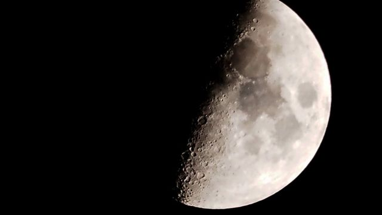
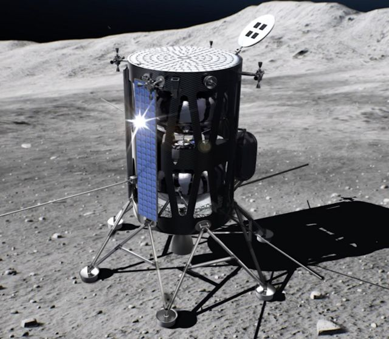
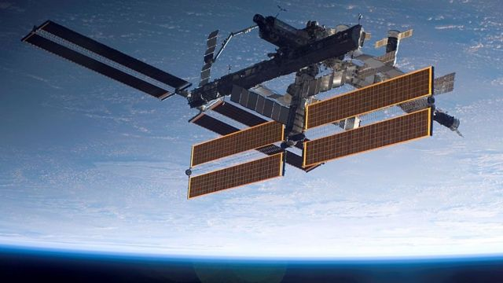
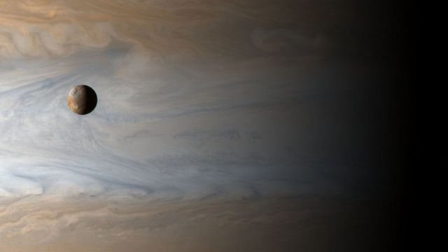

# [Science] 2023年太空探索：载人登月准备，冰月探索，军事活动

#  2023年太空探索：载人登月准备，冰月探索，军事活动

> 图像来源，  Getty Images
>
> 图像加注文字，2022年以阿耳忒弥斯（Artemis）1号发射结束，那是登月飞船在不载人的情况下被发射进入太空并绕行月球

**我们都喜欢太空的报道和信息。那么，太空迷们，准备好迎接2023年的太空新消息吧。**

2022年以阿耳忒弥斯（Artemis）1号发射结束，那是登月飞船在不载人的情况下发射进入太空并绕行月球。

在新一年里将有很多飞船发射和太空探索，其中许多是为人类重返月球表面并返回地球的任务做准备。

让我们看看世界上今年的一些重大太空活动。

##  登月

阿耳忒弥斯登月计划发射的猎户座（Orion）太空船绕行月球轨道成功后，美国宇航局计划进行更多的发射，测试仪器设备，进行科学实验，准备在2025年实现载人登月。

在众多的太空发射中，一个就是首次发射Nova-C月球登陆器，并在月球上被称作“风暴洋”（the Ocean of Storms）的区域安全放置5个科学设备。

> 图像来源，  Intuitive Machines/NASA
>
> 图像加注文字，3月猎鹰9火箭将Nova-C月球登陆器发射进太空，登陆器将科学设备送到月球表面

这些设备上的技术仪器将来能让地面科学家在载人登月开展前进行测试。

低频无线电系统，传感器和照相机将经过测试，检验这些设备搜集和记录数据的效率，这将对未来的登月活动至关重要。

美国宇航局将发射首枚推力巨大的火神半人马座（Vulcan Centaur）火箭，将“游隼”号（Peregrine）月球登陆器送上太空，这也是载人登月计划的一部分。

这种月球登陆器有5个主要的发动机为飞船的主要飞行阶段提供推力，飞船就像邮递货车一样向月表运送货物。

##  太空旅游

今年还有两次前往国际空间站 (ISS) 的太空发射，付费游客乘坐飞船进入绕行地球的空间站逗留10天。

那才算是真正窗外有风景的客房！

除此之外，日本一位亿万富翁将挑选8人和他一起乘坐美国太空探索技术公司（SpaceX）的载人飞船进太空环绕月球飞行！（当然还有待美国的监管当局批准这种太空飞行）

##  国际太空站补偿给养

> 图像来源，  NASA
>
> 图像加注文字，国际太空站离不开定期运送补给，宇航员需要的科研设备，食品要定期从地面送到太空站

近年来私营的太空探索技术公司的龙飞船（SpaceX Dragon）多次将宇航员送上国际太空站，这个由亿万富翁马斯克拥有的太空公司得到了向国际太空站往返运送人员和物资的任务。

2023年还有值得关注的消息是，美国宇航局的宇航员也会乘飞船升空。

不过今年不仅仅有龙飞船载人升空。波音公司的CST-100星际航线飞船也会进行首次运营发射。

按照设计，星际航线飞船的一部分能够重复使用。飞船能把宇航员送上国际空间站和其他地球低轨道上的飞行器，我们会看到首次这样的太空发射。

星际航线飞船的一部分能够被重复使用10次，飞船上有许多创新技术，包括平板电脑和无线互联网！

##  木星冰月

> 图像来源，  NASA
>
> 图像加注文字，木星的第三大卫星Io，背景是巨大的气态行星木星

欧洲空间局(ESA)热衷于推进自己的太空探索行动，他们计划发射木星冰月探测器。

这个太空探索需要有耐心，因为飞船需要8年时间才能接近木星的冰月球。那时候的我们又在哪里？至少老了8岁。

探测器到达那里的时候将开始探索木星和它巨大的冰雪覆盖的几个月球。

10月，美国太空探索技术公司的重型猎鹰（Falcon Heavy）飞船将执行美国宇航局的一次探索任务，即飞向一个被称作“灵神”（Psyche）的小行星。

由于软件和技术故障，这个发射计划从2022年推迟到今年，相关的太空探索任务要到2029年才能完成。

探测器最后到达目的地的时候还会掠过火星。

##  军事机密！

显然我们愿意提供更多事实，信息和知识……但是现在有些信息连我们都不清楚。

美国军队最新的分支，美国太空部队今年也有几次发射行动，将一些设备送进太空，原因我们无从得知，为这个所谓的星际“保卫者”添加了更多神秘色彩。

关于美国太空部队的许多信息属于机密，只有那些有特殊许可的人才能看到，这说明美国政府的高层不希望公开所有的行动。

我们不了解他们发射的太空飞机，该太空飞机在去年已经完成了908天轨道飞行……

以上是一些2023年我们能够看到的部分太空探索计划，欢迎接收BBC的节目，了解这些来自天外的消息。

