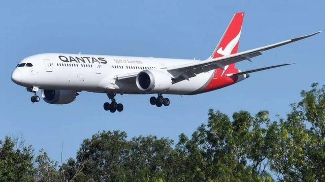
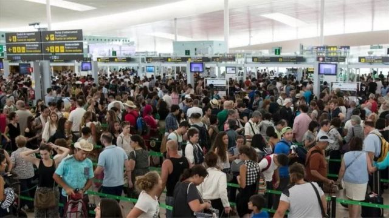
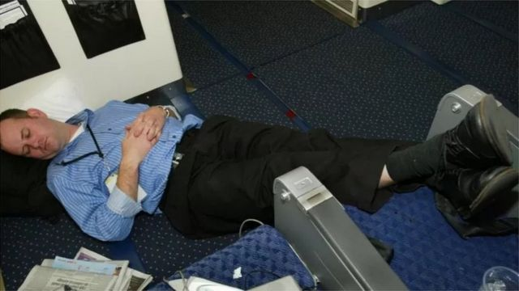
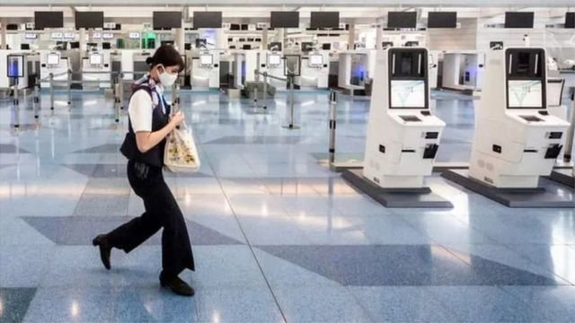

# [Science] 旅行与健康：长途飞行可能会给身体带来哪些影响？

#  旅行与健康：长途飞行可能会给身体带来哪些影响？

  * 托尼·席默（Tony Schiemer） 
  * 《对话》 

8 小时前

> 图像来源，  Getty Images

**如果拥挤的机场可以算作一个迹象，那么澳大利亚人真是特别渴望重返蓝天旅行。如果你经常长途飞行，那几年后，可能甚至会有航程更长的选择。**

澳洲航空公司（Qantas）宣布从2025年底开始将开通从澳大利亚东海岸直飞英国伦敦的航班，飞行时间超过19个小时。相比之下，目前的航班需要24小时，但要转机，分成几段较短的航程。

那么，更长时间的飞行过程中身体可能有怎样的变化？它会和现在的长途飞行有区别吗？

##  一，可能会脱水

> 图像来源，  Getty Images
>
> 图像加注文字，上飞机前，别忘了多喝水。

脱水是长途飞行常见的一种现象。这就是为什么在飞机上，喉咙、鼻子以及皮肤感觉干燥的原因。飞行时间越长，脱水的风险就越大。

这是因为同地面上相比，机舱中的湿度较低。这主要是因为机舱中流动的空气绝大多数是从外面进来的，而在高空中空气中没有太多水分。

还可能因为没有饮用足够的水，或是因为喝了过多的酒而脱水（酒精是利尿剂，会导致液体流失增加）。

因此，在登机前要喝水。飞行期间也要比平时喝更多的水。

##  二，机舱会严重干扰耳朵、鼻窦、肠道和睡眠

> 图像来源，  Getty Images
>
> 图像加注文字，你会这样在飞机上休息吗？

随着机舱内压力的变化，身体内气体也会随之做出相应反应。它随着飞机爬升、气压下降而膨胀，而在飞机下降时则正相反。这就会导致以下一些常见问题，例如：

  * 耳痛 - 当鼓膜内外两侧气压不同时，鼓膜会受到压力 
  * 头疼 - 可能是由鼻窦内所滞留的空气膨胀所致 
  * 肠道问题 - 接受可能会排气更多的事实 

可能还会比平时更犯困。这是由于身体无法从高空机舱中吸收像平时在地面上那么多的氧气造成的。身体慢下来是保护自我的一种方式，它会让你感觉困倦。

但好消息是，大多数问题不一定在更长途的飞行中更明显，它们主要出现在飞机攀升和下降时。

##  三，可能会出现血栓

> 图像来源，  Getty Images
>
> 图像加注文字，新冠给飞行带来更多挑战。

对乘客来说，通常最大的担心是由于长时间不动而形成血栓。这包括在腿部形成的血栓（深静脉血栓，DVT），它们可以移动到肺部（形成肺栓塞）。

如果不在飞机上四处走动，那么，你具有的以下风险因素越多，形成血栓的可能性就越大：

  * 年纪较大 
  * 肥胖 
  * 血栓病史或家族史 
  * 某些类型的凝血障碍 
  * 癌症 
  * 最近刚刚使用固定术或是手术后 
  * 妊娠或是最近刚生过孩子 
  * 使用激素替代疗法或服用口服避孕药 

根据2022年一项结合了18个研究数据的评估，飞行时间越长形成血栓的风险就越大。研究人员计算出，从4小时飞行后算起，每飞行2小时血栓风险就会增加26%。

那在飞行时间更长的旅程中血栓风险究竟如何呢？在我们开始研究搭乘那些航班的乘客前我们将无法确认这个风险。

在获得证据之前，目前的建议仍然适用。保持活动，多喝水和限制酒精摄入。

也有证据显示，穿压力袜（也称弹力袜）也可以帮助防止血栓形成。这种袜子据称可以促进腿部血液循环，并帮助血液回流心脏。正常情况下，这是由于移动或行走让肌肉收缩而发生的。

2021年的考科蓝（ Cochrane review  ）回顾结合了9项试验结果，共有2637人参加了飞行时间超过5小时的试验，他们被随机选择穿或是不穿弹力袜。

没有任何参与者出现有症状的DVT。但有证据表明，穿弹力袜的人显著减少了出现无症状血栓的几率。我们知道任何血栓都有可能扩大、移动，并随后引发症状。

因此，如果担心形成血栓，飞行前最好咨询医生。

通常，如果你确实形成了血栓当时也未必知晓，（一般）要等到下飞机后才知道，因为血栓形成和在体内移动需要一定的时间。因此，在飞行后要注意以下症状：腿部疼痛和肿胀（往往只是一条腿），胸部疼痛、咳嗽和气短。如果需要，请寻求紧急医疗帮助。

##  四，时差、辐射和新冠

> 图像来源，  Getty Images
>
> 图像加注文字，无论在飞机什么舱位都要站起来经常活动

当然，还有时差，只有极少数人不受时差影响。这是因为在跨越不同时区时，身体所认为的时间和当地所在时间脱节的关系。

飞行时间越长就意味着更有可能（但也不总是）跨越更多不同时区。时差通常在跨越三或四个时区时会更严重，尤其是如果向东边旅行。

如果经常长途飞行，则有理由假设你在空中飞行的时间越长，身体暴露在宇宙辐射（cosmic radiation）的几率越大。顾名思义，这是来自太空的辐射，它可能会增加癌症以及生殖方面的风险。我们不知道什么程度的辐射是安全的。

但除非经常飞行，这一般不太可能有问题。如果你怀孕了或是有其他方面的担心，在飞行前还是最好咨询一下医生。

别忘了，还有新冠。需要采取一些通常的预防措施，比如经常洗手、戴口罩，以及在身体感觉不适时不要旅行。

简而言之，有关澳洲和欧洲之间更长途的直飞航班中人体可能会作何反应的研究仍处于早期阶段，澳洲团队目前正在对此进行研究。

在结果出来之前，应对长途飞行的建议相对比较简单。

遵循航空公司的提示，如有必要，在旅行前去看医生。

飞行期间要格外努力在机舱内走动、多喝水、戴口罩，并保持勤洗手的良好卫生习惯。

如果在飞行后出现任何令人担心的迹象，请立即就医，因为血栓形成、生长以及在血管中移动需要数小时，甚至几天的时间。

注：本文作者是托尼·席默（Tony Schiemer），他是商业飞行员、航天医学专家、阿德莱德大学临床讲师（Commercial Pilot | Aerospace Medicine Specialist | Clinical Lecturer, University of Adelaide）。原文发表在知识共享网站《对话》（ the Conversation  ）上。

