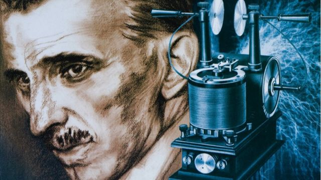
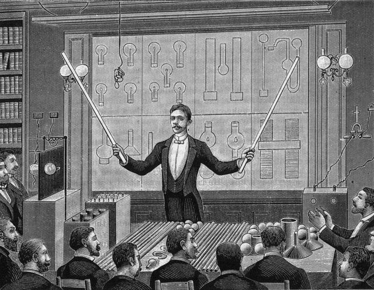
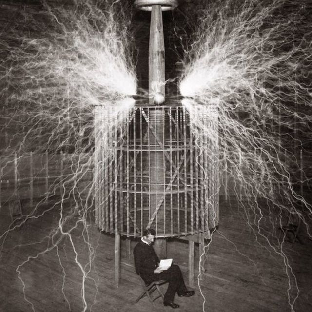
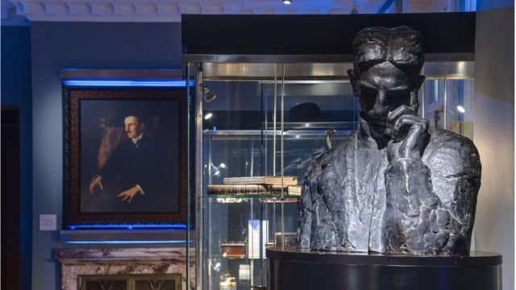
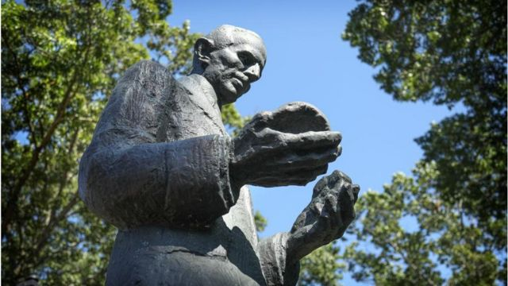
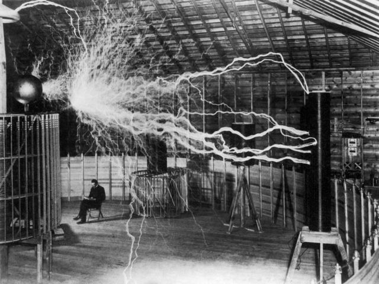
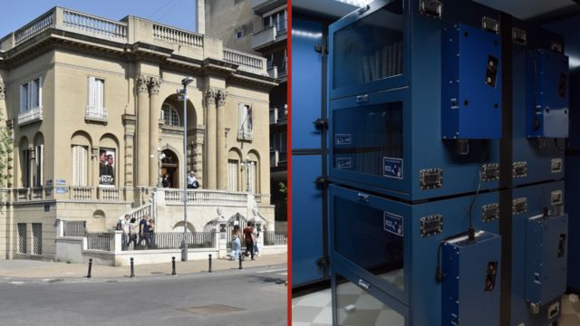
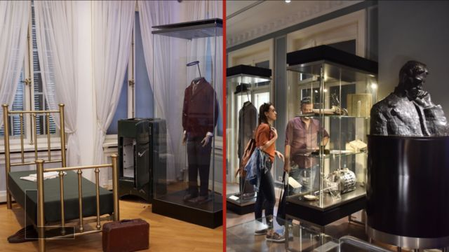

# [Science] 发明家尼古拉·特斯拉未竟的梦想：无线供电

#  发明家尼古拉·特斯拉未竟的梦想：无线供电

  * 佩特拉·齐维克（ Petra Zivic） 
  * BBC 国际部 

8 小时前

> 图像来源，  Getty Images

**尼古拉·特斯拉（Nicola Tesla）是谁？这个名字可能现在大部分人都不熟悉，但无疑所有的人都在享受他的发明带来的惠泽。**

他80年前已经去世，但这篇文章之所以能被你我在手机、平板或其他设备上阅读，很大程度上要归功于这位美籍塞尔维亚发明家。

“我认为特斯拉不仅是电力或全球通信之父，”历史学家、电影制片人迈克尔·克劳斯（Michael Krause）告诉BBC，“他的想法超前于他的时代 —— 他是一个有远见的人，为人类的进化做出了贡献。”

早在 1890 年代后期，特斯拉在纽约哥伦比亚学院演讲厅的台上走来走去，手里拿着发光管，向观众介绍自己新发明的振荡变压器时，人类世界大部分还处于黑暗中。

“电力是未来的东西，当时大多数人必须前往展示电力的地方才能目睹它的效力，”历史学家伊万·R·莫鲁斯（ Iwan Rhys Morus）在他撰写的《尼古拉·特斯拉和电力的未来》一书中如此记述。

当然，情况很快就改变了。

##  灯光璀璨

> 图像来源，  Getty Images
>
> 图像加注文字，发明家尼古拉·特斯拉（1856 -1943 ) 在巴黎法国物理学会和国际电工学会演讲

尼古拉·特斯拉 1856 年出生于奥地利哈布斯堡帝国。他的家乡斯米尔扬现在在克罗地亚境内，但他的家人是塞尔维亚人。他年轻时离开家乡，奔赴新世界灯光明亮的大都市。

他 1884 年抵达纽约，为著名的发明家和商人托马斯·爱迪生（Thomas Edison）工作。

“他来自一个古老的世界，然后变成现代文明的主角之一，”克劳斯说。

根据另一位传记作家伊内兹·惠特克·亨特（Inez Whitaker Hunt）的说法，刚踏上美国土地时，这位电气和机械工程师 —— 以及未来学家 —— 口袋里只有几美分和围绕一架飞行器的计算草稿。

不过，让特斯拉出名的并不是飞行器。他多年来一直致力于完善交流电机。

他抵达美国堪称恰逢其时；当时围绕不同类型的电流之间的争斗正在白热化。

##  给世界“注电”

> 图像来源，  Getty Images
>
> 图像加注文字，1899年，特斯拉在科罗拉多泉的实验室，背后是他发明的“放大发射器”（magnifying transmitter）

当时，世界的发展需要更多能源，因此人们竞相为电动机器和照明设备寻找最有效的发电和供电方式。

“有两种不同的电力传输系统在相互竞争，”莫鲁斯告诉BBC。

争夺焦点是电力传输应该用交流电（AC） 还是直流电（DC），对垒双方是美国企业家、工程师乔治·威斯汀豪斯（George Westinghouse）和特斯拉的老板托马斯·爱迪生。

爱迪生的公司投资于直流电，直流电只能在一个电压下沿一个方向和短距离流动。

交流电在多个方向上流动，可以距离更长，电压可以升压或降压，也可以把电力送到更多的地方。

> 图像来源，  Museum of Nikola Tesla, Belgrade
>
> 图像加注文字，贝尔格莱德的尼古拉·特斯拉博物馆。他的骨灰和生前个人物品存放在那里

“这有点像将马和马车跟喷气式飞机相比较，”特斯拉传记作者马克·塞弗（Mark Cypher）告诉BBC历史“目击者”播客。

当特斯拉抵达纽约时，他的口袋里有一架“喷气式飞机”——他在欧洲工作时一直在试验交流电，并于 1883 年制造了他的第一台感应电机。

但由于爱迪生坚持直流输电，两人分手。很快，西屋电气买下了特斯拉交流变压器和电机系统的专利权。

特斯拉的设计能够经济高效地远距离传输电能，并且至今仍在使用。

##  特斯拉的表演天才

> 图像来源，  Getty Images
>
> 图像加注文字，美国纽约州特斯拉生前工作的研究机构

“我们今天仍在使用交流电，发电和输电系统仍然基于特斯拉的理念，”贝尔格莱德尼古拉·特斯拉博物馆的策展人伊万娜·佐里克（Ivana Zoric）告诉BBC。

事实上，特斯拉的系统仍然是生产、传输和分配电能的主要方法。不过，今天许多电气设备都依赖于他的另一项发明。

“感应电机当时非常具有创新性，今天它们仍在工业和许多家用电器中使用 —— 甚至用于电动汽车，"他说。

1891年，特斯拉发明了特斯拉线圈，这是一种发射出美丽的飞散电流的装置，通过无线方式传输电力。它今天仍然用于广播和电视机以及其他电子设备。

两年后，特斯拉和西屋电气赢得了在芝加哥举行的世界哥伦比亚博览会的竞标，庆祝欧洲发现美洲400周年，特斯拉成为超级巨星。

“当人们意识到这项发明的威力时，特斯拉得到了在尼亚加拉大瀑布建造发电厂的工作，” 佐里克说。

那是世界上第一座水力发电厂，特斯拉拥有它的建造中所运用的13 项专利中的九项。

“人们知道谁是了不起的特斯拉先生，他一下子火起来了，”莫鲁斯说。

特斯拉很快建立了自己的实验室，并开始在无线通信和能量传输领域进行实验。

根据莫鲁斯的说法，他还向公众敞开了大门，展示出他对表演技巧的娴熟理解。

“他努力推销自己对这种无线世界和自由能源的独特愿景，试图将自己作为能够实现这个未来愿景的人来推销。 ”

##  无线的未来

> 图像来源，  Getty Images
>
> 图像加注文字，特斯拉向媒体敞开自己的实验室，设法推广自己关于无线供电、输电的愿景

当世界依靠电线传输信息来发送电信时，特斯拉开始尝试无线信号传输。

他的所有新实验都需要资金。1890年代初，他设法从美国金融家J.P.摩根那里获得了资金，开始在长岛建造他的无线世界广播塔。

他的伟大目标是提供全球通信 —— 一个无线系统，可以实现即时的全球视频和语音通信，任何人都可以在任何地方获得信息。

但是，摩根后来撤回了支持。

“不幸的是，他最大的梦想，为人们提供电力和通信系统的国际系统没有实现，因为他还没有达到那个程度，或者技术还不存在，”克劳斯说。

特斯拉继续从事各种项目，但经常缺乏资金，他的许多想法只能留在他的笔记中，一个重要原因是他不明白科学和工程是涉及许多人的高度协作过程。

“特斯拉犯了重大错误。他确实认为他是唯一可以创造电气未来的人。他对合作和与其他人合作不感兴趣，”莫鲁斯说。

他以“怪人”闻名，被认为是一个深陷细菌恐惧症的人，他关于跟其他星球交流的说法受到严厉批评。

##  特斯拉之死

> 图像来源，  Nikola Tesla Museum, Belgrade
>
> 图像加注文字，贝尔格莱德的尼古拉·特斯拉博物馆

特斯拉于1943年在纽约一家酒店房间里去世，他在那里度过了生命的最后10年。

“1951年，特斯拉的个人物品被运往塞尔维亚贝尔格莱德，这要归功于他侄子的努力，”佐里克说。

四年后，尼古拉·特斯拉博物馆在贝尔格莱德开放，至今每年仍然吸引成千上万的游客。它还吸引了数百名研究人员，因为馆内收藏了16万份特斯拉文件，包括计划，草图和照片。

虽然特斯拉的档案可以在线访问，但他的许多个人物品仍然在仓库内，因为博物馆没有足够的展览空间。

“我们现在保留特斯拉的床，冰箱，衣柜，他的13套西装，75条领带，40多副手套等，”佐里克说，“我们希望一旦获得更大的空间就能够展示这些藏品。”

> 图像来源，  Nikola Tesla Museum in Belgrade
>
> 图像加注文字，特斯拉的物品，包括生前最后十年居住的酒店客房内的家具，现在在特斯拉博物馆展出

1956年，在博物馆开放一年后，一个测量磁场强度的单位以特斯拉的名字命名。

塞尔维亚有街道、学校、机场以他的名字命名，在塞尔维亚和克罗地亚，特斯拉都在钞票和硬币上。

美国企业家埃隆·马斯克创办了世界最早的电动汽车制造商之一，就以特斯拉命名它的产品和公司；2018年，SpaceX用猎鹰重型火箭上向火星发射了一辆特斯拉跑车。

但是，特斯拉会如何看待我们的未来？

“我想，如果特斯拉今天还活在人世，他会说人类更关注舒适，而不是未来及其可能带来的问题，”佐里克说。

