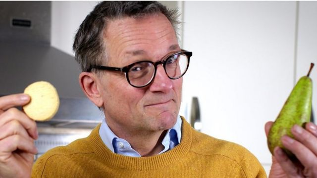
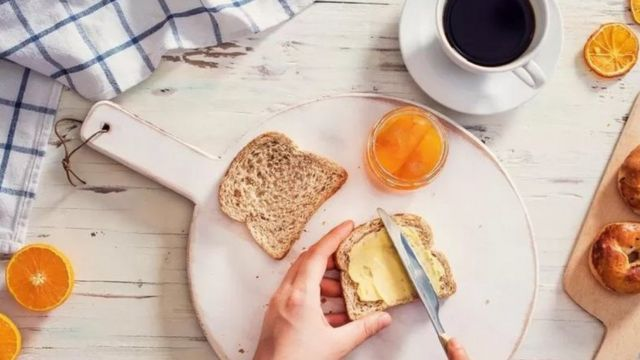
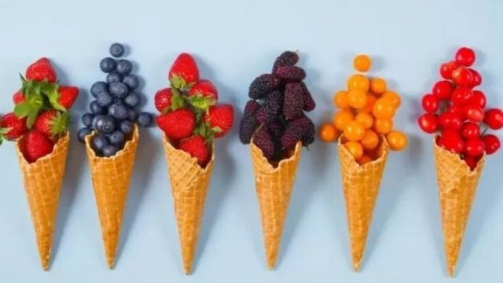
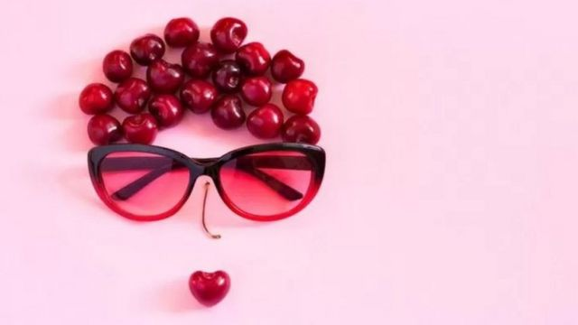
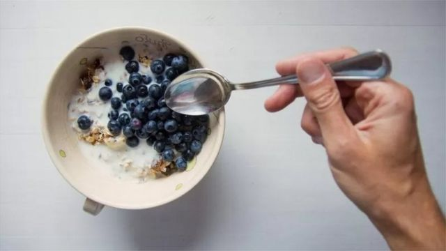
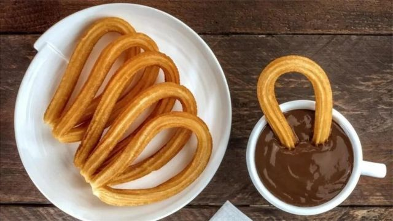

# [Science] 饮食与健康：用水果代替糖可能给你带来的种种益处

#  饮食与健康：用水果代替糖可能给你带来的种种益处

> 图像加注文字，莫斯利医生

**我们当中的许多人都会在一天的某一时刻特别想吃含糖食品，比如，当我们感到压力、没睡好觉的时候，或者干脆就喜欢吃甜食。因此，想抵抗甜食的诱惑就算有可能，也相当困难。**

但研究显示，少吃糖会给健康带来巨大好处。它不仅有助于牙齿和腰围健康，还能提升情绪、记忆力以及改善微生物群，甚至让我们更长寿。

吃水果能解决问题吗？水果虽然含有天然糖，但水果中的纤维可以降低风险。新研究表明，它或许有助于减少我们对甜食的渴望。

BBC科学节目主持人迈克尔·莫斯利医生（Michael Mosley）在《就一件事》播客节目中，探讨用水果代替糖是否真能帮助我们控制对甜食的渴望：

##  糖累积起来很快

> 图像来源，  Getty Images
>
> 图像加注文字，果汁和面包中也含有很多糖

英国全民健康服务体系（NHS）说，成年人每天不应该摄入30克以上的游离糖（free sugar），它不包括水果，但包括任何添加到食物中的糖， 以及果汁、蜂蜜以及糖浆。

不幸的的是，我们平均所食用的游离糖是推荐量的两倍。

你可能会以为自己没过量，但是，糖累计起来究竟有多快，这个发现可能令你吃惊。一杯苹果汁，或是商店买的一小罐思慕雪（也称冰沙或奶昔，smoothie）就含有几乎30克的游离糖， 也就是一整天的推荐量。甚至连意大利面酱每份里也有多达7克的糖。

##  少吃糖有助改善情绪

> 图像来源，  Getty Images
>
> 图像加注文字，用水果代糖是一种选择。

我们知道少吃游离糖可以改善心情。 2015年，一项涉及近7万女性的研究发现，饮食中添加糖的含量越少，患抑郁症的几率就越低。

有趣的是，在同一份研究中，那些大量摄入天然糖成分（例如水果中的糖分）的女性患抑郁症的风险也较低，这显示在提升情绪方面，只要简单替换一下，就可以取得双重效果。

##  增强记忆力

少吃游离糖可以增强记忆力。澳大利亚一项针对4千人的研究发现，与饮用更多含糖饮料的人相比，那些每天喝不到一杯含糖饮料的人脑容量更大，同时在记忆力测试中得分也更高。

##  少吃糖甚至有助长寿

> 图像来源，  Getty Images
>
> 图像加注文字，多吃水果少吃糖

少吃糖，特别是含糖饮料还能帮助延年益寿。美国曾开展了一项针对12万健康专业人员长达30多年的跟踪调查，以观察含糖饮料对长期健康的影响。他们发现，人们喝的含糖饮料越少，因各种原因早亡的可能性就越小。

##  替换糖有助于减肥

如果我们一次吃很多糖，会引起血糖飙升，进而引起胰岛素飙升。德国马克斯·普朗克研究所（Max Planck Institute）伊芙林·梅达沃博士（Dr Evelyn Medawar）解释说，“随着时间推移，这些胰岛素飙升会导致胰岛素抵抗（insulin resistance），从而改变身体对食物摄入的反应方式。从长远来看，这也会导致脂肪堆积。”

但如果吃的是含有糖和纤维的（就像水果那样的）的饮食，那么则需要更长的消化时间。“（人体）对食物的整个新陈代谢反应会放缓，而且会更加规范，”她说。

##  关爱肠道

> 图像来源，  Getty Images
>
> 图像加注文字，早餐麦片中可以加上水果

水果，特别是果皮中所含的维生素以及黃烷醇（flavanols）有助于滋养肠道中的有益细菌。因此，可以用一些水果来代替游离糖，比如，吃个梨或是苹果将改善（肠道中）微生物群。

梅达沃博士说，“如果我们的饮食中只吃大量添加糖食品但却没有多少纤维，可能会导致产生对肠道菌群（gut microbiota）不太有益的某些细菌菌株。”

“如果吃一个带皮的苹果和果肉，就会得到喂养肠道微生物群组的所有好处，因为所有的纤维都在里面。”

##  多吃纤维实际上可以减少对糖的渴望

> 图像来源，  Getty Images
>
> 图像加注文字，多吃纤维可以减少吃甜食的欲望。

梅达沃博士解释说，研究人员通过在老鼠身上试验含糖饮食发现，“来自肠道的一条精准和独特的通道作用于那些老鼠大脑的神经元，使之对糖产生特定偏好。这些吃糖的老鼠……想要更多。”

这表明肠道中的微生物（microbes）可能会影响我们对食物的选择。梅达沃博士说，这很令人兴奋，因为通过饮食选择我们也可以影响它们。

马克斯普朗克研究所的研究人员进行了一项研究，他们给参与试验者3克菊糖（inulin），它是一种益生元纤维化合物，然后测量他们对食物的欲望。同时，研究人员还观察了他们的大脑活动，以了解与肠道微生物群相关的大脑奖励网络是否发生了变化。

梅达沃博士说，“我们不仅看到了行为层面的变化，而且还可以从大脑活动水平上看到对食物的渴望减少了。”

因此，结论有了：证据显示，多吃纤维可以减少我们大脑中想吃糖的欲望。把水果蛋糕换成水果沙拉，不仅可以改善你的情绪和记忆力，你还可能会发现自己对甜食的强烈渴望正在减少……

