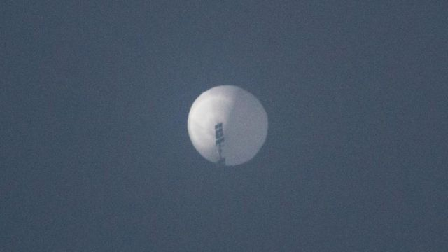
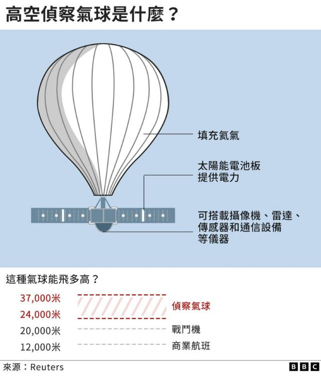
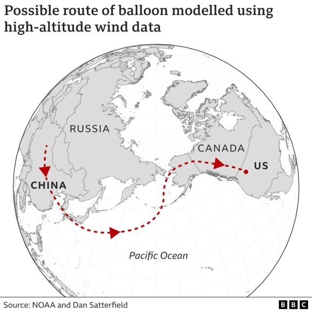

# [Science] 中国气球：是否真如北京所说因偏离航线误入美国领空--BBC事实核查

#  中国气球：是否真如北京所说因偏离航线误入美国领空--BBC事实核查

> 图像来源，  Reuters
>
> 图像加注文字，气球会随着盛行风方向和速度航行。

**中国当局承认一艘自己的飞艇（气球）进入美国领空，但坚称其用途是气象研究，受西风带影响的不可抗力偏离航线。**

我们研究了盛行风的规律和数据，以找出这个气球的飞行轨迹。

##  气球是在哪里被发现的？

它先是在加拿大领空被发现，然后于当地时间周三（2月1日）出现在美国蒙大拿州的比灵斯市（Billings）。

美国当局称，已经通过载人飞行器追踪这颗气球在美国领空的飞行轨迹，发现它出现在多处敏感的军事区域。

##  中国称“偏离航线”

中国当局表示，受“西风带”影响，该装置“自身控制能力有限”，偏离了计划的航线。

气象学家、BBC气象预报主播西蒙·金（Simon King）说，在中国和北美之间的北太平洋区域，盛行风属于西风。也就是说，风向是从西往东。

“最近一段时间，在9000到1万米（3万到4万英尺）高空以上的这一太平洋区域，其风速为每小时240公里（150英里）或以上，”他说，“在这一区域这一风速并不反常。”

他表示，北太平洋上空最近的气流规律可能将气球吹向西北的阿拉斯加，然后往西南方向经加拿大进入蒙大拿。

“大多数气象气球达到10万英尺高度后几个小时就会散架，其装备通过降落伞方式落到地球。对一个气象气球来说，像这样坚持了数天很少见。”

伦敦国王学院国防问题研究员玛丽娜·米隆（Marina Miron）说，这个气球可能比中国方面自称的情况更加复杂。

“这个气球可能被地面的操作员遥控，”她说，“他们可以升高也可以降低其高度，以搭乘不同气流，去往不同方向。”

“你还可以让它定点逗留，以搜集数据。这是卫星做不到的。”

##  能追踪它的航线吗？

这不确定。举例来说，我们没有像商业航空器那样掌握它的飞行轨迹数据，因此我们需要参考其它信息来源。

用于估算高空物体轨迹的一项技术是基于风速和风向。

在这一技术基础上，美国国家海洋和大气管理局（National Oceanic and Atmospheric Administration，NOAA）掌握一种对14000米（46000英尺）以上的气流进行分析的模式。

“它的主要用途，是掌握污染物和有害物质在大气中的运行和扩散。”BBC气象预报主播西蒙·金说。

“这种模式被称为轨迹模式，通过它我们可以得知污染物以及其它材料的来源。”

“对于在美国上空出现的气球来说，轨迹模式能够显示搭载这个气球的气流源头。此外，通过分析风向和风速，显示它会飞向何处。”

美国气象学家沙特菲德（Dan Satterfield）曾用这一模式计算监视气球的可能飞行线路，并把他的发现在网上进行了分享。

从2月1日发现气球位置的蒙大拿州开始追溯，他根据气流数据推测出这个气球可能的飞行轨迹是从中国中部地区开始的。

但必须指出的是，这并非该监视气球的实际飞行轨迹，而是根据美国政府机构海洋和大气管理局的模板进行分析得出的结果。

