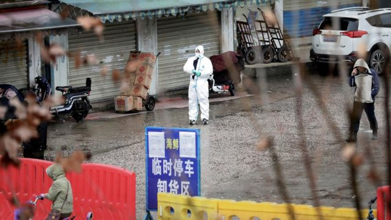
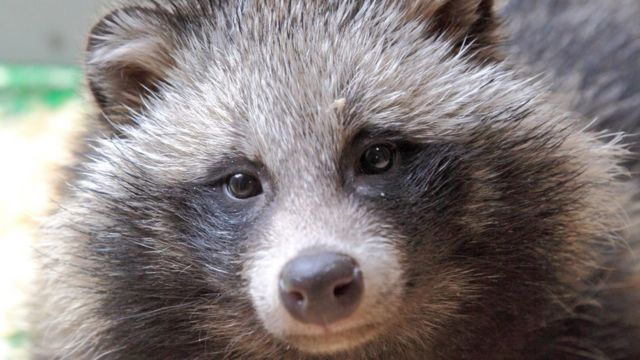
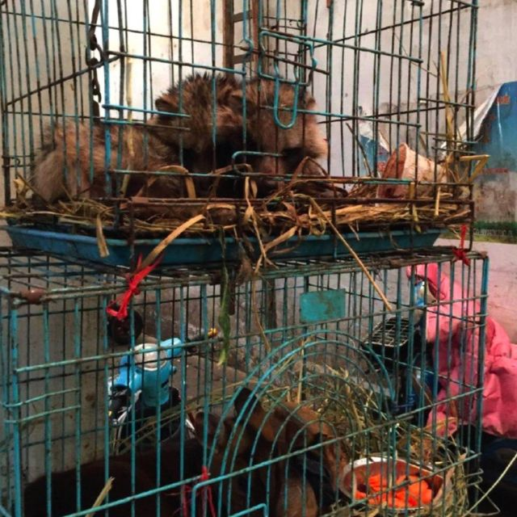
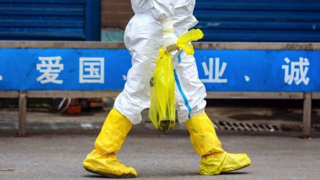

# [Science] 新冠病毒：野生动物貉进入视野，我们是否发现了这种病毒的“动物起源”？

#  新冠病毒：野生动物貉进入视野，我们是否发现了这种病毒的“动物起源”？

  * 维多利亚·吉尔（Victoria Gill），罗兰·皮斯（Roland Pease） 
  * BBC记者 

> 图像来源，  Reuters
>
> 图像加注文字，科学家们说，早期疫情与市场上的活体动物销售之间存在着“强烈关联”。

**一个科学家小组声称，可能掌握了迄今为止发现的关于新冠病毒是如何首次传播给人类的“最佳证据”。**

这是寻找一个世纪以来最严重的大流行病源头的最新转折。这一溯源工作一直障碍重重和高度政治化，并有几个理论相互竞争，而这些理论既未能被证实也没有被完全推翻。

最新分析指出，新冠病毒可能来源于一种特定的动物物种。这一分析是基于三年前从武汉华南野生动物市场收集到的证据，该市场一直是疫情爆发初期的一个焦点。

2020年初，当新冠病毒还是一种神秘疾病时，中国疾病预防控制中心（CDC）从市场上采集了环境样本。这些样本中包含的基因序列直到最近才被短暂公开，这使得一个研究小组能够对其进行分析，并指出貉可能是疾病蔓延到人类之前的“中间宿主”。

根据3月20日在线发表的 一项分析  的关键依据是，被活体出售的野生哺乳动物貉的DNA被发现的位置，与市场上2019新型冠状病毒（SARS CoV-2）检出的地点相同。

> 图像来源，  PA
>
> 图像加注文字，对疫情早期爆发中心所在的野生动物市场三年前的数据分析表明，貉可能是一个“中间宿主”。

但在混乱的溯源过程中，市场早已被关闭，所有曾被出售的动物都已被扑杀，仍然缺乏确凿证据。一些科学家认为，延迟了三年才公布这一关键数据是“令人愤慨的”。

上述研究结果发表之际，有信号显示实验室泄露论正在美国当局获得越来越多的支持。

中国政府极力否认病毒源于科学研究所的说法，但美国联邦调查局（FBI）和能源部（Department of Energy）认为这种情况是“非常有可能的”。

美国多个部门和机构对这个谜团进行了调查，得出不同的结论，但在3月1日，联邦调查局长指责北京“尽其所能试图阻挠和混淆视听”，并透露联邦调查局相信实验室泄漏论“已经有一段时间了”。该局没有公开他们的调查结果，这让一些科学家感到沮丧。

BBC采访了参与这项为期三年的新冠病毒起源调查任务的一些科学家。他们认为，这项新的分析可能使我们最接近了解疫情是如何开始的，而中国和西方之间的分歧正在阻碍揭开这一谜团的科学努力。

##  新研究表明了什么?

巴黎生态学与环境科学研究所（iEES Paris）高级研究员佛罗伦斯·德巴雷（Florence Debarre）博士弄清了这些采自市场的关键拭子上的病毒完整基因序列。她告诉BBC《科学行动》（Science in Action）节目，自她首次发现这些数据存在以来，她就“痴迷”于找到它。

她和同事在全球流感共享数据库（GISAID）中找到并下载了基因序列，随后便开始寻找哪些物种与在相同地点采集的病毒样本相匹配。“我们看到结果出现在我们的屏幕上，它是：貉、貉、貉、貉。”她回忆道。

“所以我们发现了动物和病毒（在一起）。”德巴雷博士解释说。“这并不能证明这些动物被感染了，但这是对我们所看到的情况最合理的解释。”

> 图像来源，  Worobey et al
>
> 图像加注文字，华南海鲜市场曾出售活体动物，包括现在已知易感染新冠病毒的物种。

悉尼大学的埃迪·霍姆斯（Eddie Holmes）教授也参与了这项研究，他表示，这是“我们将揭开”新冠病毒动物起源的“最佳证据”。

“我们永远也找不到那个中间（动物）宿主——它已经不在了。”霍姆斯教授告诉BBC。

“但基因数据发现了这些幽灵，这是非同寻常的，它不仅完全告诉我们那里有什么物种，还告诉我们它们在市场上的确切位置。”霍姆斯教授说。

##  科学家们现在能如何找到新冠起源？

这些新数据可以为进一步调查疫情起源提供更多线索，但追踪这些线索将是复杂的。

> 图像来源，  Getty Images

来自鹿特丹伊拉斯姆斯大学的马里恩·库普曼斯（Marion Koopmans）教授是世界卫生组织（WHO）2020年派往武汉的溯源小组成员。她解释说，新的分析“将它们的存在锁定在特定摊位上，这样你就可以检查那里出售的动物来自哪里”。

“当然，如果这是非法销售，问题就在于你能否把它找出来。”

在为买卖而饲养这些动物的农场中，可能仍存在生物学证据。如果研究人员能够找到带有抗体的养殖动物显示它们曾感染SARS CoV-2，这可能会提供另一条线索。这些基因信息至少可以缩小寻找范围。

但霍姆斯教授表示，在动物身上找到真正的病毒将非常困难。

##  这是否回答了大流行是如何开始的问题？

这并不是确凿的证据，而那是我们可能永远不会拥有的东西。

对这一证据的寻找本身已经变得高度政治化和有害。虽然该发现为病毒出现在野生动物身上并在市场上传播给人类的理论提供了支持，但另一种理论则聚焦在武汉病毒研究所“实验室泄漏”病毒的可能性上。

最近，在美国能源部发布情报评估和共和党领导的病毒来源听证会举行数周后，联邦调查局的介入进一步推动这一理论登上头条新闻。

在接受BBC节目采访时，霍姆斯教授提到了此前对武汉已知最早的新冠病例的研究。“疫情是从市场及周边开始的。”他说，“现在我们可以看到原因——关键的动物在那里。”

“它不是在30公里外的实验室附近开始的。没有一份数据显示实验室周围有任何早期病例。”

然而，这一宝贵数据姗姗来迟，导致一些研究者对中国疾病预防控制中心感到失望和愤怒。

“这些数据是三年前的——花了这么长时间才公诸于世，这绝对是个丑闻。”霍姆斯教授说。

实际上，这些信息早在1月份就已经发布到GISAID基因数据库中，但没有人注意到它。据推测，上传这些数据是为了给中国疾控中心研究人员正在准备的一份基于该数据的研究论文提供支持性证据。（分享这种背景数据被认为是发表科研论文的要求）。

但在中国研究人员得知其他人看到这些信息后不久，该数据又被隐藏起来。

在3月17日的新闻发布会上，世界卫生组织总干事谭德塞（Tedros Adhanom Ghebreyesus）表示，“每一项数据”对于推动我们接近这个答案都很重要。“与研究新冠病毒起源相关的每一项数据都需要立即与国际社会共享。”

霍姆斯教授说：“我们必须超越政治，回到纯粹的科学上来。”

他补充说：“人类从野生动物那里感染病毒——在我们整个进化史上都是如此。我们能做的最好的事情就是远离这些野生动物，并更好地监控。”

“因为这种事还会发生。”

