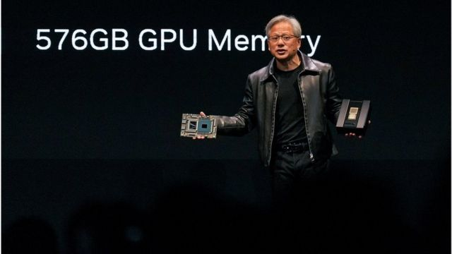
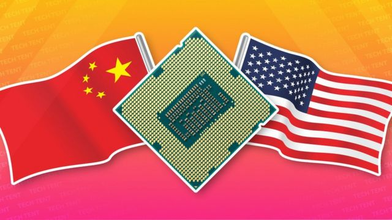
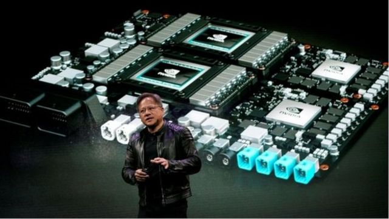
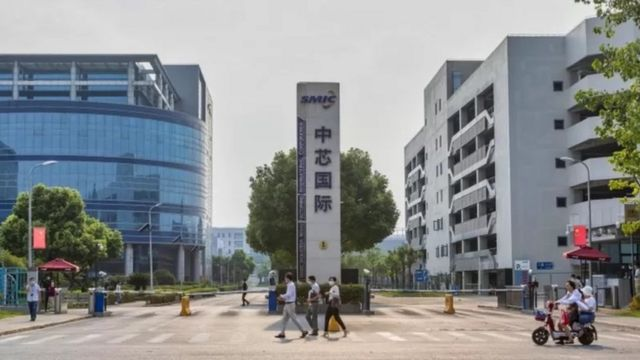
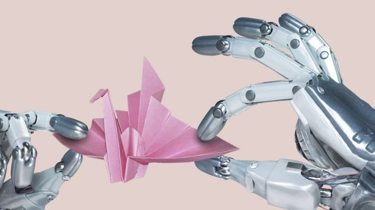
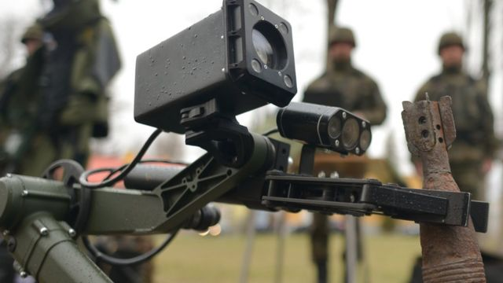
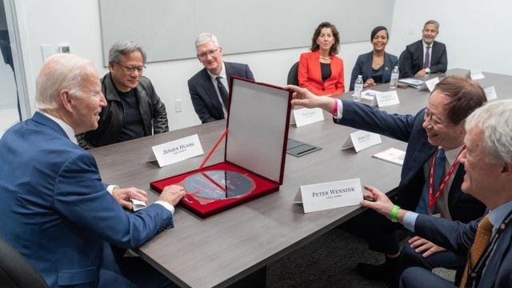

# [Science] 美中半导体大战进入深水区 人工智能AI晶片为何成为关键

#  美中半导体大战进入深水区 人工智能AI晶片为何成为关键

  * 吕嘉鸿 
  * BBC中文 

> 图像来源，  Getty Images
>
> 图像加注文字，辉达总裁兼首席执行官黄仁勋5月29日在COMPUTEX展会上就Grace Hopper超级芯片发表主题演讲。

**今年夏季，人工智能（AI）晶片（芯片，Chip）应用呈指数级增长。分析称，这是由于诸如ChatGPT及MidJouney等各种AI产品横空出世，AI晶片业绩因此在今年暴涨。**

曾经被外界认为在疫情期间因为过度生产晶片，预期在今年面临生产趋缓的半导体产业，却因为AI晶片的需求暴增，再次成为全球焦点。

这也让发展AI晶片的龙头——美国大厂辉达（Nvidia，中国称英伟达），一夕之间市值暴增，甚至超越了半导体晶片代工龙头厂家台积电（TSMC）与韩厂三星（Samsung），辉达创办人黄仁勋（Jensen Huang）也成为国际金融科技界新的聚焦点。

> 图像来源，  Getty Images
>
> 图像加注文字，黄仁勋认为，美国的一连串禁令反而让中国的半导体公司开始生产自己的AI晶片，与辉达现在傲视群雄的游戏、绘图和人工智慧处理器等产品进行竞争。

但是，AI晶片产业同样无法回避地缘政治问题，尤其是这几年来在美国不断出尽“辣招”，试图掣肘中国晶片产业的发展，白宫未来是否会全面禁止辉达等AI晶片前沿公司继续销售AI晶片给中国客户（譬如腾讯或百度等），全球正拭目以待。中国面对美国可能使出的贸易制裁手段，如何加速自己生产国产AI晶片，成为下一场美中半导体大战焦点。

##  AI晶片背后的美中半导体大战

众所皆知，如同石油般，半导体无法逃避区域政治。美国在几年前发起针对中国半导体产业进行制裁的贸易战，几乎是在全方位展开。从2019年要求台积电等公司禁止销售晶片给中国科技龙头华为公司之后，后者手机生产线被腰斩，至今全面停摆。2022年美国施行的晶片法案，要求拥有美国绿卡及国籍者，不能在中国半导体公司中任职，引发中国强烈抗议。

上个月，中国宣布封杀美光（Micron）产品销往中国，彭博社称这是北京对美国的出口管制措施，所实施的最具意义的报复行动：“自己看似强硬，而且经济不会受到重伤。”

如今，美中半导体科技战在进入深水区后，美国是否会循台积电与华为模式，开始全面禁止美商生产的AI晶片销往中国，成为各界关注焦点。辉达公司在中国的客户几乎包含中国所有科技电商龙头，包含阿里巴巴、腾讯、百度和抖音母公司字节跳动等等，这些公司在销售产品上，特别需要AI晶片。AI晶片技术也是涉及军事武器和医学药物发展的重要技术，敏感性越来越高。

商人面对美中半导体大战则感受特别深。辉达主事者黄仁勋今年五月底在接受《金融时报》专访时称，美国为了阻碍中国半导体产业实施的出口管制措施，已经让辉达 “手脚被绑住”，已经难以在该公司最大的市场之一销售若干先进AI晶片。

> 图像来源，  Reuters
>
> 图像加注文字，台湾出生的美国科技企业家黄仁勋1993年创立辉达（英伟达）。

黄仁勋认为，美国的一连串禁令反而让中国的半导体公司加速生产自己的AI晶片，与辉达现在傲视群雄的游戏、绘图和人工智慧处理器等产品进行竞争。他强调，中国“若没办法买到想要的东西，中国就会自己做，所以美国势必要谨慎面对。”

半导体产业专家、台湾南台科技大学朱岳中教授告诉BBC中文说，辉达尚未正式公开过中国营收在该公司总体营收的占比，但他推估至少有10%以上。换言之，中国市场对该公司影响仍然很大。朱岳中说，作为商人，黄仁勋因此对美国针对中国的禁令有意见，并不让人意外。

此外，中国的AI平台，譬如百度或阿里巴巴现在发展使用AI晶片，还是多半来自美商辉达与超微（AMD）2022年9月前美国禁令前采购的晶片。朱岳中表示，中国AI发展平台还是没有如ChatGPT或谷歌等顺畅，因此在用完美国买来的高阶晶片后，中国的AI发展势必会遇到阻力。

> 图像来源，  EPA
>
> 图像加注文字，美国投资者还被禁止持有或交易中芯国际股票。

当然，中国这几年来一直也在发展国产AI晶片，包含寒武纪、海光信息及百度等等。但是，朱岳中认为，这些AI晶片需要高阶制成的晶片厂合作量产。但当下中国最强的公司中芯国际，晶片最高制程只到14奈米，因此短时间要超越美国，可能性很低。

科技分析机构“摩尔透视与战略”（Moor Insights & Strategy）首席分析师安舍尔·萨格（Anshel Sag）则告诉BBC中文说，他不认为中国无法获得AI晶片，就会因此加快其发展，超车赶上美国。他强调，北京在中国公司被实施制裁或限制销售之前，早就推出了长期的国家半导体计划，“但考虑到中国已经花费了多少亿资金，却未见成果，仅仅是再投入更多资金并不是该问题的唯一解决方案。”

科技研究公司“蒂里亚斯研究”（Tirias Research）创办人、半导体分析师​吉姆·麦格雷戈（​​Jim McGrego） 则告诉BBC中文，​​AI晶片产业和世界需要美中两国都更具弹性，且愿意进行谈判，引领发展。他说：“不幸的是，我不认为这种情况会发生。我们正朝着一个迫使产业分裂和可能引发经济灾难的局面前进。”

> 图像来源，  Reuters
>
> 图像加注文字，有些专家认为，芯片已经成为“现在的石油”，容易受地缘政治影响而触发全球危机。

##  AI晶片是什么？

如同上世纪的石油，晶片是当下全球科技运作的主要命脉。晶片用于手机、电脑、军事武器（譬如超音速导弹）以及汽车处理器，高阶的晶片运用是这些产品未来继续升级的关键。

AI晶片在此背景下被研发及生产，开始影响人类生活。

目前，主要可以看到的是，AI晶片的发展正在加速机器及超级电脑学习和深度学习的处理速度，使得使用者能够在图像辨识、语音识别、自然语言处理等领域取得突破性进展。AI晶片的出现驱动了自动驾驶、智能家居、物联网等领域的发展，为人类的日常生活带来了更多智能化的应用便利甚至风险。

分析师萨格告诉BBC中文称，人工智慧研究加快了人们在应用中利用人工智慧的便利和进程，AI晶片的快速发展与此有很大关系。他说：“在许多不同行业中已经广泛应用了人工智慧，现在我们看到它在所有行业中的应用，并且有多个应用程序能够帮助人们节省时间和金钱。”

因此，有评论说，二战后，当代经济的变化，从“石油财”到“晶片财”，现在正要进入“AI晶片财”。

全球科学家正前仆后继地进入AI在半导体领域的研究及发展，在今年有了很大的进一步突破。台湾清华大学人工智慧研究中心黄朝宗副教授解释说：“若说AI应用如同汽车改变人类运输方式的话，那么AI晶片就是其不可或缺的燃料，而若要让每人都有一台汽车的话，那么就需要提供同量级的燃料量，这就是AI晶片在当今的重要性。”

长期研究人工智慧与晶片，黄朝宗告诉BBC，AI晶片受到关注的主因是近期“生成式AI”（Gen AI）神经网路的快速崛起。

##  关键：生成式AI

> 图像来源，  Getty Images
>
> 图像加注文字，因此，有评论说，二战后，当代经济的变化，从石油财到晶片财，现在是正要进入了AI晶片财。

研究者认为，“生成式AI”应用的应用程序，譬如文本生成和图像生成，将可预见地开始被大量地整合到个人和企业的工作流程里。譬如，Bing Chat、ChatGpt、Google Bard、Office365 Copilot、MidJourney 等都已开始整合，黄朝宗说“生成式AI”应用的发展，是AI晶片如何能继续生产的关键。

黄朝宗告诉记者，先前AI发展的瓶颈在于无法有效地、稳定地训练超大型网路，尤其是其训练资料是相当庞大的文本库或图库。但是，近年来，科学家成功地找到合适的训练方法，建立了先前难以想像的庞大生成式网路，其生成品质也因而达到让人类分辨不出真假的程度。

他认为，目前的实作瓶颈变成是“如何以合乎成本的方式，让数以亿计的使用者皆能进行推论使用”。

> 图像来源，  Getty Images
>
> 图像加注文字，人工智能和机器人已经被军队在战场上试验使用。

针对“生成式AI”，半导体分析师​麦格雷戈告诉BBC中文说，在未来10年内，AI将影响我们几乎所有的生活需求，譬如工作、娱乐或教育等等。

他指出：“AI的秘密在于不断发展的软体（software）。“他强调，在可预见的未来，AI多数是在很基础的用例上使用，譬如电池控制、监控或控制噪音上，大概占90%。但是，随着技术进步，特别是在生成式AI （Gen AI）的发展上，“AI预见将完成更具挑战性的任务，这是我们在ChatGPT 或Stable Diffusion等应用程序中所看见的。”

黄朝宗则说，在教育方面，已预见AI会是双面刃，一来可以加速积极性高的学生自我学习的速度，但另一方面也可能弱化学生自行整合知识的能力:“目前AI拥有的是基于庞大人为资料下的准确猜测能力，而非人类使用的因果推理能力，因此在使用上仍须相当小心。”他对BBC说。

##  谁领先AI晶片的生产？

以制作绘图晶片（GPU）起家的矽谷大厂辉达，在GPU非常适合进行AI计算的背景下，随着AI技术及应用产品自今年起爆炸性的发展下，多年投资在有了惊人回报。分析辉达之所以在AI晶片行业中领先，有几个因素。

首先，该公司在图形处理单元（GPU）领域拥有领先地位。GPU的高并行运算能力，使其成为训练和运行大规模神经网络的理想选择。此外，该公司多年来致力于开发专用于人工智能的硬体和软体工具（如TensorRT等），这为开发者提供强大的工具和支援。

譬如，分析师萨格告诉BBC，“辉达在这个领域的很多主导地位都是来自该公司在软体方面投资的结果，特别是他们研发的产品CUDA（统一计算架构，能整合软硬体） ，充分利用GPU的可编程性，提供高性能又易于开发的GPU。”

> 图像来源，  Joe Biden Facebook
>
> 图像加注文字，去年底台积电董事长刘德音（右二）赠送给拜登的礼物是一张晶圆。左二即是辉达黄仁勋。

分析师麦格雷戈则解释，随着处理要求的增加，尤其是大型语言模型（LLM）、设备、网络和云端对更专业的AI处理的需求也在增加。他告诉BBC，这种处理要求，都被集成到从基本的MCU （微控制器单元）到SoC（系统单晶片），再到现在辉达生产招牌的GPU这样的分立加速器的所有事务里头。他说，“辉达之所以成为AI晶片的主导者，不仅是因为它的晶片主导了云端的AI培训，而且主要是因为该公司继续投资开发软件工具和资料库。”

清华大学黄朝宗则观察到，辉达早在10多年前就开始致力于维护开发者平台，让AI研究者可以轻易地使用他们的GPU进行研究，这是该公司目前难以被取代的深层原因。但是，他也强调，若晶片已被公认为新时代的石油，在这个比喻下，目前位居咽喉点的产油公司其实还是台积电。

他认为，因为辉达全线晶片或谷歌（Google）公司的TPU（张量处理器，是该公司开发的专用积体电路，用于加速机器学习）都是台积电生产的，“因此，未来AI晶片的发展潜力或瓶颈，台积电都扮演重要角色。”

