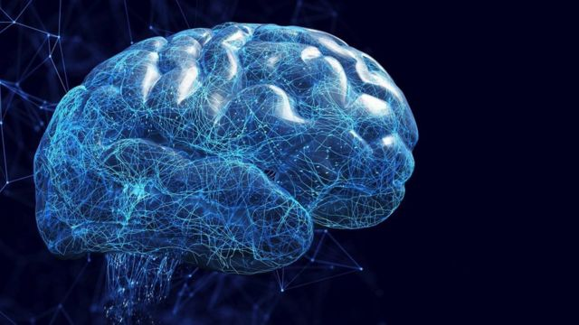
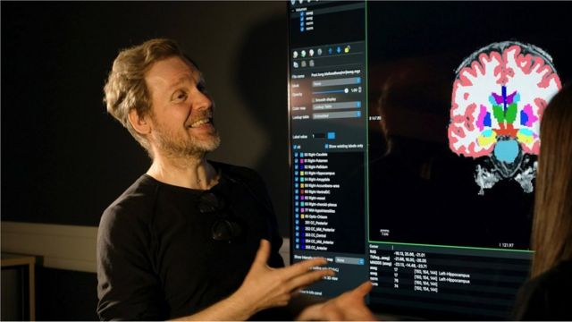
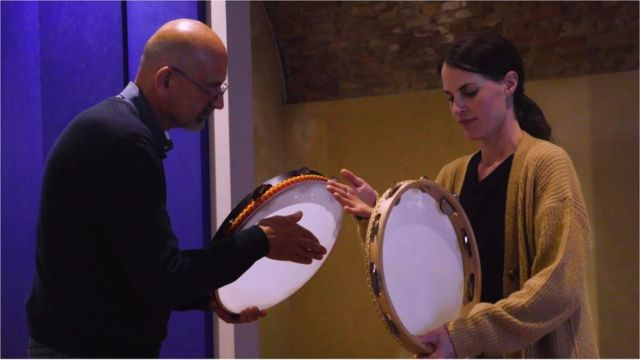
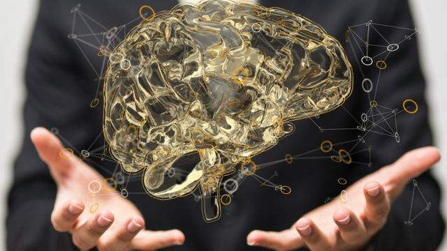

# [Science] 重塑大脑之旅：我如何用六星期提升了脑袋功能

#  重塑大脑之旅：我如何用六星期提升了脑袋功能

> 图像加注文字，记者霍根博姆参加为期六周课程，尝试重塑大脑。

**越来越多证据表明，日常生活中的简单改变，就能改变大脑及其功能。BBC未来网（BBC Future）编辑梅丽莎·霍根博姆（Melissa Hogenboom）给自己做脑扫描一探究竟。**

“要什么都不去想，原来出乎意料地困难。”这是我躺在扫描机器里想到的其中一件事。

当这台功能性磁共振成像（Functional Magnetic Resonance Imagine, fMRI；又译功能性磁振造影、功能磁力共振成像）机器吵吵闹闹地运作着，我被要求专注盯着一个黑色的十字。要一直睁着眼睛感觉上也很难。扫描器嗡嗡作响有些催眠作用，我还真有点担心要是睡了过去，会影响到大脑影像结果。

作为一位科学记者，大脑如何运作总是让我着迷。因此我躺在伦敦大学皇家霍洛威学院（Royal Holloway, University of London）的扫描仪里，先给大脑做个检查，再开展一场为期六个星期的重塑大脑之旅。

我的目标是要了解我们能否自行影响大脑产生有意义的变化。透过改变日常生活的不同方面，我希望找出是否可以强化大脑内的关键联系，并在过程中让头脑变得更健康。

过程中，我学会了一些大家都能应用的技巧，而且效果很显著。

##  神经可塑性与全神贯注

大脑有惊人的适应、学习与成长能力，因为它本质上有可塑性——也就是说，它会改变。

这是所谓的神经可塑性（neuroplasticity），是大脑在结构与功能上不时适应和进化的意思。

曾几何时，这被认为只局限于青年身上，但如今我们知道这是塑造我们的一种持续力量。每当我们学会一项新技能，大脑就会适应。

> 图像来源，  Getty Images
>
> 图像加注文字，大脑本质上具有可塑性。

神经科学家与心理学家现在认识到，我们有能力在某程度上控制大脑。

我们有很好的理由要去提升大脑功能——越来越多研究指出，这在延缓或预防退化性大脑疾病上能发挥作用。

因此，在英国萨里大学（University of Surrey）临床心理学家托尔斯滕·巴恩霍费尔教授（Prof Thorsten Barnhofer）的帮助下，我着手去做这件事。

他在研究静观（mindfulness；又译正念）对于管理压力和困难情绪上的效用，尤其是在严重抑郁症患者身上。

让我意外的是，静观这种简单的练习，能在维持头脑健康方面扮演如此关键的角色。研究显示，要提升某些认知功能，静观是简单而有力的方法。

它能改善专注力，舒缓痛楚和减少压力。研究发现只需数月的静观训练，某些抑郁与焦虑症状能得到舒缓——然而正如任何复杂的心理健康问题一样，这或许会因人而异。

还有，静观能改变大脑。巴恩霍费尔教授说，这是因为当压力激素皮质醇（cortisol）增加并维持在高剂量时，“这会对你的大脑有毒”。

压力也能直接抑制神经可塑性，因此管理压力能让大脑更可塑。

##  实验开始

问题是，这对我的脑袋有用吗？

在六个星期时间里，巴恩霍费尔教授为我调校出一套静观课程。每天30分钟，一次过或分成两节各15分钟，我会聆听一段录音练习静观冥想。

> 图像加注文字，研究表明简单的静观练习能帮助我们维持思绪健康。

此外，我每周跟巴恩霍费尔上一节冥想课，他在Zoom上给我指导。整个静观课程都能在网上免费浏览。

我得到的指示是尽力注意当下，尤其是留意我通常会忽略的事物，例如我都想到哪去了，有什么事情是我在朝思暮想的。

他还鼓励我更专心于日常生活，例如在烹饪或跑步时认真专注于当下，将心思拉回去正在做的事情上，同时留意自己有多容易走神。

这一部分研究最让人着迷的是，静观这看似简单的过程，能带来可量化的效果。

巴恩霍费尔教授解释说：“静观所能做的是缓冲压力，你会越来越能注意到挑战和那些反刍回应，这些是一种担忧的来源。”

我也许不是最理想的实验对象——我在训练前后都测量了压力水平，一般都很低——但我还是感到受益匪浅。

当我开始一节课时，感觉前一两分钟很容易。我会按照指示专注于呼吸或是身体的某些部位。

但每逢静寂时刻，我的思绪就踏上了时光机之旅。我会思考几周前与朋友的对话，然后在不过几秒之间掠过要预约牙科检查的念头，接着又想起下一项工作的截止期限……诸如此类。

> 图像加注文字，临床心理学教授托尔斯滕·巴恩霍费尔研究正念如何帮助大脑的塑造。

在短短瞬间，我看到自己的思绪如何快速转换。要是把速度加快的话，就会让人极度疲惫。

巴恩霍费尔教授说：“当然，心神游移在许多方面是有帮助的。”

“它有助于我们的创意，但这也能打乱事情。这就是重复思考、反刍思维（ruminative thinking）和担忧的来源。这些会导致我们压力增加。”

当我开始注意到这一点，我越来越觉得我们超前思考、预先计划、担心事情的出色能力要是过了头，可以令人衰弱。

换言之，揭示我们的脑袋到底如何运作，是我们尝试放下忙碌束缚的关键第一步。

**大脑** **与** **身体** **的** **联系**

在我花时间在静观课程的这六周里，我还花时间为我的纪录片 《大脑妙招》（Brain Hacks）  拍摄其他神经科学家，看看有没有哪些同类型“妙招”我能借鉴。

例如，有证据表明，冥想和锻炼都能提升大脑的可塑性。

> 图像来源，  Getty Images
>
> 图像加注文字，冥想与运动锻炼均可增强大脑可塑性。

我并未增加运动量，但我有逼着自己跑得更快——我经常在我家附近的公园里用21分钟跑完5公里。

我知道这样做或许能同时提升我的大脑，这让我更有动力去做。英国伦敦大学伯贝克学院（Birkbeck, University Of London）大脑和认知发展中心讲师奥里·奥斯米博士（Dr Ori Ossmy）说：“体育运动能促进大脑的可塑性。”

“如果你把体育跟认知任务结合起来，提高自己感兴趣的技能，你也许能做得更强。”

萨里大学比较认知学教授吉莉安·福雷斯特（Prof Gillian Forrester）认同这有道理，因为身体健康与大脑健康是相辅相成的。

她说：“我们的身体健康与精神健康完全是纠缠在一起，这才能创造生活品质。”

身体健康与认知健康同样息息相关。像福雷斯特教授这样的科学家，透过研究婴幼儿，了解大脑和身体之间的联系。

在伯贝克学院全新的婴儿实验室（Baby Lab），福雷斯特教授向我展示了她的最新研究项目，其名字为“宝宝成长”（Baby Grow）。

这项研究将监察婴儿出生首18个月的发育情况，目的是在认知障碍迹象变得明显之前抢先找出它们。为什么要这么早便做监察？这也跟神经可塑性有关。

在幼年发展阶段，儿童的大脑尤其具可塑性——随着他们长大，学习了解周遭环境，新的脑神经连线与网络以惊人的速度建立起来。

这意味着在这高度可塑时期，对有需要的儿童采取介入措施会更容易。

这就是为什么福雷斯特教授相信，加深了解塑造大脑的日常过程特别重要的原因之一。

##  神经康复

病人从严重脑创伤康复时，同样的理论也可以套用进来。

我跟博尼诺·普莱霍神经病变中心（Centro Neurolesi Bonino Pulejo）科学总监安吉洛·夸塔罗内教授（Prof Angelo Quartarone）见面。那是一家位于意大利西西里的脑创伤中心，他每天见证着大脑的可塑性。

> 图像加注文字，学习新技能——这次是学习打西西里铃鼓——既有趣，又能帮助大脑继续成长。

他说：“即使在最糟糕的状态，大脑还是会以某种形式自我修复……透过神经康复（neurorehabilitation），我们能加快复原进度。”

他的团队采用多种方法辅助康复，包括机器人、虚拟现实（VR）和在脑部植入电池线圈。

他说：“微量的电流可以可以与神经康复技术所采用的相同机制相互作用。这样就能一举两得。”

他有一位右肢乏力的病人让我惊叹不已，他透过玩电脑模拟游戏，成功建立新的神经连接，让他重拾失去了的运动机能。

这种增强大脑功能的方法值得我们学习。

显然，练习新技能和经常接触新环境，统统都能帮助大脑不断适应与成长。

我用意大利语下单要日晒番茄干的时候就是如此。还有去上一个打西西里铃鼓的速成班，然后再坐在埃特纳火山（Mount Etna）脚下冥想。

当然，我必须补充一个注意事项：我只是一个人的样本，而以上种种都只是例证，而非纯粹科学。

##  结构上的改变

六个星期的尾声，我极好奇我所做的一切，对脑袋有没有起到任何作用。

经过又一次大脑扫描后，我到萨里大学找巴恩霍费尔教授听取结果，他详细分析与比较了我的两次脑扫描。

结果出来了：我的大脑确实改变了，并且出现了一些可衡量的变化。

我的杏仁核（amygdala）右侧的一半缩小了体积，它是处理情绪很重要的部位。

这种变化很轻微，但能量度出来。然而，让人更兴奋的是，这与科学文献一致，即静观能缓冲压力，致使杏仁核缩小。

当我们的压力增加，杏仁核便会增大。我一开始没感觉到特别大压力，但即便如此，能看到变化还是教人兴奋。

另一样变化发生在扣带皮层（cingulate cortex），那是脑干边缘系统（limbic system）中跟行为和情绪反应有关的部分。

这对于默认模式网络（default mode network, DMN）也很重要，当思绪漫游和胡思乱想时，该区域会活跃起来。

在我的大脑中，它在六周之后稍微增生了，这表明该区域的控制有所加强。这再次与科学文献中已发表过的研究相呼应。

> 图像来源，  Getty Images
>
> 图像加注文字，人类经历更多压力，大脑杏仁核便会增生。

这也跟我在课堂上所注意到的情况一样。随着时间的推移，我发觉我越来越能保持心平气和，能更好地排除忙碌思绪。

我在大屏幕上看到我的脑袋出现了这些成果，实在大开眼界。

单纯透过静观练习，我成功扩充了脑袋的其中一部分，防止自己过度胡思乱想。

最后要提醒大家：我们所看到的一切大脑变化，都可能只是随机事件，这一点很重要。

无论如何，大脑无时无刻都在变化，但这些研究说明，这整个体验是个很值得的挑战过程，很多人能从中受益。

当然，为了让变化得以持久，我显然该继续鞭策自己去练习这些“妙招”。

我还会继续每天冥想吗？我很想说：“这当然。”

前提是，生活上要有这个空闲……

**补充报道：汤姆** **·** **海登（** **Tom Heyden** **）、皮耶朗杰洛** **·** **皮拉克（** **Pierangelo Pirak** **）**

**请访问** BBC Future  **阅读** 英文原文  **。**

