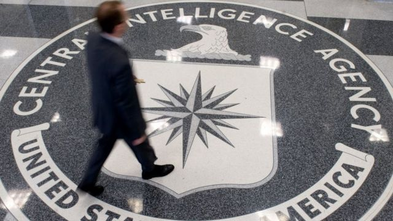
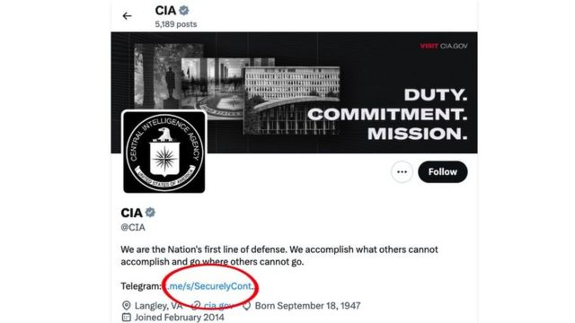

# [Science] 美国中情局招募线人网络频道因漏洞被人发现

#  美国中情局招募线人网络频道因漏洞被人发现

  * 乔·提迪（Joe Tidy） 
  * BBC网络事务记者 

> 图像来源，  Getty Images

**一名网络安全研究人员利用美国中情局（CIA）官方推特账户的一个故障，成功劫持了该单位一个用于招募间谍的频道。**

中情局在社交媒体“X”上的帐户（以前称为推特）显示了一个供线人使用的通讯软体“电报”（Telegram）频道的链接。

但名字叫做凯文·麦克希汉（Kevin McSheehan ）的男子却能成功够将潜在的中情局联系人重新定向到他自己的Telegram频道。

“中情局这次真的失败了，”这名道德黑客说。

中情局是美国政府组织，以通常使用网路科技从世界各地的间谍和线人组成的庞大网络收集秘密情报信息而闻名，该组织官方“X”账户拥有近350万粉丝，用于宣传该机构并鼓励人们相互联系以保护美国国家安全。

##  “最大的恐惧”

居住在美国缅因州今年37岁的麦克希汉表示，他于周二（10月17日）早些时候发现了这个安全错误。

“我的第一反应是恐慌，”他说。

“我看到他们分享的官方Telegram链接可能会被劫持。我最担心的是像俄罗斯、中国或朝鲜这样的国家可以轻易地拦截西方情报。”

在9月27日的某个时间点，中情局在其“X”官方页面上添加了一个Telegram的链接——https://t.me/securelycontactingcia——其Telegram频道包含有关通过暗网和其他秘密手段联系该组织的讯息。

> 图像加注文字，任何点击链接的人都被定向到麦克希恩的Telegram频道。

**其他相关报道：**

该频道用俄语说：“我们的全球使命要求个人能够从任何地方安全地联系中情局”，同时警告潜在的新成员“警惕任何声称代表中央情报局的管道”。

但“X”显示某些链接的方式存在缺陷，意味着完整的网址已被截断为“https://t.me/securelycont”， 一个未被使用的Telegram用户名。

麦克希汉一注意到这个问题，就注册了用户名，这样任何点击该链接的人都会被定向到他自己在Telegram上的个人频道，而该频道警告他们不要分享任何秘密或敏感信息。

“我这样做是出于安全预防措施，”他说。

“这是我以前见过的‘X’站点的问题，但令我惊讶的是中情局竟然没注意到。”

中情局没有回复BBC的置评请求，但在BBC的请求发出后一小时内，错误纠正了。

