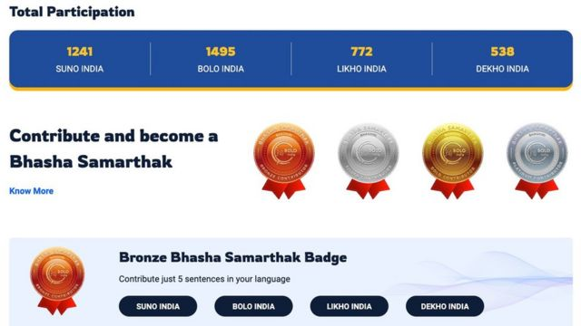

# [Science] ChatGPT的语言偏见：令非英语使用者“掉队”的三种方式

#  ChatGPT的语言偏见：令非英语使用者“掉队”的三种方式

  * 乔·提迪（Joe Tidy） 
  * BBC记者 

> 图像来源，  Getty Images
>
> 图像加注文字，在非英语产品中使用硅谷人工智能的企业处于不利地位。

**专家警告说，由于人工智能（AI）系统向英语倾斜，令全世界的非英语使用者正在“掉队”。**

聊天机器人ChatGPT和谷歌Bard等AI生成工具正在为数百万人带来新技能和商业理念，但也有可能让更多人处于弱势地位。

在过去几个月里，通常由政府支持的公司竞相推出或开始为其母语构建AI，包括印尼语、日语、汉语、韩语和印度的多种语言等。

但它们能否与硅谷的AI机器人相抗衡，或提供可靠的替代方案呢？

以下是非英语使用者被生成式AI浪潮甩在后面的三种方式，以及为什么我们需要重视这个问题。

##  1\. 对于非英语使用者来说，准确性更低，成本更高

机器学习工程师郑甄妮（Yennie Jun，音译）在用不同语言测试ChatGPT-4时，开始注意到这个问题。

“我发现速度慢了很多，而且不像使用韩语和汉语时效果那么好，因为它们通常有高质量的训练数据可供使用。”她说道。

本月早些时候，郑甄妮决定用一些棘手的数学问题来测试OpenAI的最新人工智能模型GPT-4。

> 图像来源，  Getty Images
>
> 图像加注文字，聊天机器人ChatGPT等AI生成工具正在为数百万人带来新技能和商业理念，但也有可能让更多人处于弱势地位。

她用16种不同的语言提出相同的数学问题，结果发现GPT-4在解决某些语言（如英语、德语和西班牙语）的问题时表现得更好。

事实上，GPT-4能够正确解决用英语提出的数学问题的概率，是亚美尼亚语或波斯语等其他语言的三倍。而它无法解决用缅甸语或阿姆哈拉语提出的任何难题。

这只是郑甄妮为强调ChatGPT和其他所谓AI“大型语言模型”的不平等性，而进行的最新实验。

在今年夏季早些时候进行的另一项测试中，郑甄妮制作了一个“Tokenizer”（分词器）工具，用来说明为何这些AI模型在处理非英语语言时会困难重重。

AI会将语句分解成更小、更易理解的语块，即“token”（词节；也被译为标记）。它对语言的理解程度越低，创建的词节就越多。例如，如果你用不同的语言在她的分词器工具中输入“告诉我羊肚菌”（tell me about morel mushrooms）这个简单的语句，词节的数量会有很大的不同：

  * 英语：6个词节 
  * 西班牙语：8个词节 
  * 汉语（中文）：14个词节 
  * 缅甸语：65个词节 

这很重要，因为这意味着非英语用户面对的结果会稍慢一些，而且由于提示框受到词节长度的限制，他们也无法像英语用户那样在提示框中输入那么多单词。

但郑甄妮表示，这种不平等带来的真正劣势，来自于企业试图利用这些AI构建产品和服务。

例如，如果一家蘑菇种植企业在自己的应用程序中内置了ChatGPT-4来回答客户提问，那么该公司为缅甸客户提供服务的成本将是英语客户的10倍，因为为满足客户要求需要大量的词节。

这并非仅限于ChatGPT，所有大型语言模型都会存在类似的差异。当你向谷歌的Bard询问这个问题时，它也承认了这一点：“Bard对非英语语言的词节化可能会导致用其他语言提出提示的速度更慢、成本更高，因为非英语语言的词节化过程要比英语复杂得多。”

##  2.以英语优先的AI无法反映其他文化

> 图像来源，  EPA
>
> 图像加注文字，在美国参议院委员会的听证会上，OpenAI首席执行官山姆·阿尔特曼（Sam Altman）被质疑该工具偏向英语使用者。他表示该公司“同样重视”保障其他文化也被纳入其中。

英语在互联网上占据主导地位，目前也在人工智能领域占据主导地位。

这背后的原因在于，大多数AI模型都是使用从开源互联网上搜集来的数据进行训练的，而这些数据绝大多数都是英语。

非营利组织“民主与技术中心”（CDT）在其关于AI语言偏见的报告中指出，尽管全球只有16%的人口使用英语，但英语网站却占全球网站的63.7%。

英语经常被描述为一种“资源极多”的语言，从社交媒体帖子到商业报告和科学论文，英语文本似乎取之不竭。

但是，一种语言的网络资源丰富程度与其使用人数并不成正比。

例如，“民主与技术中心”研究员表示，尽管非洲大陆有6亿多互联网用户，但几乎所有的非洲语言仍是“资源很少”的语言。

学术界对语言的分类各有不同，但以下是对语言资源状况的总体概述：

  * 资源极多的语言：英语 
  * 资源很多的语言：中文（汉语）、日语、西班牙语、德语、法语、俄语、阿拉伯语 
  * 资源中等的语言：印地语、葡萄牙语、越南语、荷兰语、韩语、印度尼西亚语、芬兰语、波兰语、捷克语 
  * 资源很少的语言：巴斯克语、海地克里奥尔语、斯瓦希里语、阿姆哈拉语、缅甸语、切罗基语、祖鲁语和大多数其他语言 

OpenAI没有透露英语在ChatGPT的训练数据中所占比例。如果你询问AI，它的回答是“数据集中语言的具体分类和百分比仍然是专有信息”。谷歌的Bard被问及这些信息时也表示，具体的数据样本是“机密的”。

正如“民主与技术中心”在其报告中所说，“这种（对某种语言的）偏向未能反映全球互联网用户所使用语言的多样性，并进一步延续了英语的主导地位”。

郑甄妮说，她的实验也发现了强烈的西方偏见。

“我做了一些实验，比如向AI询问历史上重要的事件和人物，即使你用其他语言询问，它仍会得出非常偏向西方的人物和事件。”她说。

##  3\. 硅谷可能不会解决不平等问题

> 图像来源，  Getty Images
>
> 图像加注文字，“民主与技术中心”和其他研究者在内的一些人认为，多语种语言模型对于非英语用户的表现仍然较差。而另一些语言拥有更大的数据集，这意味着翻译和转录会更加准确。

“民主与技术中心”认为，美国公司没有投入同样多的资金来改善非英语客户的体验，因为从全球南方等地区获得的收入更少。

据《连线》（Wired）最早报道，OpenAI的一名员工去年在一个开发者论坛上承认，该公司的模型“有意使用英语训练”，“任何好的西班牙语结果都是额外奖励”。

在美国参议院委员会的听证会上，OpenAI首席执行官山姆·阿尔特曼（Sam Altman）被质疑该工具偏向英语使用者。他表示该公司“同样重视”保障其他文化也被纳入其中。

OpenAI和谷歌都没有回应我们向其新闻办公室提出的问题。

另一家AI巨头Meta正在投资一个名为“不落下任何语言”（No Language Left Behind）的大型翻译项目，以改进数百种语言的机器学习翻译工具。但即便如此，该公司也承认其最新的大型语言模型Llama 2对于非英语用户来说“仍然很脆弱，应谨慎使用”。

尼克·亚当斯（Nick Adams）是专注于AI的风险投资基金“微分创业”的创始合伙人。他表示，如果继续维持现状，那么资金和投资将继续流向那些已经很富有的公司、国家和语言。

“我认为，AI的现状会加速不平等，而不是让它变得更好。新兴市场没有足够的算力、数据集或AI所需的财力来与西方世界的模型竞争。”他说。

除了缺乏对非英语AI的投资外，数据问题也很难克服，甚至超出了美国科技巨头的能力范围。

人们曾一度认为，开发多语种语言模型可以解决数据差异问题，即通过训练人工智能模型来发现资源较多语言的模式，并将其应用于资源较少的语言。但包括“民主与技术中心”和其他研究者在内的一些人认为，多语种语言模型对于非英语用户的表现仍然较差。

> 图像来源，  Bhasha Daan initiative
>
> 图像加注文字，“巴沙达安倡议”邀请人们“通过验证数据来改进自己的AI语言模型”，它向参加者播放不同的印度语言播客或节目音频，然后给予数字奖牌以奖励他们将其翻译成自己的语言。

印度电子和信息技术部发起了一个野心勃勃的项目，旨在通过众包提高低资源语言的训练数据量。

“巴沙达安倡议”（Bhasha Daan initiative）邀请人们“通过验证数据来改进自己的AI语言模型”。该计划向参加者播放不同的印度语言播客或节目音频，然后给予数字奖牌以奖励他们将其翻译成自己的语言。

但是，该方式仍然道阻且长。尽管母语人口众多，但迄今只有几千人参与其中。

