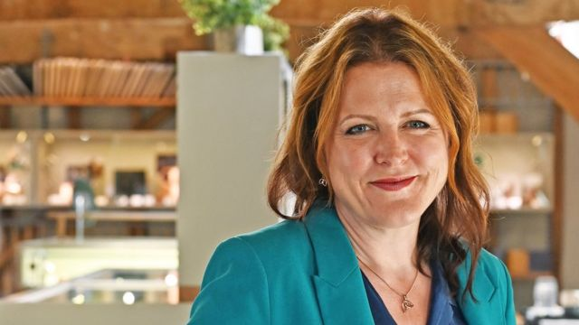
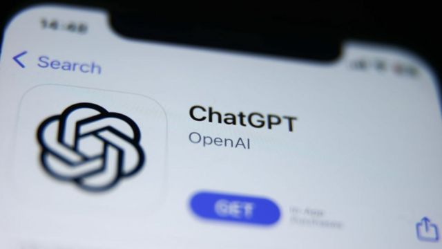
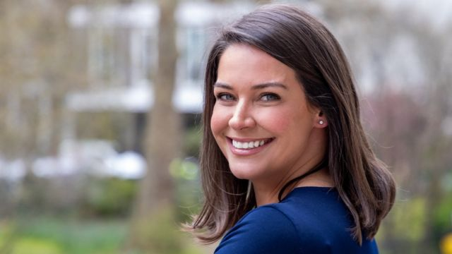
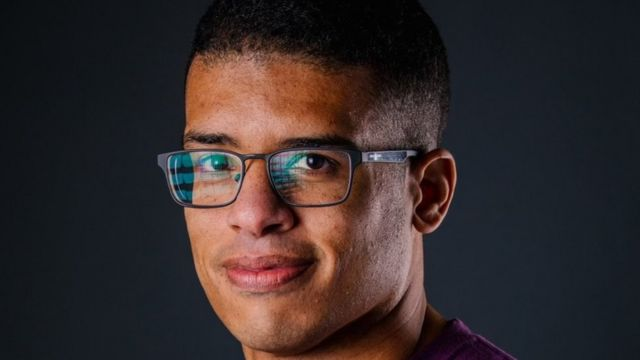

# [Science] 人工智能：女性使用AI比男性少，这是为什么

#  人工智能：女性使用AI比男性少，这是为什么

  * 玛丽卢·科斯塔（MaryLou Costa） 
  * 商业事务记者 

> 图像来源，  Harriet Kelsall
>
> 图像加注文字，哈丽特·凯尔索说，她觉得目前流行的ChatGPT应用程式，有太多的错误。

**广为流行的人工智能（AI）聊天机器人ChatGPT目前拥有超过1.8亿用户，但是珠宝设计师哈丽特·凯尔索（Harriet Kelsall）说，这玩意不适合她。**

作为阅读障碍症人士，她承认，使用这个工具或许有助于令她在与网上客户沟通时表达更清晰，但是最终，她说她就是不信任它。

凯尔索女士的工作地在诺丁汉（Nottingham），她说当她今年试着使用ChatGPT的时候，发现了一些错误。她试探性地问它关于查尔斯三世国王（King Charles，查理斯三世）在5月加冕礼上所佩戴的圣爱德华王冠（St Edward's Crown）的问题。

“我让ChatGPT告诉我一些关于王冠的信息，就是想看看它会说些什么，”她说，“我对皇家王冠上的宝石相当了解，而我注意到文本当中有很多内容，其实说的不是同一顶王冠。”

凯尔索女士还表示，她同样担心人们“把ChatGPT告诉他们的内容当作自己独立思考的想法，并且进行剽窃”。

尽管ChatGPT自一年前推出以来就变得非常受欢迎，但是像凯尔索女士这种不太愿意使用它的情况，似乎在女性中间比在男性中更为常见。根据今年早些时候的研究，54%的男性现在会在职业或个人生活中使用AI，而女性当中的这个比例仅有35%。

这种AI里疑似的性别差异，原因是什么，是否应该引起关注？

> 图像来源，  Getty Images
>
> 图像加注文字，ChatGPT目前在全球有超过1.8亿用户。

工作地在伦敦的商业教练米歇尔·莱弗斯（Michelle Leivars）说，她并不使用AI为自己写作，因为她希望保留自己的声音和个性。

“客户说过，他们与我预约咨询是因为我网站上的文字并不令人觉得是那种模板文章，而是我在直接跟他们对话，”她说，“认识我的人进入网站后说，他们能从中听到我说出这些词语，而且他们一下子就知道那是我。”

与此同时，同样在伦敦的海莉·拜斯特拉姆（Hayley Bystram）并没有打算通过使用AI来节省时间。拜斯特拉姆女士是婚恋中介“鲍斯- 里昂合伙人”的创始人。她会亲自与客户网页，手把手地将他们与志趣相投的人进行配对，而不借助任何运算法。

“我们本可以利用ChatGPT这类工具来取代那些精心制作的会员资料。制作这些可能要用上半天时间，”她说，“但是对我来说，那样做会令这个过程当中的灵魂与个性被抽走了，感觉像是作弊，所以我们还是保持原来冗长的方式。”

> 图像来源，  Hayley Bystram
>
> 图像加注文字，海莉·拜斯特拉姆表示，使用AI感觉像在“作弊”。

苏格兰佩斯利（Paisley）的商业策略师亚历山德拉·考沃德（Alexandra Coward）认为，使用AI进行内容生成，就像是“重度修饰照片”。

她还特别担心，有种越演越烈的趋势是人们用AI来创作“令他们看起来最苗条、最年轻、最时髦”的照片。

考沃德女士补充说：“我们正走向这样一个空间，你的客户将认不出现实中的你，而你自己也认不出现实中的你。”

虽然这些都是对AI敬而远之的合理理由，但是人工智能专家朱迪·库克（Jodie Cook）表示，女性之所以不像男性一样尽情拥抱这项技术，还有更深层次、更根深蒂固的原因。

“STEM领域（指科学、科技、工程和数学）传统上一直被男性主导，”库克女士说。她是Coachvox.ai的创始人，这款应用程序让企业领袖可以创建AI克隆版的自己。

“目前采用AI工具的趋势似乎也反映了这种差异，因为AI所需要的技能也根源于STEM学科。”

##  AI威胁论被过分夸大了吗？

周三（11月1日）在英国举行的全球人工智能安全高峰会（AI Safety Summit）上，英国政府公布了由包括美国、欧盟和中国在内28个国家共同签署的《布莱奇利宣言》（The Bletchley Declaration）。

这被称作全球第一份针对“前沿AI”的国际宣言，将作为加强全球AI安全合作的依据。

在会上，英国国王查尔斯三世通过视频表示，AI所带来的风险需要人们“以迫切、团结和共同努力的态度”来应对。

峰会的焦点是全球合作管理最具风险的AI技术——即那些目前能力不被知晓的最前沿人工智能。

各国政要、部长和业界巨头各自发表了对人工智能和其管理的看法。

出席会议的特斯拉（Tesla）和社交媒体“X”（前Twitter）的拥有者伊隆·马斯克（Elon Musk）表示，AI有可能令人类灭绝。

英国首相里希·苏纳克（Rishi Sunak，辛伟诚）则在会前向BBC表示，监管AI的风险非常重要，不能只依靠科技企业“自评功课”。

他表示，这项工作必须由政府和外部人员来完成，才能确保AI技术下民众的安全。

美国商务部长雷蒙多（Gina Raimondo）则称，美国会在峰会后成立自己的AI研究院。

美国副总统哈里斯（Kamala Harris，贺锦丽）在会前表示，世界领导人必须“全光谱”地应对AI对人类造成的风险，并举例提到医疗系统中的错误算法、深伪技术和虚假信息等等。

中国同样对全球合作应对AI表示支持。出席峰会的科技部副部长吴朝晖呼吁“全球合作分享知识，并让AI技术向公众开放”。

目前，各国才刚刚开始对人工智能的潜在风险进行应对——这当中可能包括对隐私的侵犯、黑客攻击以及取代人类工作等方面。

有专家认为，AI对人类的威胁有可能被夸大了。

脸书（Facebook）母公司Meta的主席尼克·克莱格（Nick Clegg）表示，人们不应该对一些揣测性的预言感到恐慌，从而忽略了AI眼前最迫切的威胁。

观察人士认为，AI最直接的威胁是自动化令人们失业，或者将人类社会中已有的偏见逐渐建立成一个更有影响力的网络体系。

马斯克向BBC表示，他并不期待峰会能立即出台政策：“你必须先有洞察再有监督。”

在英国，STEM领域的女性劳动力仅占24%，因此，“女性可能对使用AI工具不太自信，”库克说，“即使许多工具不需要熟练的技术，但如果更多女性认为自己擅长技术的人，可能就不会尝试使用它们。”

“而AI现在感觉仍然像是科幻小说。媒体和流行文化当中，科幻小说通常倾向于男性市场。”

库克女士表示，在未来，她希望看到更多女性使用并从事人工智能行业。“随着这个产业的发展，我们绝不希望看到性别差距不断扩大。”

然而，心理学家李·钱伯斯（Lee Chambers）表示，典型的女性思维和行为模式可能正令一些女性不愿意接受人工智能。

“这是自信差异——女性倾向于在开始使用某种东西之前要具备很高的能力水平，”他说，“而男性则通常乐于在没有很高能力的情况下就开始尝试某个东西。”

> 图像来源，  Lee Chambers
>
> 图像加注文字，心理学家钱伯斯说，女性会担心使用AI会引人质疑她们的能力

钱伯斯先生还表示，女性或许还害怕，如果她们使用AI工具的话，自己的能力会受到质疑。

“女性更有可能被指责不够能干，所以她们必须更多地强调自己的资质，以显示自己在某个特定领域的专业知识。”他说，“人们可能会认为，如果人们知道你作为一个女性使用AI，那就是意味着你可能并不是那么合格。”

“女性已经被贬低，想法被男性夺走当成他们自己的，于是让人们知道你使用AI，可能也会成为你不够合格的口实。这不过是又一件贬低你的技能、才干和价值的事情。”

又或者，就如哈丽特·凯尔索所说的：“我珍视真实性和人类的创造力。”

